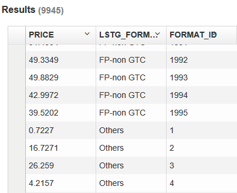

# How to use Window Function in KAP

Since KAP v2.1, we've provided window function in KAP to support more complicated query, keeping SQL query simple and work well. Here we are going to introduce how to use this function.

## Window Function

Window Functions query supported by KAP is list as follow:

| Operator syntax                      | Description                              |
| ------------------------------------ | ---------------------------------------- |
| RANK() OVER (order by)               | Returns the rank of the current row with gaps; same as ROW_NUMBER of its first peer |
| DENSE_RANK() OVER (order by )        | Returns the rank of the current row without gaps; this function counts peer groups |
| ROW_NUMBER() OVER ()                 | Returns the number of the current row within its partition, counting from 1 |
| FIRST_VALUE(value) OVER ()           | Returns *value* evaluated at the row that is the first row of the window frame |
| LAST_VALUE(value) OVER ()            | Returns *value* evaluated at the row that is the last row of the window frame |
| LEAD(value, offset, default) OVER () | Returns *value* evaluated at the row that is *offset* rows after the current row within the partition; if there is no such row, instead returns *default*. Both *offset* and *default* are evaluated with respect to the current row. If omitted, *offset* defaults to 1 and *default* to NULL |
| LAG(value, offset, default) OVER ()  | Returns *value* evaluated at the row that is *offset* rows before the current row within the partition; if there is no such row, instead returns *default*. Both *offset* and *default* are evaluated with respect to the current row. If omitted, *offset* defaults to 1 and *default* to NULL |
| NTILE(value) OVER ()                 | Returns an integer ranging from 1 to *value*, dividing the partition as equally as possible |

## Example

In this section, we would take a dataset defaulted in KAP as data source to practice some typical query mentioned above. Step by step, we will introduce you how to use Window Function in KAP.

#### Dataset

Select a default **Data Source** named as `learn_kylin`, then the table structure would present below: there are one fact table (`KYLIN_SALES`) and two lookup tables (`KYLIN_CAL_DT` and `KYLIN_CATEGORY_GROUPINGS`). Take a minute to check the `KYLIN_SALES` as well as its sample data, and we'll use it later.

#### Rank Function (rank, dense_rank, row_number, ntile)

Though we have the row column in this table, for most data analysts, generating row number is essential to get some particular results by different partitions. For instance: `select price, LSTG_FORMAT_NAME, row_number() over(partition by LSTG_FORMAT_NAME) as format_id from kylin_sales`

Then result returns like:

#### Offset Function (first_value, last_value, lead, lag)

Similar with rank function, offset function would provide access to a row at a given physical offset beyond that position. To get to know the closest date recorded within the table, then you can input: `select price, part_dt, lead(part_dt,1) over(partition by LSTG_FORMAT_NAME) as latest_dt from kylin_sales`

Result would be:

