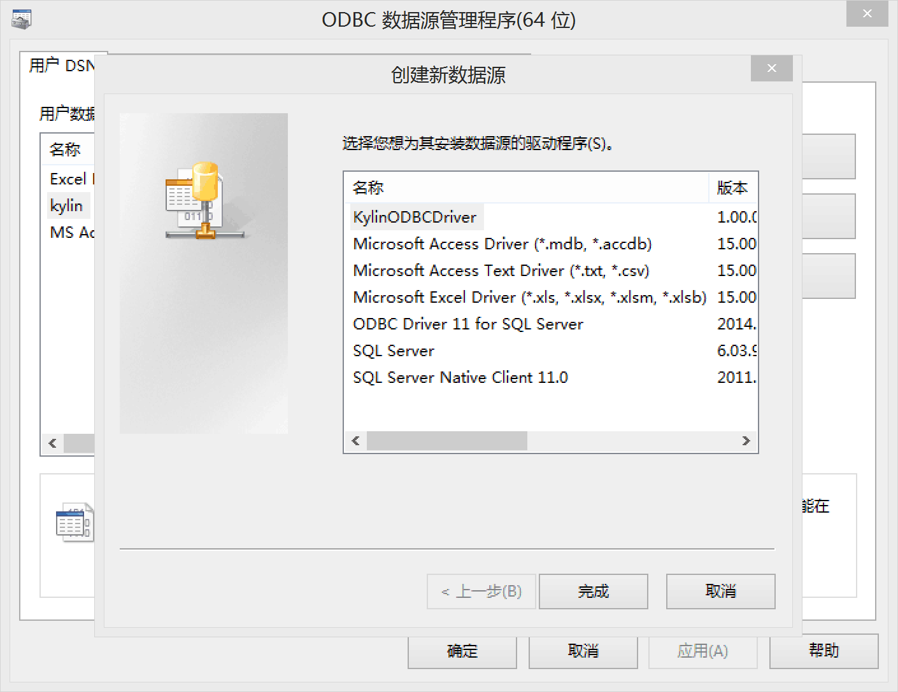

## ODBC Driver

KAP provides an ODBC driver for Windows, through which applications with ODBC interface can access KAP to query data. 

Test the operating system: Windows 7, Windows Server 2008 R2

Test applications: Tableau 8.x, Table 9.x, Power Desktop, Excel

In this article, we take Windows 7 as an example to introduce ODBC driver's installation and use steps. 

## Prerequisites

1. Install Microsoft Visual C++ 2012（Redistributable）
   * 32 bits: download [32bit version](http://download.microsoft.com/download/1/6/B/16B06F60-3B20-4FF2-B699-5E9B7962F9AE/VSU_4/vcredist_x86.exe) 
   * 64 bits: download[64bit version](http://download.microsoft.com/download/1/6/B/16B06F60-3B20-4FF2-B699-5E9B7962F9AE/VSU_4/vcredist_x64.exe)
2. The ODBC driver would call KAP's Rest server, so make sure the KAP service is working properly.

## Installation
1. If you have installed ODBC driver, please uninstall ODBC driver first.
2. [Download](http://kylin.apache.org/download) drivers, and run.
   * 32 bit Microsoft Office Excel：Please install KylinODBCDriver (x86).exe
   * 64 bit Microsoft Office Excel：Please install KylinODBCDriver (x64).exe

## Configure the DSN

1. Open ODBC Data Source Manager

* 32 bits ODBC driver：click "start>operation" to open C:\Windows\SysWOW64\odbcad32.exe
* 64 bits ODBC driver：select "Control Panel> Administrative Tools" to open "ODBC Data Source Administrator" 

2. Switch to the System DSN tab, click `Add` and select "KylinODBCDriver" in the pop-up driver selection box, then click `finish`.

3. In the pop-up Kylin DSN Configuration Dialog, input the KAP server information, as shown in the figure: 

Among them, the parameters are described below: 

* DSN Name: DSN----data source name
* Server Host: KAP server address
* Port: KAP server port number
* Username: username to login KAP 
* Password: password to login KAP 
* Project: the name of the KAP project to use for the query; after entering the blank space above, click `Connect` to activate the Project selection box 

4. Click `Done` 

## Special Reminder

If you want to use the ODBC driver to connect to other client applications, the configuration is similar to this example. More information please visit the [Integration with 3rd party BI tools](integration/README.md) chapter of KAP manual or Kylin's official website.