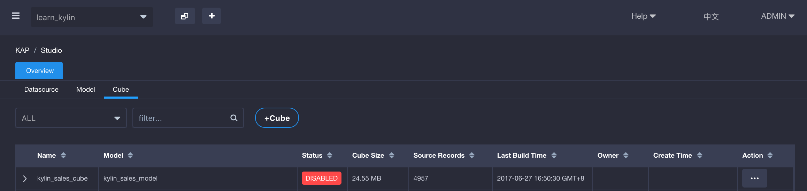
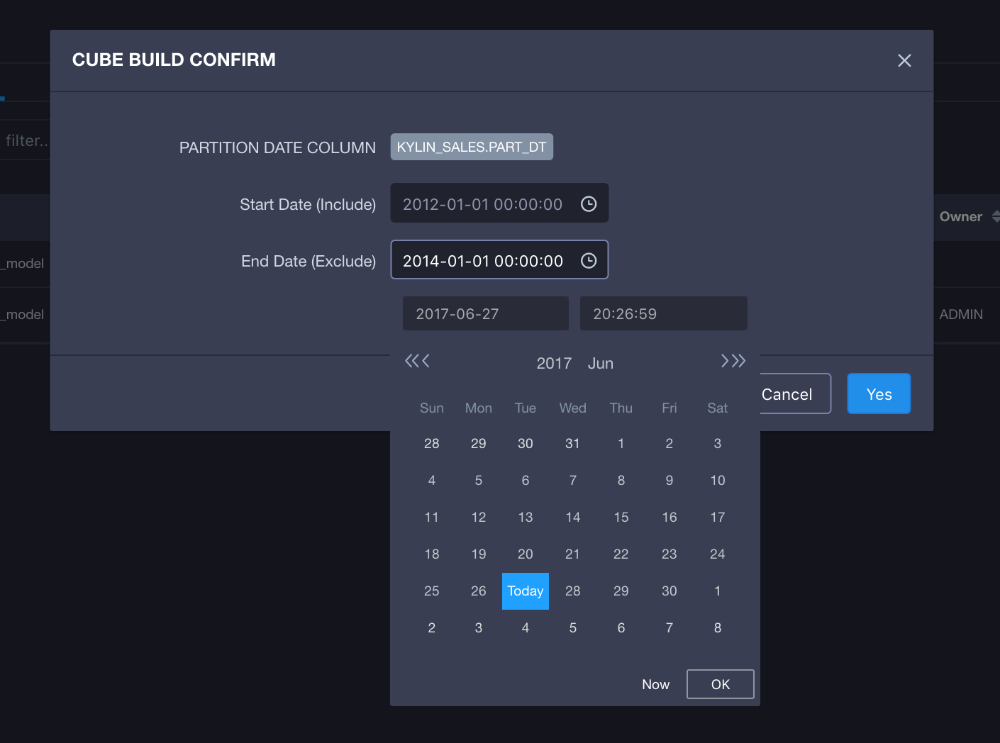
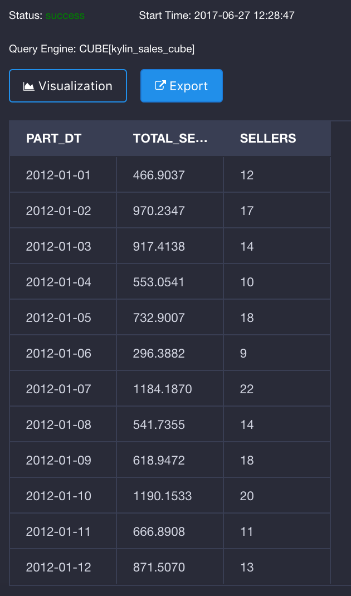

## Install Validation

KAP ships with sample data. It takes only a few minutes to create and build a sample cube, to validate the correctness of installation.

### Import Sample Data and Cube

`bin/sample.sh` will create five sample hive tables and import sample data. After the data uploaded into Hive, the sample project metadata will be imported also, which includes model and cube definition. 

```shell
cd kap-{version}-{hbase}
bin/sample.sh
```

After the successful execution, the log would be:

> Sample cube is created successfully in project 'learn_kylin'.
> Restart Kylin server or reload the metadata from web UI to see the change.

### Reload Metadata

On KAP web, under the **System** page, click `Reload Metadata` to refresh the sample project and cubes just created.

### Build Cube

On KAP web, select project *learn_kylin* in the project dropdown list (left upper corner). 



At the **Model** page, select the sample Cube *kylin_sales_cube*, click **Action -> Build**, pick up a end date later than **2014-01-01**(to cover all 10000 sample records), and submit the build job.



At the **Monitor** page, click *Refresh* to check the build progress, until 100%.

### Execute SQL

When the cube is built successfully, at the **Insight** page, three sample hive tables would be shown at the left panel. User could input query statements against these tables. For example: 

```sql
select part_dt, sum(price) as total_selled, count(distinct seller_id) as sellers from kylin_sales group by part_dt order by part_dt
```

The query result will be displayed at the **Insight** page also. User could check the query results between KAP and Hive, including accuracy and response time. 


