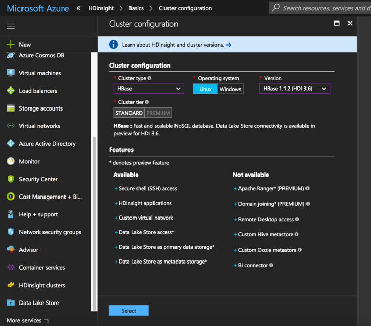
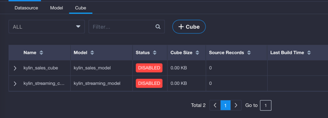
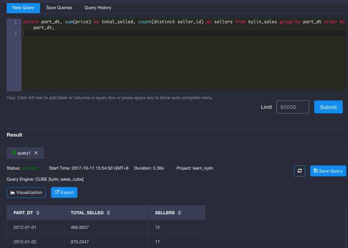
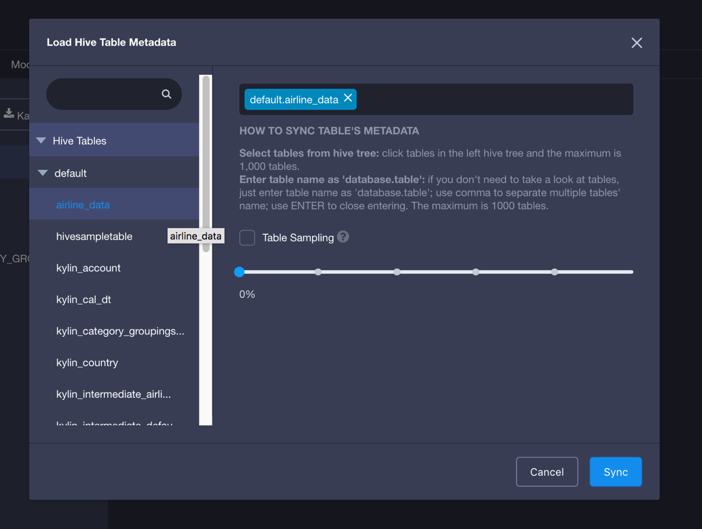
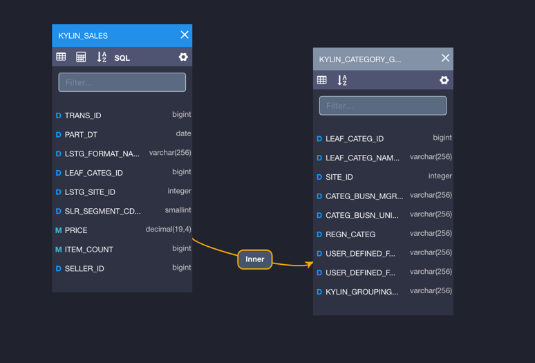
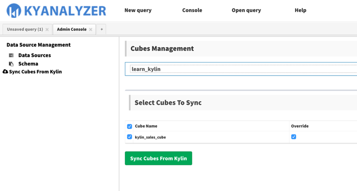
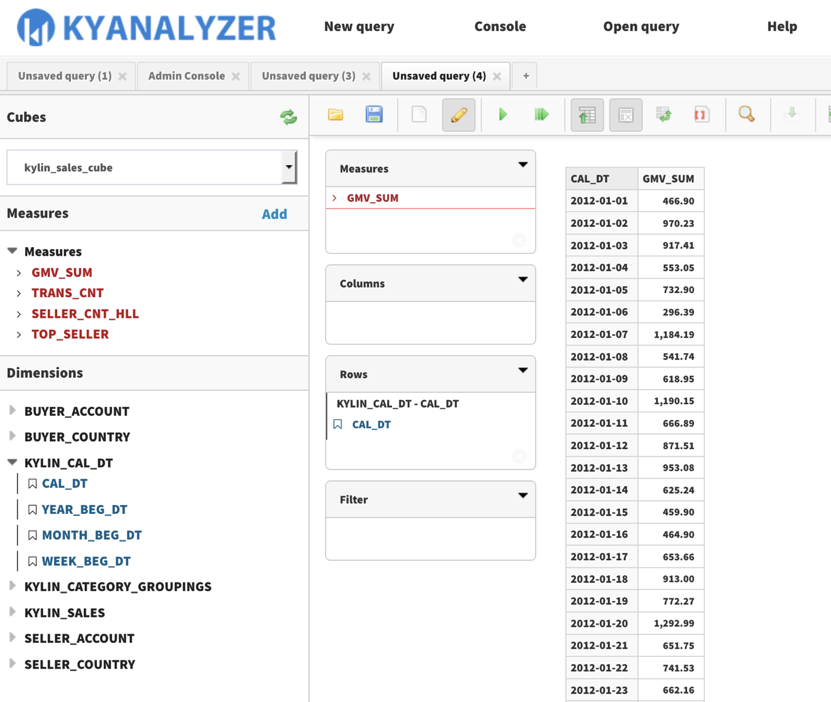
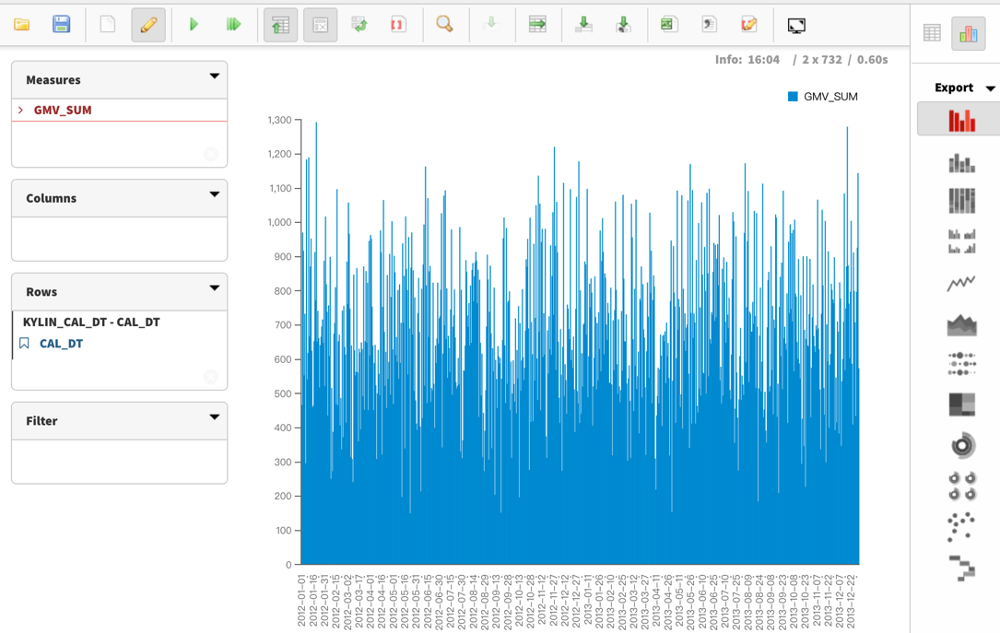

## Deployment on Microsoft Azure HDInsight

### **Azure HDInsight**

Backed by a 99.9% SLA, Microsoft Azure HDInsight is the only fully-managed cloud Apache Hadoop offering that gives you optimized open-source analytic clusters for Spark, Hive, MapReduce, HBase, Storm, Kafka, and Microsoft R Server. This architecture separates computing and storage, and since the data is persisted in Azure Blob Storage or Azure Data Lake, customers can easily start/stop and scale/shrink the cluster on demand without worrying about data loss. Azure Blob Storage and Azure Data Lake are highly available, highly scalable, high capable, HDFS compatible, low-cost storage services.

### **KAP on HDInsight**

With Azure HDInsight, you can easily deploy KAP in a few minutes. KAP can run on any node of the cluster, communicating with Hadoop services (Hive/YARN/MapReduce/HBase, etc.) via standard protocols. KAP automatically finds the services with the client configurations and then starts working. No additional installation/configuration is needed on Hadoop cluster. If you want to uninstall, a “kylin.sh stop” command shuts down KAP and releases all the resources from cluster.

HDInsight application platform is an easy way to distribute, discover, and install applications that you have built for the Hadoop ecosystem. HDInsight application platform automatically provisions an “Edge Node” for the application, and installs/configures the Hadoop clients on it. Developers only need to provide a shell script to install the application, and other processes are handled by Azure. This is a fancy feature that other Cloud-based Hadoop platform don’t have. This makes deploying KAP on HDInsight much easier and more efficient. Figure 1 shows the architecture of KAP with HDInsight.


By referring to the samples in Azure [Iaas-Applications](https://github.com/hdinsight/Iaas-Applications) project, we developed the first version of the Azure Resource Manager (ARM) template for KAP, and successfully deployed KAP on a cluster. After that, we continuously enhance the template and scripts to enable more features. Now, both KAP and KyAnalyzer, our agile BI tool, can be installed as HDInsight applications. Users can quickly get a Hadoop-based Data Warehouse + Business Intelligence tool in a couple of minutes.

Advanced users expect to optimize Hadoop and KAP to have better performance. With Apache Ambari as the centralized configuration management and monitoring platform, users can easily tune the HDInsight parameters and then sync them to all nodes. KAP reads the Hadoop configurations at runtime, so most of the Hadoop changes can take effective immediately without restarting KAP. For KAP/Kylin related configurations, users can log into the edge node with SSH, which is also easy to do.

### **How to Install KAP**

KAP is now available on Microsoft Azure. Our customers have already started to use KAP for their business. We, Kyligence Inc., are also using it in development, testing, training, live demo, prof of concept and other scenarios. To enable it, you just need a couple of steps:

1) You need to prepare a HDInsight cluster with the type of “HBase”. It can be an existing cluster or a new cluster.



2) If it is a new cluster, you need to switch to the “Custom” wizard, select “Kyligence Analytics Platform 2.5” in the third step, as below:


If it is an existing HBase cluster, you need to click the “Applications” icon, and then click “Add” button. In the application list, select “Kyligence Analytics Platform” to install. Clicking “Purchase” button means you agree with the terms to install. It won’t cause additional charge for KAP. You only need to pay for the Azure resources that you’re using.


3) After the cluster is created, you will get the KAP and KyAnalyzer URL from Azure Portal. Clicking them will lead you to the KAP web portal and KyAnalyzer web portal. You can also get the SSH endpoint of the Edge Node that running KAP, so that you can log in the Linux command line remotely.


### **Request Trial License and Login**

On the first time visiting, KAP will ask for a license. If you don’t have a license, you can easily request a free trial license here. Click ”Apply Evaluation License“, fill in your email address, organization name and person name, and then click ”Submit“. It will download a trial license immediately and then you can go ahead. After the trial expires (two months), you can contact Kyligence to purchase a formal license.


The initial administrator username is ”ADMIN“ and the password is ”KYLIN“. Enter it and then click ”Submit“ to login. At the first login, KAP will ask you to update the password to a stronger one. Please remember the new password for future login.

KyAnalyzer integrates with KAP for user authentication, so you just need to update the user in KAP once, and then use the same in KyAnalyzer.

### **Play with Sample Cube**

The installation will create a sample “kylin_sales_cube” (as well as sample tables in Apache Hive) in the “learn_kylin” project. In the left navigation, click ”Studio“ -> ”Cube“ then you will see the sample cube. It is in “DISABLED” status, you need build it before query. Click ”Actions“ -> ”Build“, and then pick an end date like ‘2014-01-01’, KAP will start a build job.



You can monitor the build progress on KAP’s  ”Monitor“ tab; After the build is finished (progress 100%), the Cube status is changed to “Ready”, that means you can query it with ANSI-SQL in the “Insight” page, e.g.:

```
select part_dt, sum(price) as total_selled, count(distinct seller_id) as sellers from kylin_sales group by part_dt order by part_dt;
```

KAP will return results quickly. You can run the same query in to compare the performance.



Now you know how to use KAP to accelerate your data analysis. But writing SQL is still troublesome for most users. You can use KyAnalyzer to analyze the data by drag-and-drop.

### **Import Data to KAP**

KAP supports Apache Hive and Apache Kafka as the data source. Hive is for batch processing; Kafka is for streaming processing.

To use your batch data in KAP, you need to describe your files as a Hive tables as the first step.  HDInsight supports using Azure Blob Store and Azure Data Lake as the storage for Hadoop, so you can easily manage and process the data on Cloud with high availability, long durability, and low-cost. Here is an example of uploading files to Azure Blob Store with command line:

```
export AZURE_STORAGE_ACCOUNT=<your storage account>
 export AZURE_STORAGE_ACCESS_KEY=<your storage account access key>
 
 # list all files in container
 azure storage blob list <container>
 # upload a file to container
 azure storage blob upload <path of a local file> <container> <name in container>
```

Although Azure Blob Store is not a real file system, it can use “/” as the separator in the file name to simulate the folder structures. The following command will upload the local file “airline_2015_01.csv” to container “mycontainer”, and use “airline/2015/airline_2015_01.csv” as the remote path:

```
azure storage blob upload airline_2015_01.csv mycontainer airline/2015/airline_2015_01.csv
```

Once the files be uploaded to Azure Blob Store, you can use HiveQL to create the table. You can do this in the “Hive view” of HDInsight Ambari, or use the Hive command line on a HDInsight node. Below is an example of creating a partitioned Hive table with CSV files from Azure Blob Store:

```
hive> CREATE EXTERNAL TABLE airline_data (
   Year int,  
   Quarter int, 
   Month int,  
   DayofMonth int, 
   DayOfWeek int, 
   FlightDate date, 
   ...
 ) 
 PARTITIONED BY (Part_year STRING)
 ROW FORMAT SERDE 'org.apache.hadoop.hive.serde2.OpenCSVSerde'
 WITH SERDEPROPERTIES ("separatorChar" = ",") 
 LOCATION 'wasb://<container>@<storage-account>.blob.core.windows.net/airline' 
 TBLPROPERTIES('serialization.null.format'='','skip.header.line.count'='1');
```

Then you can add partitions like this:

```
hive> ALTER TABLE airline_data ADD PARTITION (Part_year = '2015') location 'wasb://<container>@<storage-account>.blob.core.windows.net/airline/2015';
```

When the table created and has at least 1 partition, you can query it with SQL:

```
hive> select * from airline_data limit 100;
```

Now you have successfully created a Hive table with your data files on Azure cloud storage. You can login KAP web GUI, in the ”Studio“ -> ”Datasource“ page, click the ”Hive“ button to import table metadata into KAP:



The import only synchronizes the table metadata, like column name. The source data is still in origin place, so this operation will be fast.

To use Apache Kafka as the data source, you need have a running Kafka cluster (v0.10+), which can be connected from the HDInsight cluster that running KAP. That means your Kafka brokers need have public network address, or they are in the same v-net with KAP. With this pre-requisite matched, you can follow the “Streaming Cube” tutorial on KAP manual to create the cube.

**Create Model and Cube**

With all necessary tables being imported, you can start to define your data model. The model is a basis for Cube, and it can be reused by multiple Cubes. In the ”Studio“ tab, click ”+Model“, enter the name, and then drag and drop the tables to the model designer canvas.

On each table, click the ”setting“ icon and then mark it as “Fact table” or “Lookup table”. The fact table will be highlighted in blue. You can link two tables by draging one column from fact table to another to setup the FK/PK relationship.

KAP will automatically detect columns’ type and then determine it is a dimension, measure or none, with “D”, “M” or “-” as the prefix. If it is not accurate, you can click on the prefix to modify.



Once finished, click “Save” to save the data model. KAP will automatically to run a job to check and collect statistics of the model. You can track the job progress in the “Monitor” tab. The statistic will help KAP to understand the model and give you advices when creating Cube.

Now you can create a Cube. Cube is a data structure which has dimensions and measures. KAP supports tens of dimensions in a Cube, and you can define the most common measures like SUM, COUNT, MAX, MIN, DISTINCT COUNT and some others. Click the “+Cube”, a wizard will guide you to finish these step by step.


### **Build Cube**

After the Cube is created, you need to build data into it. In the Cube list, click “Action” -> “Build”. If your data model is partitioned, you need to specify a date range for the source data; otherwise it will build on a full data set.


When trigger a Cube build, a job is created and you can monitor the progress in the “Monitor” page. The build can take a couple of minutes to several hours, which depends on your data size and cluster capacity. You can expand the job to see each steps. If a step is a MR job, it shows the link to job on Hadoop resource manager, where you can track the detail progress. Once the build is finished, the Cube status will be changed to “Ready” automatically, which means it can serve your queries.

### **Run Queries**

Click the “Insight” tab, you can compose a SQL query and then click “Submit”. The query will be served with Cube; and you can preview the result in the web page.

### **Use KyAnalyzer for Agile BI**

Log in KyAnalyzer with the same user as KAP, in the ” Console” page, click “Sync Cubes from Kylin”, select the “kylin_sales_cube” to sync. The Cube will be imported to KyAnalyzer.



Click the “New query” to open a new page, click the refresh button beside “Cubes” to see the new loaded model, select “kylin_sales” in the dropdown list. Now you see the measures and dimensions. Click one measure and one dimension, it will query the data and generate a data table.



By clicking the “Chart Mode” icon in the upper right corner, KyAnalyzer will generate diagram based on the table, as below shows. Isn’t it easy?



Congratulations! You have built your first Cube and created the first chart by drag-and-drop. You can also integrate KAP with more visualization tools like Tableau, PowerBI/Excel. For detailed information, please refer to related pages in the chapter of **Integrate with the 3rd party**.

### **Kafka on HDInsight Integration**

Apache Kafka is a popular open-source stream-ingestion broker. It can handle large numbers of reads and writes per second from thousands of clients. KAP supports using Apache Kafka (v0.10+) as the data source. You can flow your data to Kafka topics continuously, and then build data into Cube with incremental build jobs. With this integration, it can decrease the data latency from days/hours to minutes level.

Kafka on HDInsight provides you with a managed, highly scalable, and highly available service in the Azure cloud. You can create a Kafka cluster from Azure portal quickly. To ensure the Kafka version in KAP node is compatible with the Kafka cluster, we recommend you use the same HDInsight version. Otherwise, you need to manually download and install the matched version of Kafka in KAP instance.

HDInsight does not allow to directly connect to Kafka over the public internet. In order to connect with Kafka from KAP, you need to make these two clusters share the same V-Net, or use VPN solution. The former should be the simplest way, you can use it for a new cluster.

By default, KAP doesn’t have Kafka client shipped; so you will get a “ClassNotFoundException” error when connecting to a Kafka cluster. To fix this, you need SSH into the KAP node, manually specify KAFKA_HOME environment variable in KYLIN_HOME/bin/find-kafka-dependency.sh:

```
ssh sshuser@KAP.CLUSTERNAME-ssh.azurehdinsight.net

sudo vi /usr/local/kap/bin/setenv.sh
```

In the beginning position, add (remember to update the HDP version):

```
export KAFKA_HOME=/usr/hdp/2.5.5.3-2/kafka
```

Then you can verify whether it can find the dependent jar successfully, such as:

```
 sshuser@ed10-kapdem:~$ /usr/local/kap/bin/find-kafka-dependency.sh -v

Turn on verbose mode.

Retrieving kafka dependency...

KAFKA_HOME is set to: /usr/hdp/2.5.5.3-2/kafka, use it to locate kafka dependencies.

kafka dependency: /usr/hdp/2.5.5.3-2/kafka/libs/kafka-clients-0.10.0.2.5.5.3-2.jar
```

If OK, then restart KAP service to take effective:

```
sudo systemctl restart kap
```

When KAP is restarted, go back to the “Studio” -> “Datasource” page, click “Kafka” button, input the Kafka broker host and port info. Then KAP will connect to Kafka, list the topics and then show sample messages, as shown in Figure 16.


**Practices of KAP on HDInsight**

Here are some practices that can help you in using this solution better.

**1. Use dedicated virtual network for HDInsight**

If not specified, Azure will use a default virtual network for each HDInsight cluster. The default virtual network is invisible in Azure portal; so once the cluster being created, you couldn’t add other instances to it nor customize its network firewall. In order to keep the flexibility for future, we recommend you create a dedicated virtual network and then use it for the new HDInsight. The virtual network needs to be associated with a network security group, which needs to allow the connections for HDInsight required hosts and ports. You can check HDInsight documentation for the details.

**2. Optimize Hadoop settings**

The default Hadoop settings of HDInsight might not be the best for KAP. They may allocate much resources to HBase but leave less for MapReduce. Besides, as the Cubes are immutable in HBase, we can allocate more resource to block cache to gain better read performance. You can optimize these settings in the HDInsight dashboard (Ambari Web UI). Here are some recommended settings:


After update these parameters, remember to sync the changes to cluster nodes and then restart the services to take effective.

**3. Use multiple storage accounts**

Using multiple storage accounts will better leverage the network bandwidth, so as to improve the performance. You can use separated storage accounts for the source Hive tables.

**4. Scale and shrink on demand**

With data in Azure Blob Store or Azure Data Lake, you can easily scale and shrink the cluster without worrying about data loss. For example, when you build a big Cube, you can scale out it to get more concurrencies. After the build is finished, you can shrink it back to save the cost.

**5. Shutdown and bring back**

KAP uses HBase to store the Cube metadata and Cube data. With the Hadoop/HBase data persisted in Azure Blob Store or Azure Data Lake at a very low cost, you can safely delete the cluster when you don’t need it, and someday when you need, bring it back by re-creating the cluster with the same storage account and container. The Cubes that you built previously will be working for you as before. This will be great if it is a low frequent usage scenario.

While there are still some other data you may need to take a manual backup:

- KAP/KyAnalyzer configurations and logs

KAP configurations (as well as shell scripts) are local files on the edge node. If you have made some local changes and want to keep after re-creation, a backup is needed. You can use “Hadoop fs -put” command to easily upload the files to distributed file system, which is the Azure Blob Store or Azure Data Lake.

- Hive metadata

Hive metadata is persisted in a SQL database, not Azure Blob Store or Azure Data Lake. So if you select to use an external SQL service, that would be good. Otherwise when re-creating Cluster, you may lose the Hive metadata. So you’d better backup the Hive scripts or select to use an Azure SQL service as Hive metadata store when creating HDInsight.

**6. Start/stop KAP and KyAnalyzer**

- KAP and KyAnalyzer are installed in the HDInsight edge node. You need SSH into it with the ssh user and credential that configured for the cluster:

```
ssh sshuser@KAP.CLUSTERNAME-ssh.azurehdinsight.net
```

Replace the “CLUSTERNAME” with your cluster name.

- KAP and KyAnalyzer are installed in “/usr/local/kap” (KYLIN_HOME) and “/usr/local/kyanalyzer” (KYANALYZER_HOME). You can check the scripts, configurations and log files there. For example:

```
tail -200f /usr/local/kap/logs/kylin.log

tail -200f /usr/local/kyanalyzer/tomcat/logs/kyanalyzer.log
```

- KAP and KyAnalyzer are registered as system services. You can manually start, stop them with systemctl command. For example:

```
sudo systemctl status kap

sudo systemctl stop kap 

sudo systemctl start kap
```

For KyAnalyzer, change to “kyanalyzer” as the service name.

