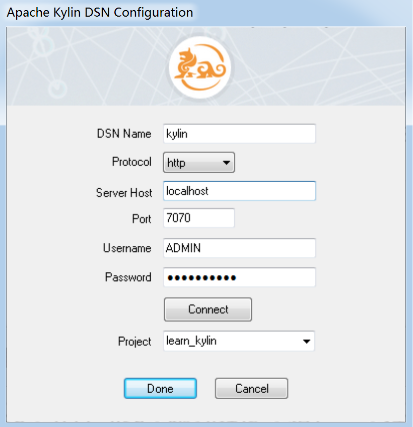
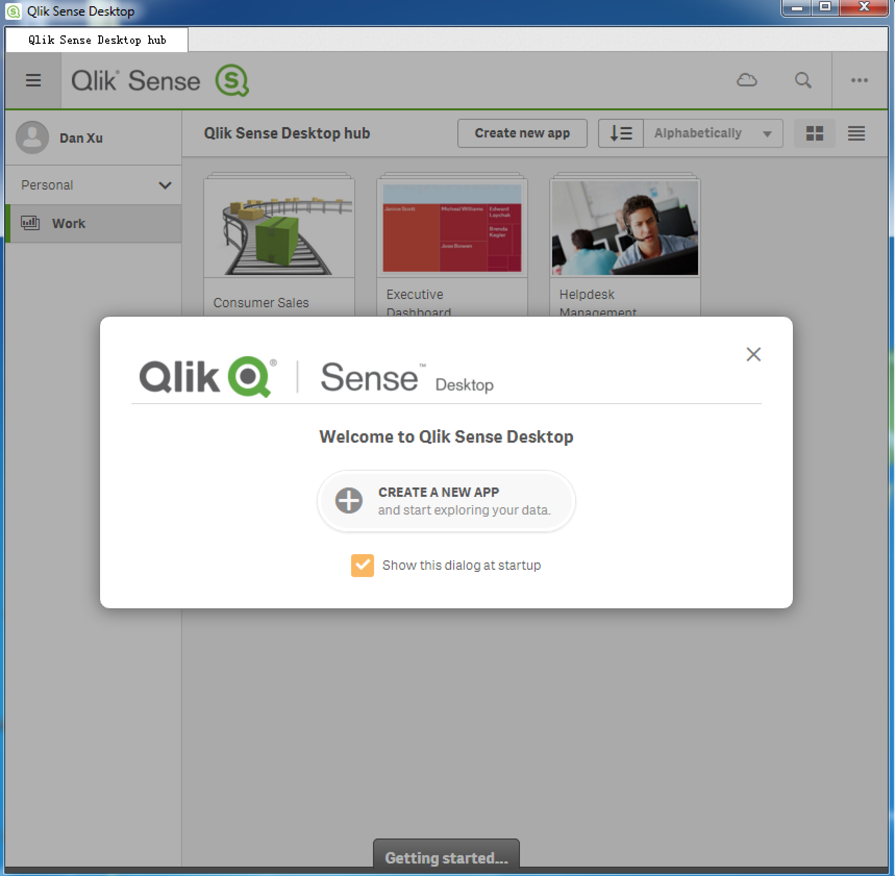
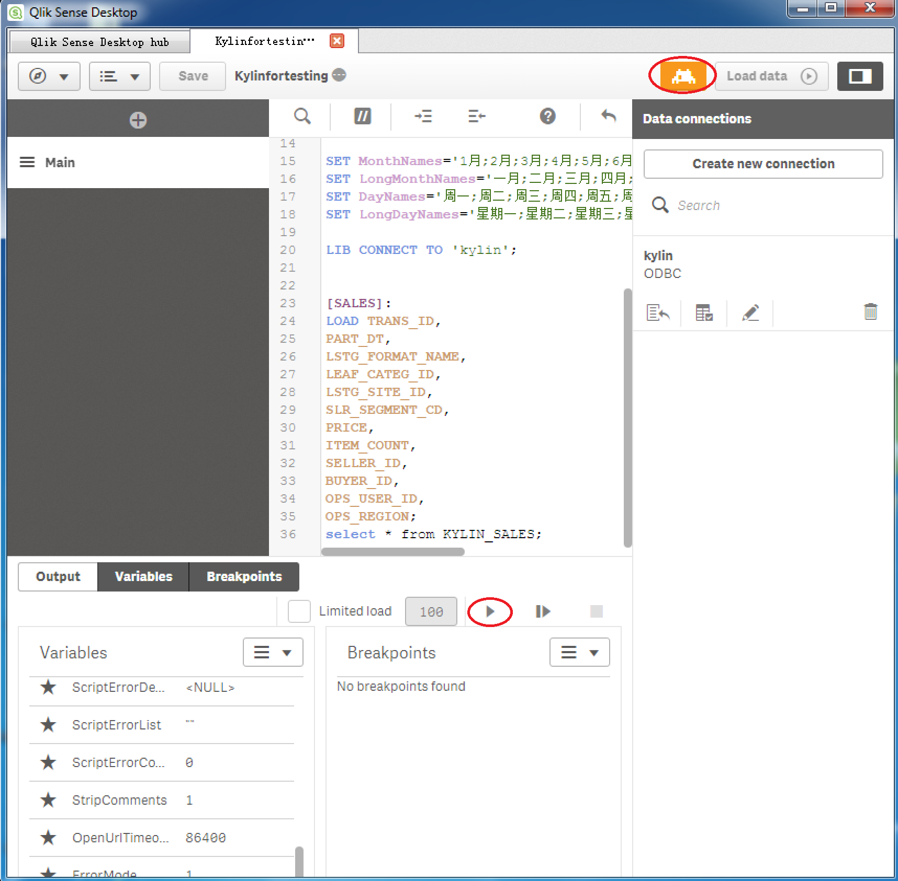

## Integration with Qlik

Qlik delivers intuitive platform solutions for self-service data visualization, guided analytics applications, embedded analytics and reporting. It is a new player in the Business Intelligence (BI) tools world, with a high growth since 2013. It has connectors with Hadoop Database (Hive and Impala). Now it can integrate with KAP. This article will guide you through the process of connecting KAP with Qlik.  

### Pre-requisites

Before integrating with Qlik, please make sure to download and install the following required applications. If you already installed Kylin ODBC Driver in your machine, please uninstall it first.

- [Kylin ODBC](http://kylin.apache.org/docs15/tutorial/odbc.html) 
- [Qlik Desktop](http://www.qlik.com/us/try-or-buy/download-qlikview) 

You may find the detailed installation and configuration guides as below.

#### Configure Local DSN

Please refer to the guide in the page of [ODBC Driver](http://docs.kyligence.io/v2.5/en/driver/odbc.en.html) to install and configure your local DSN. After going through the steps in this page, you will see the pup-up dialog **Apache Kylin DSN Configuration** as blow, please select the project of **learn_kylin**, then click **Done**.

#### Install Qlik

For the installation of Qlik, please visit [Qlik Sense Desktop download](https://www.qlik.com/us/try-or-buy/download-qlik-sense).

### Connection with Qlik
After configuring your Local DSN and installing Qlik successfully, you may go through the following steps to connect Kylin with Qlik.

1. From Windows Desktop Shortcut or click **Start -> All Applications -> Qlik Sense -> Qlik Sense Desktop** to open the application **Qlik Sense Desktop**.

2. Input your Qlik account to login, then the following dialog will pop up. Click **Create New Application**.

You may specify any name different from existing applications and then open this application. In this example, we name it as “Kylinfortesting".

3. There are two choices in the Application View. Please select the bottom **Script Editor**.

The Kylinfortesting | Data Load Editor window shows. Click **Create New Connection** in the upper right of this page.

Select **ODBC -> kylin**, ignore the account information, and then click **Create**. 

4. Change the default scripts of "TimeFormat", "DateFormat" and "TimestampFormat" to:

`SET TimeFormat='h:mm:ss';`
`SET DateFormat='YYYY-MM-DD';`
`SET TimestampFormat='YYYY-MM-DD h:mm:ss[.fff]';`

5. Load columns from KAP to Qlik:

As we have logged in KAP and select the project **learn_kylin** during local DSN configuration, currently we only need to new a query **select * from KYLIN_SALES** in KAP.

Export the query results and copy them to the script editor in Qlik Sense Desktop with comma as delimiter. 

In the running result, the line count shall be the same as in KAP. In this case, the line count is 10,000.

6. Load data to Qlik:

After the scripts run successfully, click **Load Data** in the upper right of the window Kylinfortesting | Data Load Editor. And then open **Data Manager**.

Now Data manager opens. Click **Load Data** in the upper right of this page, and click **Edit worksheet** once data loaded.

Select the charts you need, then add dimension and measurement based on your requirements. 

You will get your worksheet and the connection is complete. Your KAP data shows in Qlik now.

