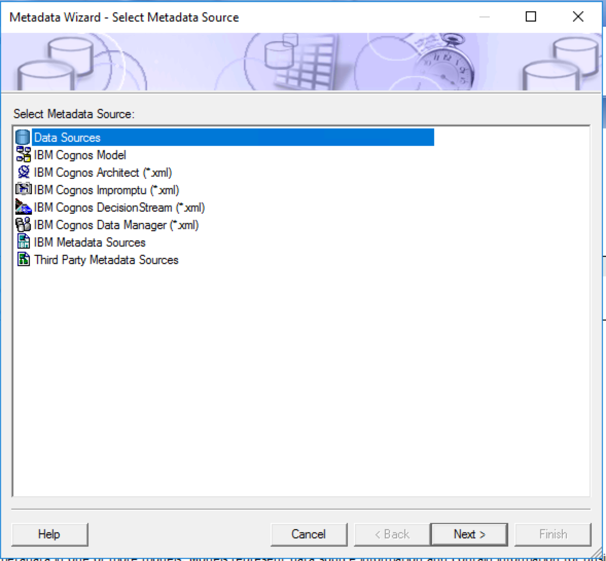
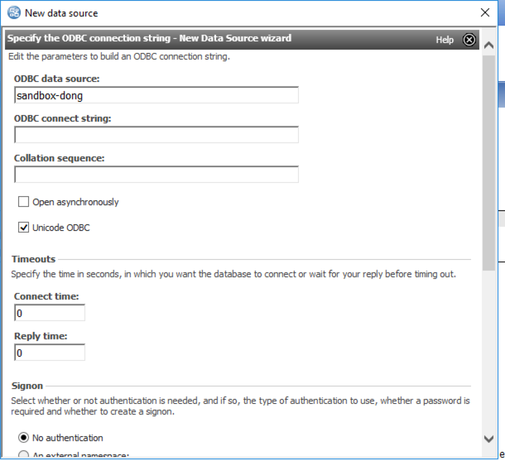
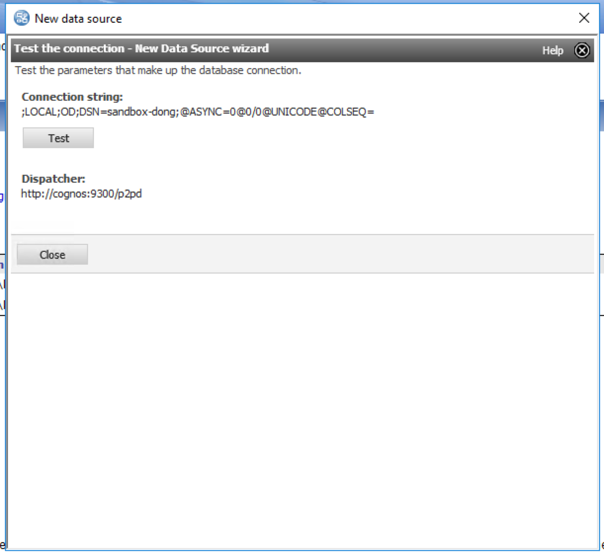
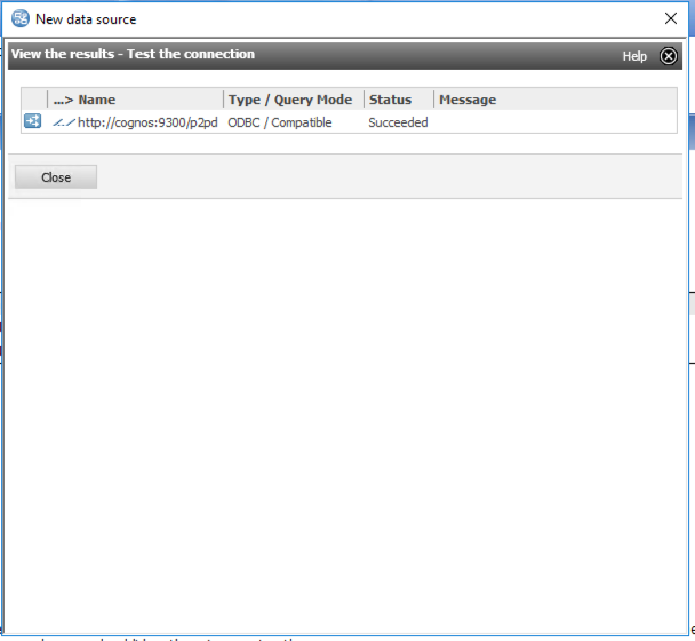
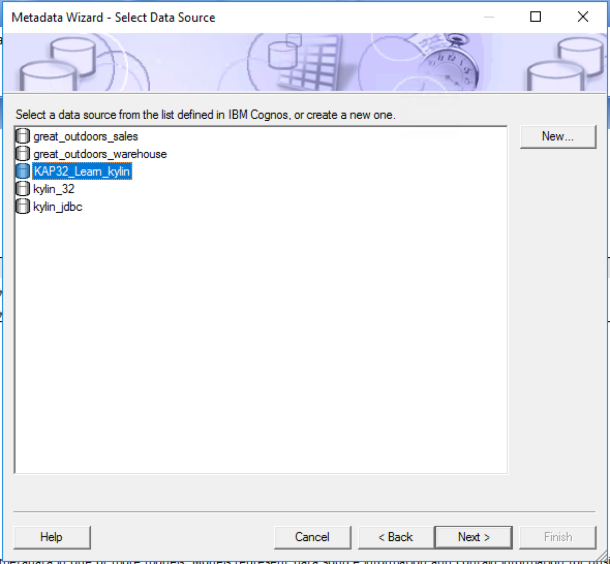
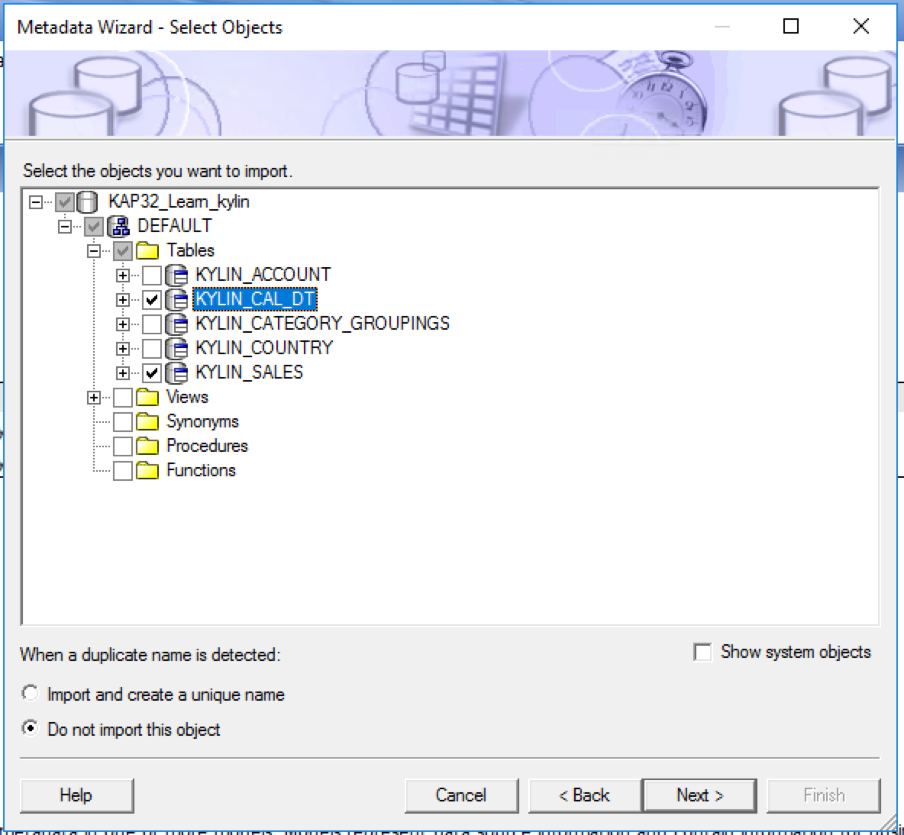

## Integration with Cognos 10.X

### Install ODBC Driver

Refer to this guide : [Kylin ODBC Driver Tutorial](../driver/odbc.en.md).

Please make sure to download and install Kylin ODBC Driver v1.6 64 bit or above. If you already installed Kylin ODBC Driver in your system, please uninstall it first.  

The kylin ODBC driver needs to be installed in the machine or virtual environment where your Cognos Server is installed.

### Create Local DSN

Open your window ODBC Data Source Administrator and create a system DSN that point to your KAP instance.

### Create a Data Sourcein Cognos

Depending on your business scenario, you may need to create a new project or simply use existing project to create data source for KAP. In the example, we will start with a new project. 

Next, create a new Data Sources

In the New Data Source Wizard, first fill in data source name, this could be any name you prefer.

In next step, choose `ODBC` as the connection type. For Isolation Level, choose `Use the default object geteway`  

Next in ODBC data source, fill in the DSN name that you created in the previous step.

Check `Unicode ODBC`. For Signon `choose no authorization`.

Then Click `Test the connection`.

If everything set up properly, test the connection will finish successfully.

Now you have the data source created.

###Test Connection

Next you may test the connection with tables.

