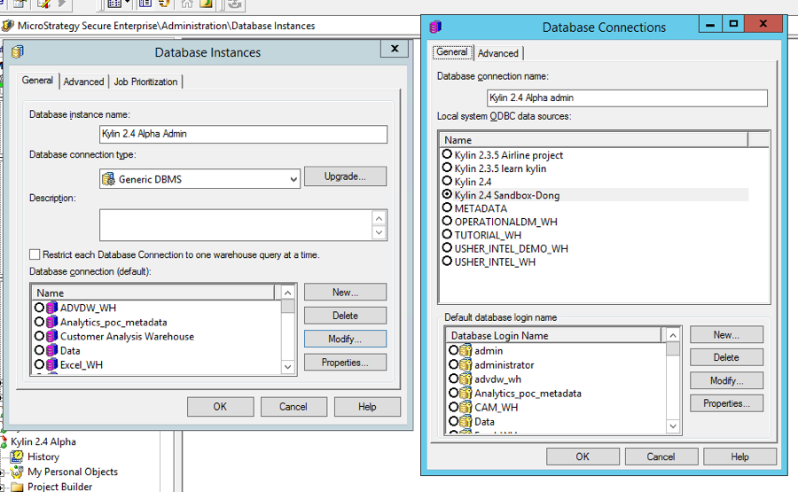
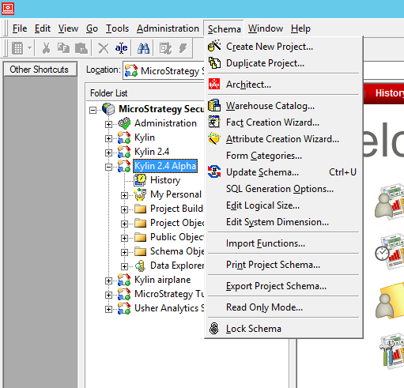
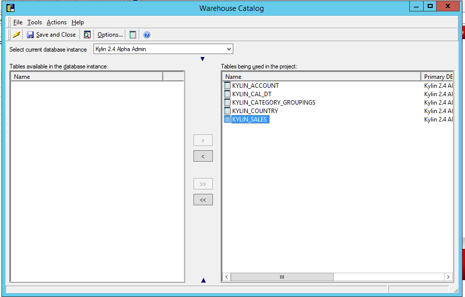

## Integration with MicroStrategy 10.X

### Install ODBC Driver

Refer to this guide : [Kylin ODBC Driver Tutorial](../driver/odbc.en.md).

Please make sure to download and install Kylin ODBC Driver v1.6. If you already installed ODBC Driver in your system, please uninstall it first.  

The kylin ODBC driver needs to be installed in the machine or virtual environment where your Microstrategy Intelligenec Server is installed. 

### Connect to Kylin Server

Connect Kylin using ODBC driver: open your MicroStrategy Developer and connect to the project source where your are going to connect Kylin data source using a user account with administrative privilege. 

Once logged in, go to Administration -> Configuration manager -> Database Instance, create a new database instance with local ODBC connection that you created in the previous step. Under database connection type, please choose Generic DBMS.

### Setting Database instance

Depending on your business scenario, you may need to create a new project and set kylin database instance as your primary database instance or if there is an existing project, set kylin database instance as one of your primary or non-primary database instance. You can achieve this by right click on your project, and go to project configuration -> database instance. 

### Import logical table

Open up your project, go to schema menu -> warehouse catalog to import the tables your need. 

### Building Schema and Public Objects

Create Attribute, Facts and Metric objects

 

### Create a Simple Report

Now you can start creating reports with Kylin as Data source.

### Best Practice for connecting MicroStrategy to Kylin datasource

1. Kylin does not work with multiple SQL passes at the moment, so it is recommended to set up your report intermediate table type as derived, you can change this setting at report level using Data-> VLDB property-> Tables-> Intermediate Table Type

2. Avoid using below functionality in MicroStrategy as it will generate multiple sql passes that can not be bypassed by VLDB property:

   ​	Creation of datamarts

   ​	Query partitioned tables

   ​	Reports with custom groups

   ​	Reports with percentage ranking

3. Dimension named with kylin reserved word will cause sql to error out. You may find kylin reserved word here: [https://calcite.apache.org/docs/reference.html#keywords](https://calcite.apache.org/docs/reference.html#keywords)

4. If underlying Kylin data model has left join from fact table to lookup table, In order for Microstrategy to also generate the same left join in sql, please follow below MicroStrategy TN to modify VLDB property:

   [https://community.microstrategy.com/s/article/ka1440000009GrQAAU/KB17514-Using-the-Preserve-all-final-pass-result-elements-VLDB](https://community.microstrategy.com/s/article/ka1440000009GrQAAU/KB17514-Using-the-Preserve-all-final-pass-result-elements-VLDB)

