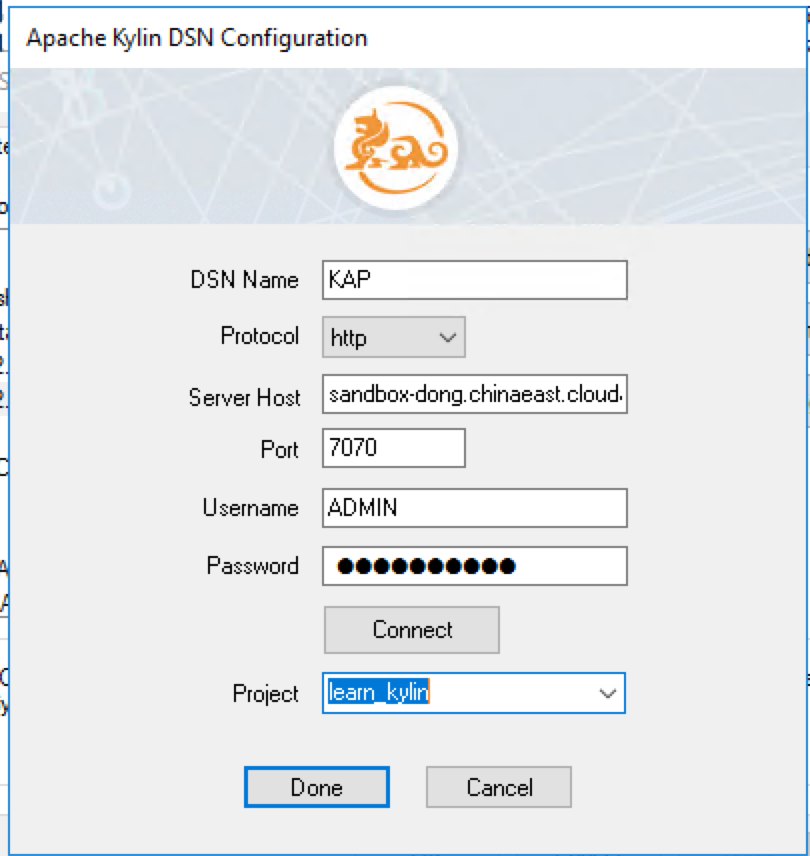

## Integration with MicroStrategy 10.X

### Install ODBC Driver

Refer to this guide : [Kylin ODBC Driver Tutorial](../driver/odbc.en.md).

Please make sure to download and install Kylin ODBC Driver v1.6 64 bit or above. If you already installed Kylin ODBC Driver in your system, please uninstall it first.  

The Kylin ODBC driver needs to be installed in the machine or virtual environment where your Microstrategy Intelligenec Server is installed. 

### Create Local DSN

Open your window ODBC Data Source Administrator (64bit) and create a system DSN that point to your KAP instance. 

### Setting Database Instance in MicroStrategy

Open your MicroStrategy Developer and connect to the project source where your are going to connect Kylin data source using a user account with administrative privilege. 

Once logged in, go to Administration -> Configuration manager -> Database Instance, create a new database instance with local ODBC connection that you created in the previous step. Under database connection type, please choose Generic DBMS.

Depending on your business scenario, you may need to create a new project and set Kylin database instance as your primary database instance or if there is an existing project, set Kylin database instance as one of your primary or non-primary database instance. You can achieve this by right click on your project, and go to project configuration -> database instance. 

### Import Logical Table

Open up your project, go to schema menu -> warehouse catalog to import the tables your need. 

**NOTE: Microstrategy will send query "select \* from fact\_table" and it'll take a long time if the table size is extremely large. To work around the issue please refer to [Configuration](../config/basic_settings.en.md#kylinqueryforce-limit)**

### Build Schema Objects and Public Objects

Create Attribute, Facts and Metric objects

 

### Create a Simple Report

Now you can start creating reports with Kylin as Data source.

### Best Practice for Connecting MicroStrategy to KAP

1. Before KAP 2.4.5, multiple SQL passes will not work in KAP, so it is recommended to set up your report intermediate table type as derived, you can change this setting at report level using Data-> VLDB property-> Tables-> Intermediate Table Type

2. Avoid using below functionality in MicroStrategy as it will generate multiple sql passes that can not be bypassed by VLDB property:

   ​	Creation of datamarts

   ​	Query partitioned tables

   ​	Reports with custom groups

   Note that in KAP 2.4.5 and above, user may rely on underlying SQL on hadoop engine to process multiple SQL passes or temporary table, if query pushdown is enabled in KAP. 

3. Dimension named with Kylin reserved word will cause sql to error out. You may find Kylin reserved word here: [https://calcite.apache.org/docs/reference.html#keywords](https://calcite.apache.org/docs/reference.html#keywords)

4. If underlying Kylin data model has left join from fact table to lookup table, in order for Microstrategy to also generate the same left join in sql, please follow below MicroStrategy TN to modify VLDB property:

   [https://community.microstrategy.com/s/article/ka1440000009GrQAAU/KB17514-Using-the-Preserve-all-final-pass-result-elements-VLDB](https://community.microstrategy.com/s/article/ka1440000009GrQAAU/KB17514-Using-the-Preserve-all-final-pass-result-elements-VLDB)

5. By default, MicroStrategy generate SQL query with date filter in a format like 'mm/dd/yyyy'. This format might be different from Kylin's date format, if so, query will error out. You may refer to this article to change the setting in MicroStrategy so that date format MicroStrategy generated will be consistent with KAP: 

   https://kyligence.zendesk.com/hc/en-us/articles/115001690433-Modify-MicroStrategy-query-date-format-to-be-consitent-with-KAP