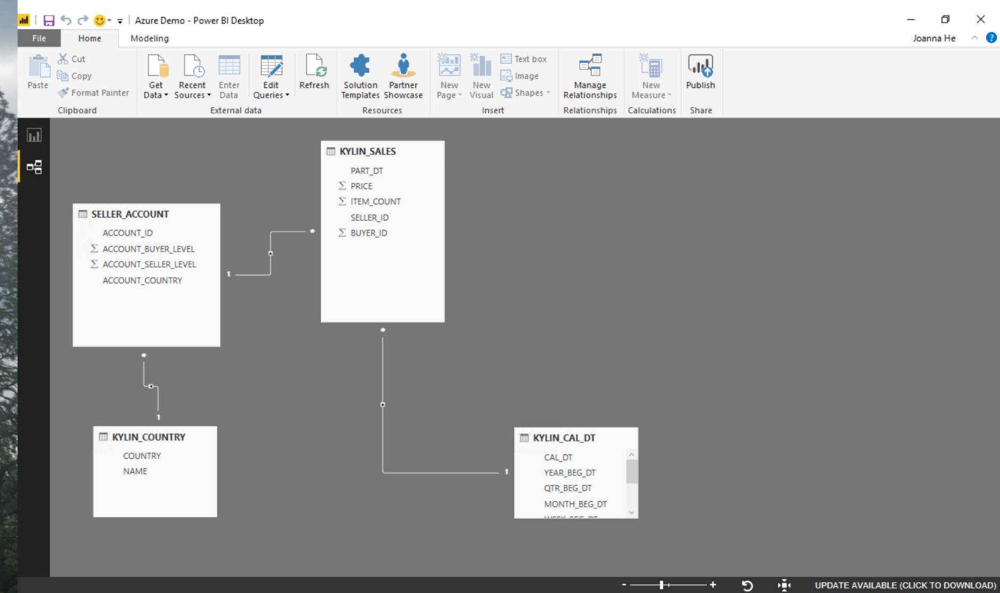
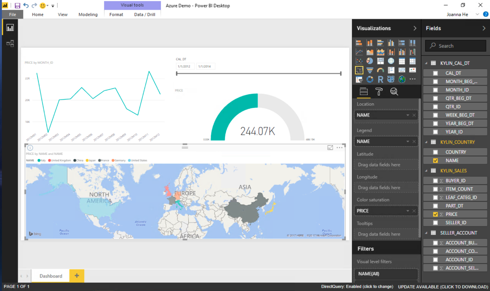

## Power BI Desktop Integration

Microsoft Power BI Desktop is a professional business intelligence analysis tool providing rich functionality and experience for data visualization and processing to user.

### Install Kyligence ODBC Driver
For the installation information, please refer to [Kyligence ODBC Driver tutorial](../driver/kyligence-odbc.en.md).

### Install Power BI DirectQuery plugin
1.  Download KAP Power BI DirectQuery plugin from [Kyligence Account Page](http://account.kyligence.io).

2.  Copy the plugin file (.mez) of DirectQuery to the folder *C:\Users\<user_name>\Documents\Microsoft Power BI Desktop\Custom Connectors*. If this folder does not exist, please create one.

3.  In Power BI Desktop, open **Options** under **Options and settings**.

4.  Click **Preview features** and then check the box **Custom data connectors**.

    

5.  Restart Power BI Desktop.

### Connect KAP through Power BI Desktop

1.  Start the installed Power BI Desktop, click **Get data -> more**, and then click **Database -> Kyligence Analytics Platform**.

     

2.  In the pop-up window, type the required database information, and select **DirectQuery** as Data Connectivity mode.
     

3.  Type user name and password to connect KAP

     

4.  After connecting successfully, Power BI will list all the tables in the project. You may select the tables based on your requirements.
     

5.  Model the tables which need to be connected.

     

6.  Return to the report page and start visualization analysis.

     