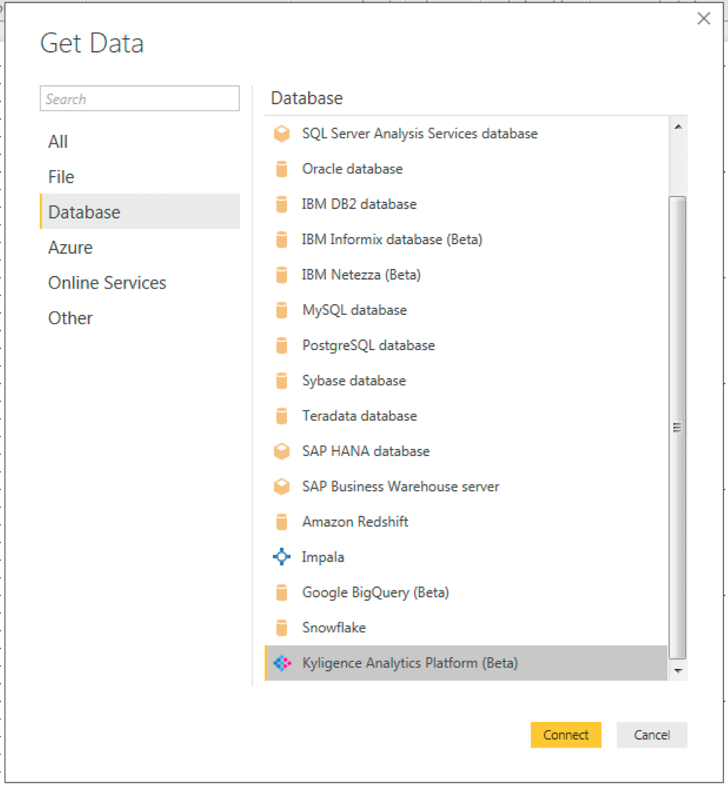
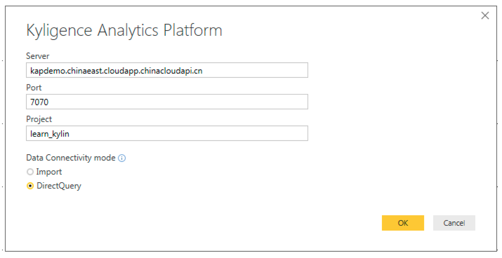

## Excel & PowerBI Integration

Microsoft Excel is one of the most famous data tool on Windows platform, and has plenty of data analyzing functions. With Power Query installed as plug-in, excel can easily read data from ODBC data source and fill spreadsheets. 

Microsoft Power BI is a business intelligence tool providing rich functionality and experience for data visualization and processing to user.

> Power BI and Excel do not support "connect live" model for other ODBC driver yet, please pay attention when you query on huge dataset, it may pull too many data into your client which will take a while even fail at the end.

### Install ODBC Driver
Refer to this guide: [Kylin ODBC Driver Tutorial](./odbc.html).
Please make sure to download and install Kylin ODBC Driver __v1.5__. If you already installed ODBC Driver in your system, please uninstall it first. 

### KAP and Excel
1. Download Power Query from Microsoft’s Website and install it. Then run Excel, switch to `Power Query` fast tab, click `From Other Sources` dropdown list, and select `ODBC` item.
   

2. You’ll see `From ODBC` dialog, just type Database Connection String of KAP Server in the `Connection String` textbox. Optionally you can type a SQL statement in `SQL statement` textbox. Click `OK`, result set will run to your spreadsheet now.
   

> Tips: In order to simplify the Database Connection String, DSN is recommended, which can shorten the Connection String like `DSN=[YOUR_DSN_NAME]`. Details about DSN, refer to [https://support.microsoft.com/en-us/kb/305599](https://support.microsoft.com/en-us/kb/305599).

3. If you didn’t input the SQL statement in last step, Power Query will list all tables in the project, which means you can load data from the whole table. But, since KAP cannot query on raw data currently, this function may be limited.
   

4. Hold on for a while, the data is lying in Excel now.
   

5. If you want to sync data with KAP Server, just right click the data source in right panel, and select `Refresh`, then you’ll see the latest data.

6. To improve data loading performance, you can enable `Fast data load` in Power Query, but this will make your UI unresponsive for a while. 

### Power BI
1.  Run Power BI Desktop, and click `Get Data` button, then select `ODBC` as data source type.
    
2.  Same with Excel, just type Database Connection String of KAP Server in the `Connection String` textbox, and optionally type a SQL statement in `SQL statement` textbox. Click `OK`, the result set will come to Power BI as a new data source query.
    
3.  If you didn’t input the SQL statement in last step, Power BI will list all tables in the project, which means you can load data from the whole table. But, since KAP
4.   cannot query on raw data currently, this function may be limited.
    
5.  Now you can start to enjoy analyzing with Power BI.
    
6.  To reload the data and redraw the charts, just click `Refresh` button in `Home` fast tab.

