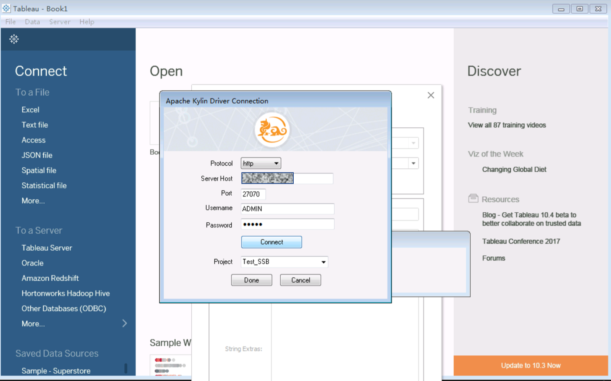
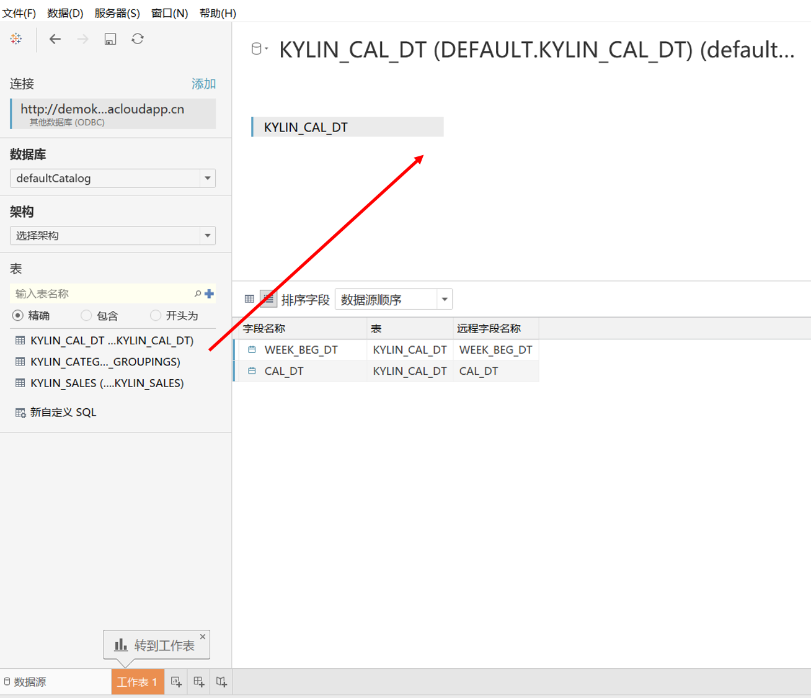
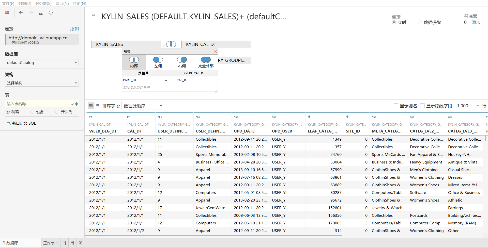
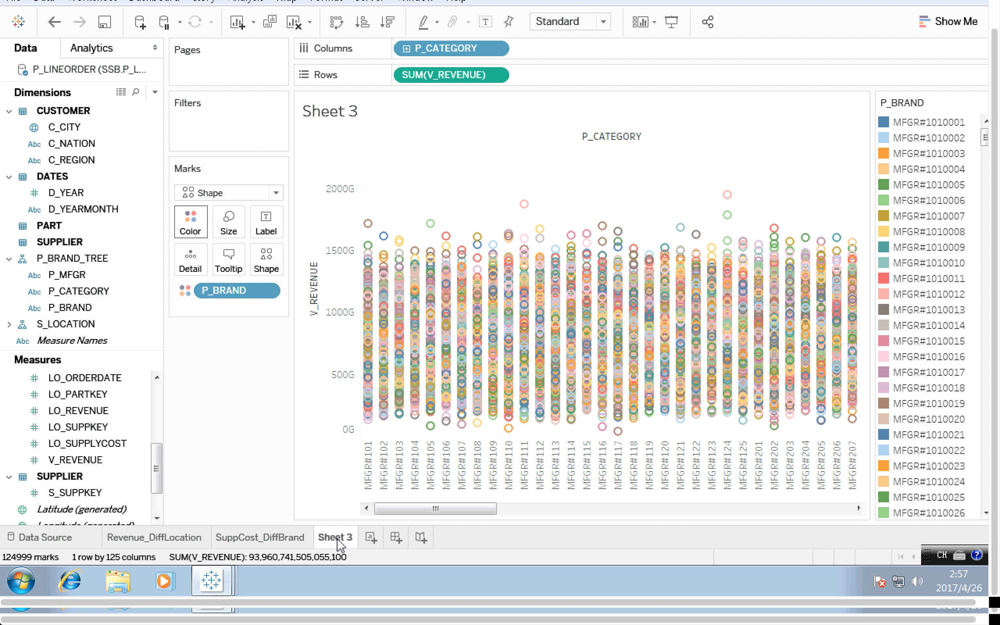

## Tableau 10.x 集成

### 安装 ODBC Driver
参考页面[KAP ODBC 驱动程序教程](../driver/odbc.cn.html)KAP ODBC Driver __v1.5__。如果你安装有早前版本，请卸载后再安装。 

### 连接 KAP Server
在Tableau 10.1创建新的数据连接，单击左侧面板中的`其他数据库(ODBC)`，并在弹出窗口中选择`KylinODBCDriver` 

输入你的服务器地址、端口、项目、用户名和密码，点击`Connect`可获取有权限访问的所有项目列表。

### 映射数据模型
在左侧的列表中，选择数据库`defaultCatalog`并单击”搜索“按钮，将列出所有可查询的表。用鼠标把表拖拽到右侧区域，就可以添加表作为数据源，并创建好表与表的连接关系（映射信息如图）。

### 保持数据实时性

Tableau 10.1中有两种数据源连接类型，选择 `连接`选项以确保使用`实时`模式。

### 自定义SQL
如果需要使用自定义SQL，可以单击左侧`自定义SQL`并在弹窗中输入SQL语句，就可添加为数据源。

### 可视化
现在你可以进一步使用Tableau进行可视化分析。

### 发布到Tableau服务器
如果希望发布到Tableau服务器, 点击`服务器`菜单并选择`发布工作簿`。

