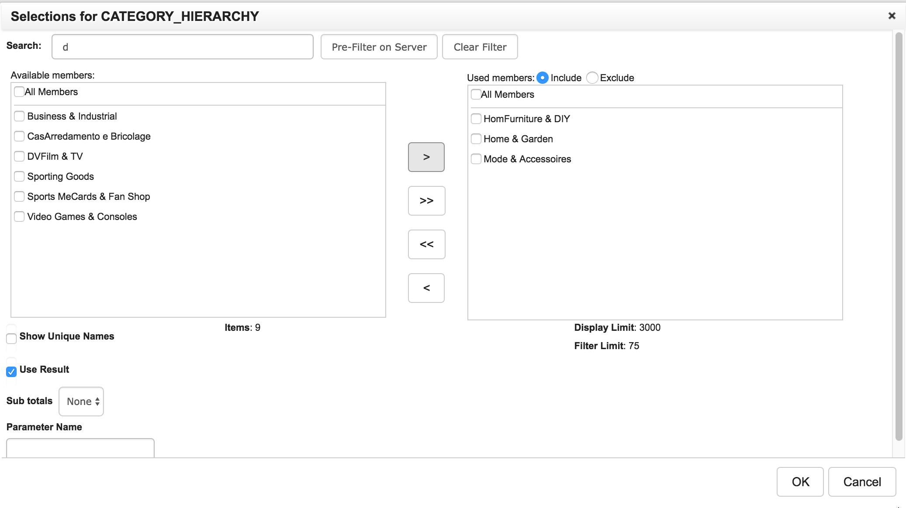
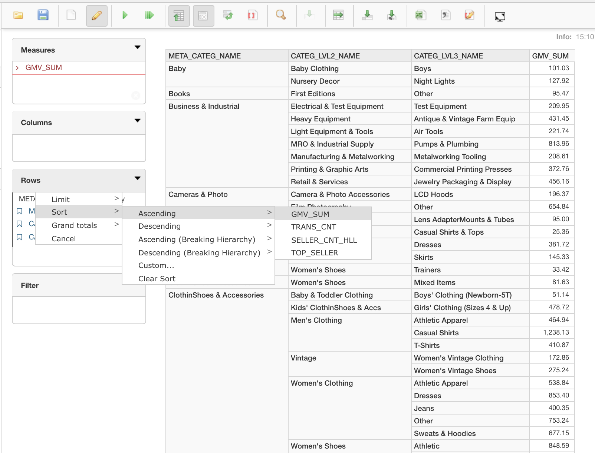
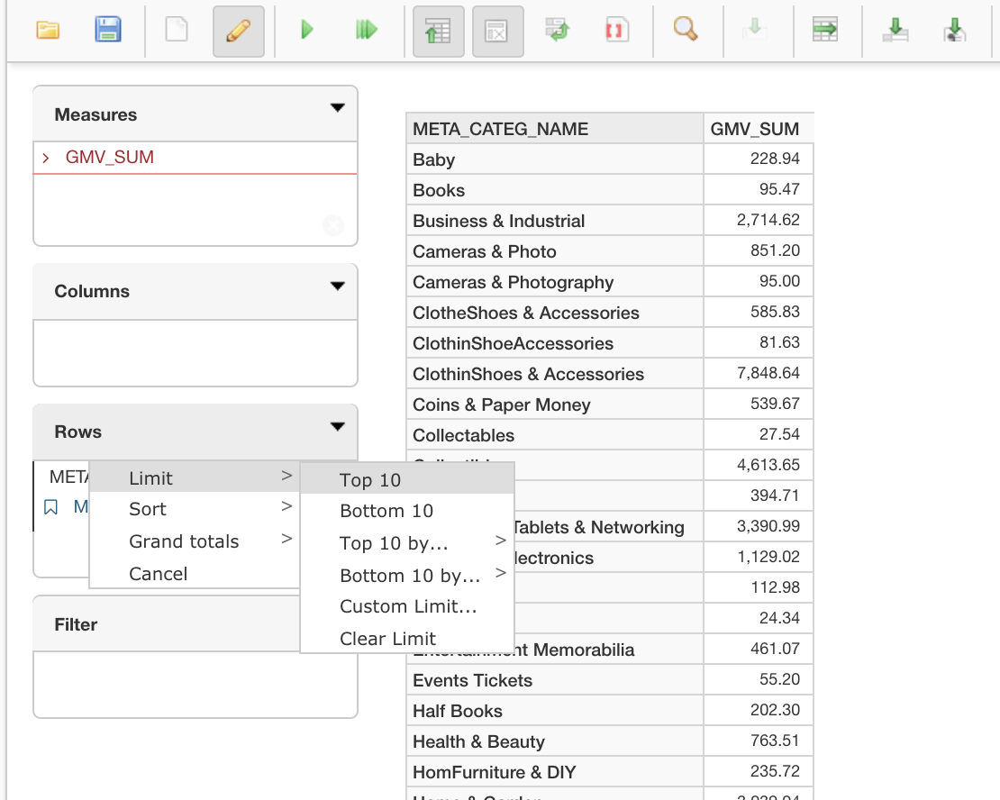
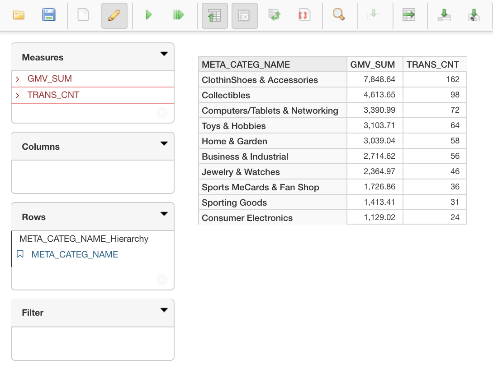
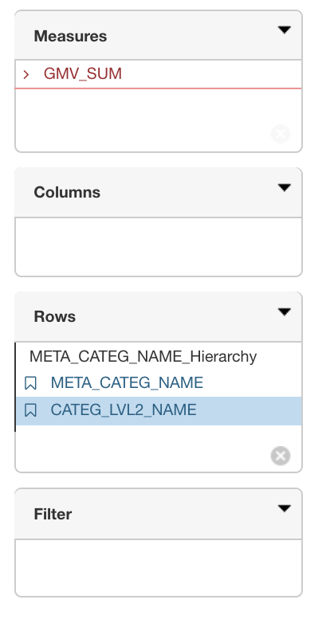
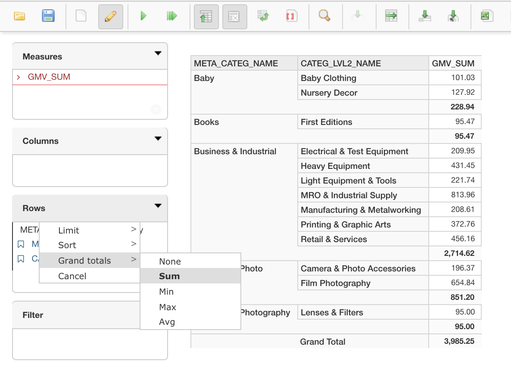

## Filtering, Sorting, Ranking and Totals 

In the following paragraphs, we will introduce several report functionalities you may perform in KyAnalyzer:

### Filtering

To filter the results, you can click the dimension name and see the filter dialog, input the search pattern to filter the select options, and select your options, you can include or exclude the options.

### Sorting

### Ranking

1. To get the top results for current query, click the little arrow on the right side of columns or row shelf. 
2. Choose `Limit` then select `Top 10` or `Bottom 10` will filter the report with Top 10 or Bottom 10 results respectively by the measure on the report.
3. If there are multiple measures in the report, it is recommended that you specify on which measure to rank the Top 10 or Bottom 10. In this example, we choose to rank Top 10 by `TRANS_CNT`.
4. Then the report will show with specified ranked results.

### Totals

You may calculate subtotals and grand totals at different dimension levels.

#### Subtotal

1. To calculate subtotal, first left click on the dimension that you may want to calculate subtotal of on row or column. In this example, we left click on `CATEG_LEVL2_NAME` to calculate subtotal
2. On the pop-up window, in Subtotal section choose the aggregation method you may prefer. In this example, we choose sum as the aggregation method for subtotal.
3. Click OK. Then you see subtotal of sum for  `CATEG_LEVL2_NAME` show up on the report.

#### Grand Total

1. To calculate grand total of current report, click the small arrow on the column or row shelf. In this example, we will calculate grant total for `Rows`.
2. Choose `Grand Totals`.
3. Select the aggregation method you may prefer. In this example, we should `Sum`.
4. Then you would see the grand total for row or column shows up on the report.

