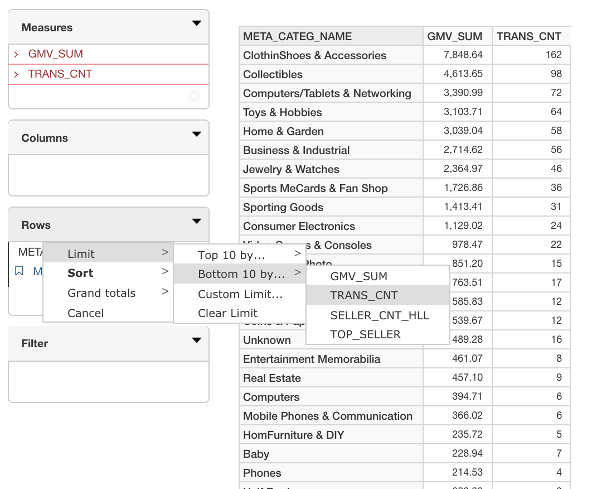

## Filtering, Sorting, Ranking and Totaling 

In this section, we will introduce several report functions you may perform in KyAnalyzer:

### Filtering

To filter the query results, you may click the dimension name, and then a filter dialog will pop up. Input the pattern in the **Search** box to narrow your selection, and then check the data options to be filtered. You can filter the options with the modes of Include or Exclude.

### Sorting

### Ranking
1. To get the top or bottom results for current query, click the down arrow on the right side of columns or rows. 

2. Choose **Limit**, and then select **Top 10** or **Bottom 10**. You will filter the reports with Top 10 or Bottom 10 results respectively by the measure on the report.

3. If there are multiple measures in the report, it is recommended that you specify one measure which you want to rank the Top 10 or Bottom 10. In this example, we choose to rank Top 10 by **TRANS_CNT**.

4. Then the report will show the specified ranked results as below.

### Totaling

You may calculate subtotals and grand totals at different dimension levels.

#### Subtotal

1. To calculate the subtotal, first click on the dimension that you may want to calculate its subtotal on row or column. In this example, we click on **CATEG_LEVL2_NAME** to calculate its subtotal.

2. In the pop-up window, in **Sub totals** section, choose the aggregation method you may prefer. In this example, we choose **Sum** as the aggregation method for subtotal.

3. Click **OK**. Then you'll see the subtotal of sum for `CATEG_LEVL2_NAME` on the report shown as below.

#### Grand Total

1. To calculate the grand total of current report, click the down arrow on the **Columns** or **Rows** box. In this example, we will calculate the grant total for **Rows**.
2. Choose **Grand totals**.
3. Select the aggregation method you may prefer. In this example, we use **Sum**.
4. Then you will see the grand total for **Rows** or **Columns** showing up on the report.

