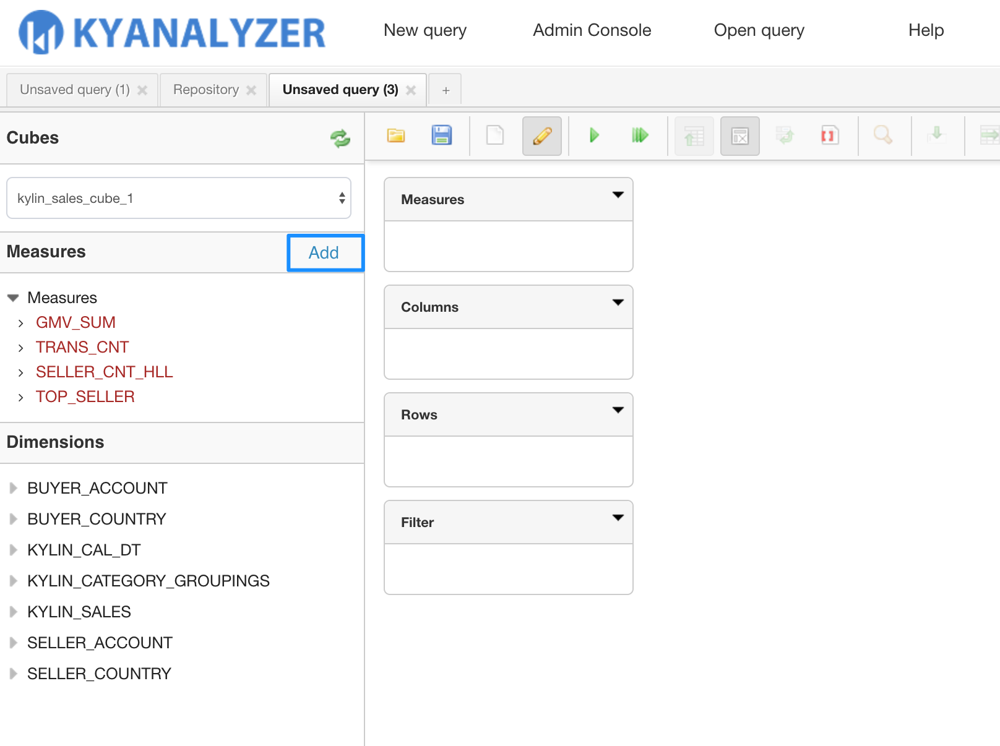
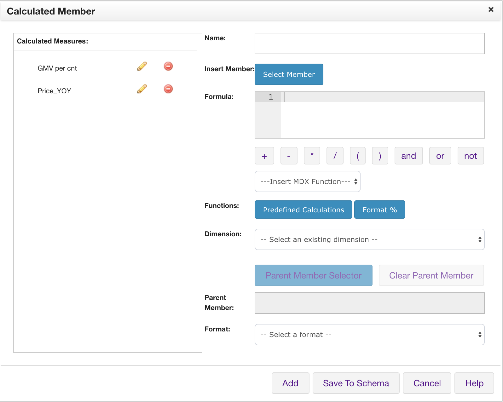
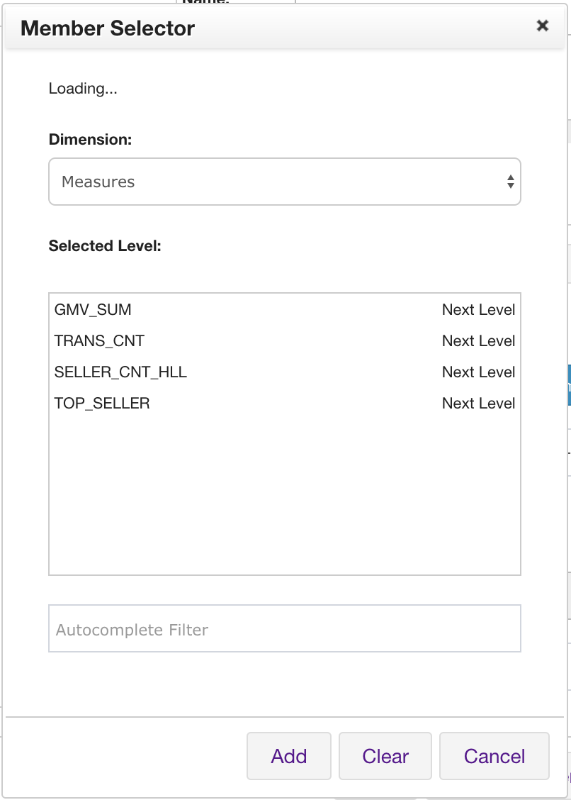
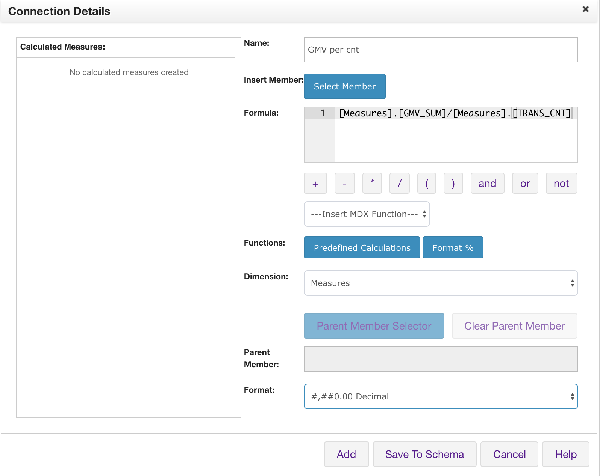
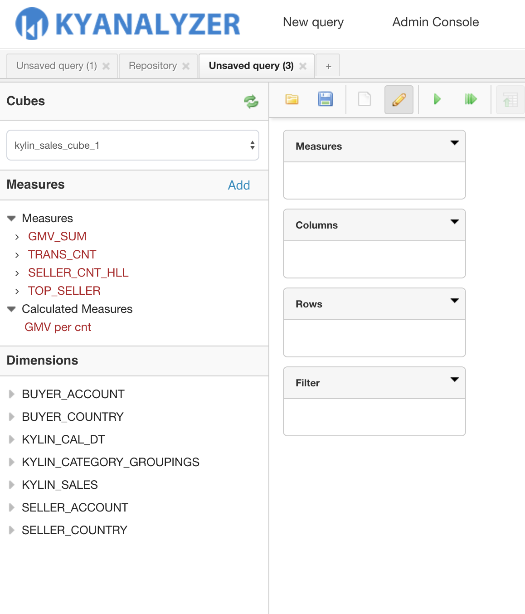
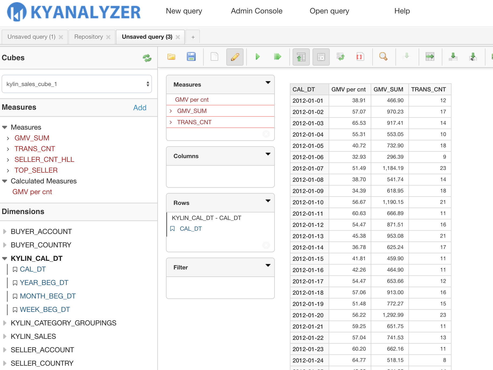

### Calculated Member

Calculated Members are members of a dimension group or a measure group that are defined based on a combination of cube data, arithmetic operators, numbers, and functions. For example, you can create a Calculated Member that calculates the sum of two physical measures in the cube. The definitions of a Calculated member are stored in KyAnalyzer, but their values are calculated at query time.

KyAnalyzer can support creating a calculated member to use MDX. 

In the following, we take a KAP sample cube as an example and measure `GMV_SUM` and `TRNS_CNT` to create a new Calculated Member.

1. Click **Add** on the right side of the member panel.



2. You can start to edit the Calculated Member in this pop-up window. 

Once a Calculated Member is created, it will display on the left side of the pop-up window for users to modify or delete.



3. Click **Select Member**  to choose `GMV_SUM` and `TRNS_CNT` .



4. Define the formula as 

```sql
[Measures].[GMV_SUM]/[Measures].[TRANS_CNT]
```

In the drop-down menu of **Dimension**, Choose **Measures**. And in the drop-down list of **Format**, select a display format for the Calculated Member.

When you have edited the calculated member, you may click **Add** or **Save to Schema** to save this calculated member. Clicking **Add** will add this calculated member only to your current query, while clicking **Save to Schema** will save this calculated member to the schema of current Cube so as to be reused by other users who create queries from this Cube.



5. The saved Calculated Member will appear on the **Measures** of current query. Now you may use it as a normal measure on the report.





