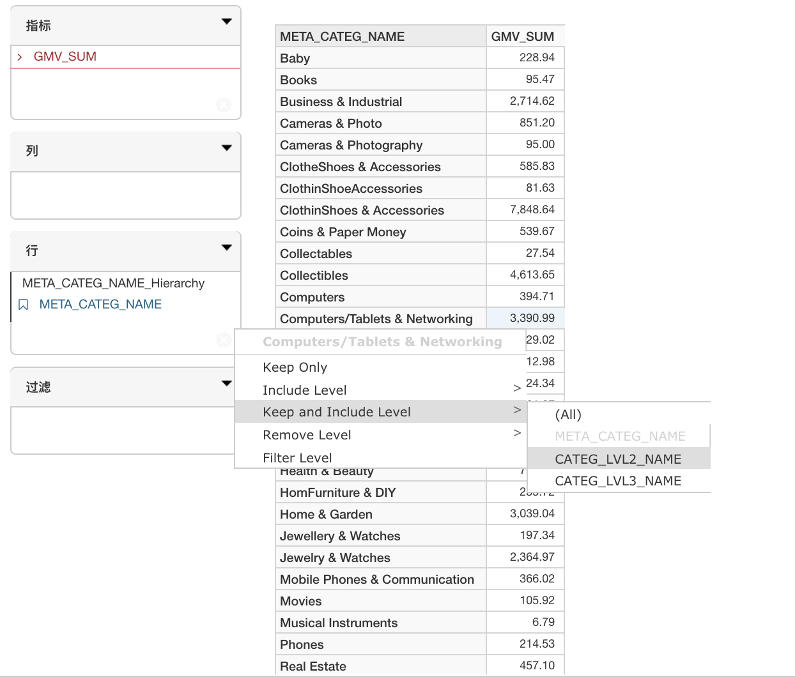
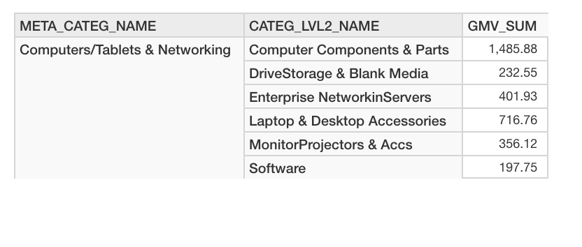
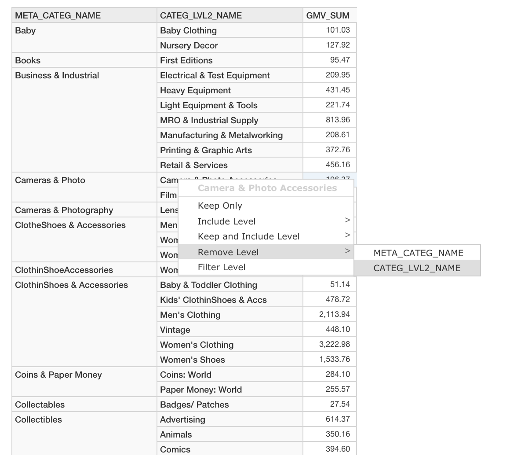
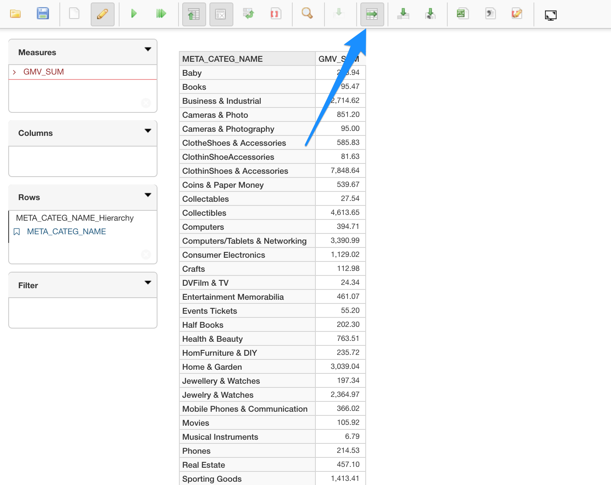
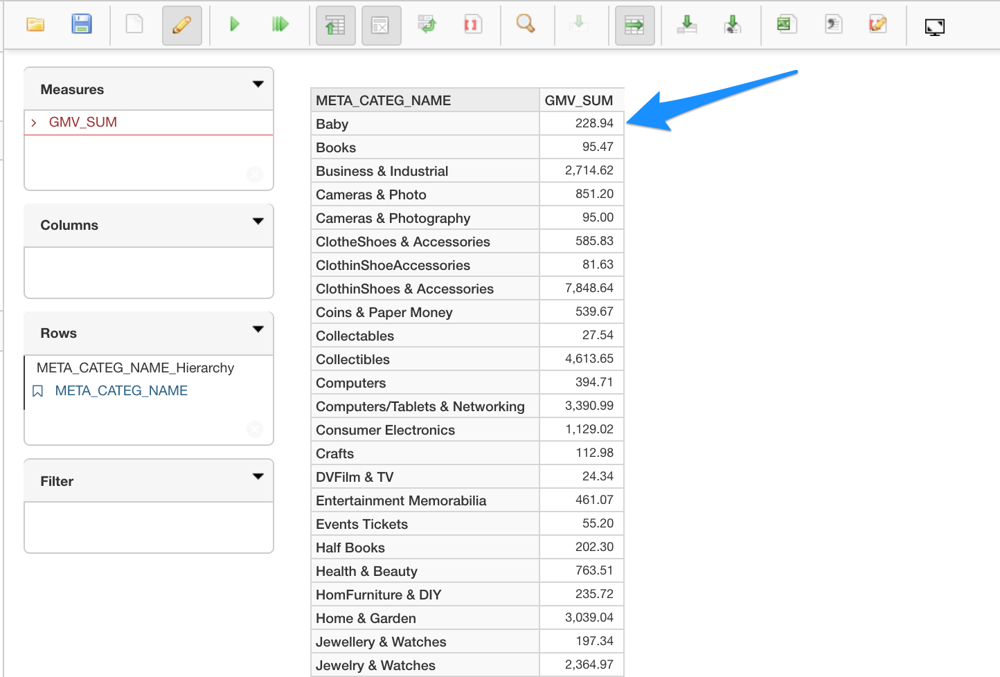
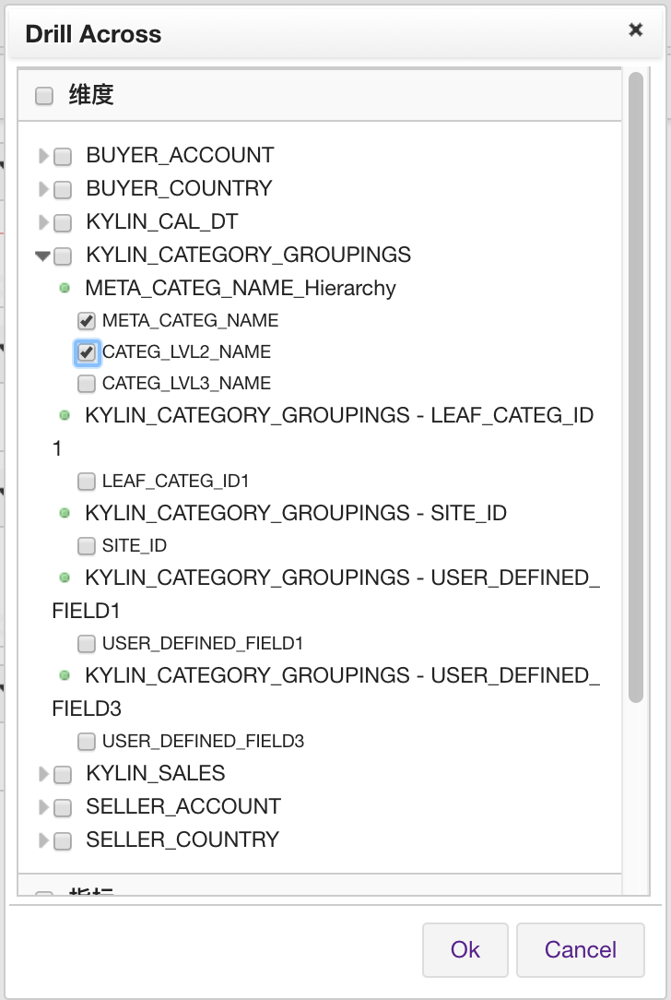
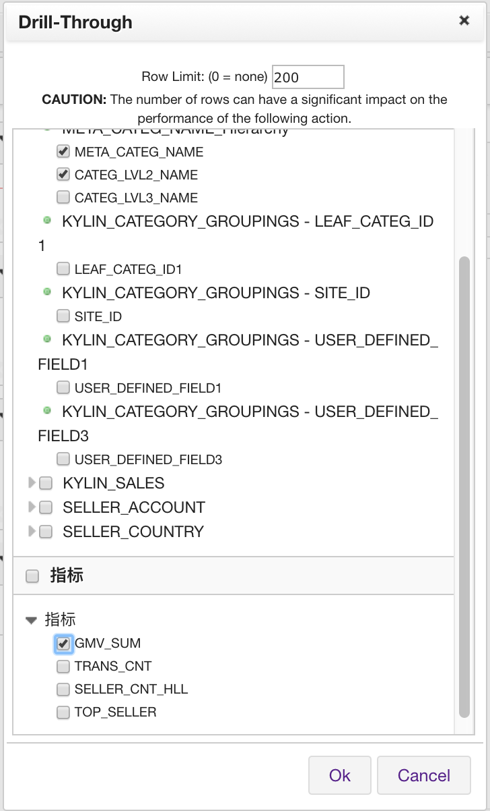
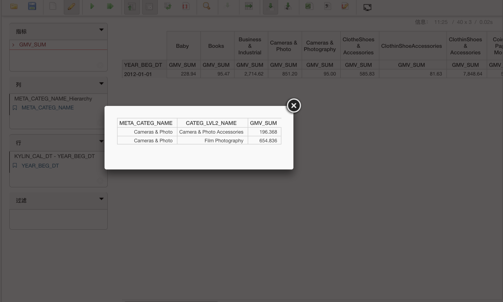

##Drill-down and Roll-up

In *Learn_kylin* project, the cube *kylin_sales_cube* contains such hierarchy. We will demonstrate how to perform drill-down and roll-up using the *kylin_sales_cube* as an example.

###Drill-down

####Drill-down without filter

1. To drill down, first, place one dimension of the hierarchy and a measure on a report. 

2. Left click on the dimension and choose `Include Level`

3. Choose the dimension that you want to drill down to.

4. The report will rerun with the dimension that you choose to drill down to. 

   

####Drill-down with filter

You may also choose to drill down with the filter applied. The report will filter on the value of the dimension you selected.

1. To drill down, first, place one dimension of the hierarchy and a measure on a report. 

2. Left click on the dimension and choose `Keep and Include Level`

3. Choose the dimension that you want to drill down to.

4. The report will rerun with the dimension that you choose to drill down to. 

   

In this example, by clicking on the value "Computers/Tablets & Networking" to trigger the filter, the drill-down with the filter will drill down with "Computers/Tablets & Networking" value only.

###Roll-up

You may also be able to roll up the dimension that you drilled down.

1. To roll up, first the hierarchy dimension that can be rolled up need to on the report.
2. Left click on the dimension that you may want to roll up and choose `Remove Level`
3. Choose the dimension that you want to roll up.
4. The report will rerun with the roll-up dimension removed. 

###Drill-across

In addition to drill-down and roll-up, you may also be able to drill across to other dimensions that are not in the hierarchy.

#### Drill Across on Row

1. Click on the drill cross icon on the top menu.

2. Click on the measure

3. On the pop-up menu, choose the dimension and measure you may want to drill across.

4. The result would rerun with the dimension and measure you selected in the previous step.

   

   

   

   ​

#### Drill Across on Column

1. Click on the drill cross icon on the top menu.

2. Click on the measure

3. On the pop-up menu, choose the dimension and measure you may want to drill across.

4. The result would rerun with the dimension and measure you selected in the previous step.

   

