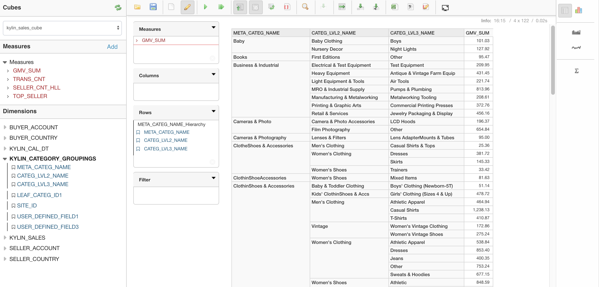

## KyAnalyzer Self-service Agile BI Tools

KyAnalyzer allow user analyze data easier and quicker.


###Pre-Condition
* KAP should be version 2.1 or later
* Apache Kylin version should be 1.5.4.1 or later.
* KyAnalyzer does not supprt *left join*, you should use *inner join* when create cube mode in KAP.

### Installation

1. Go to [ KyAccount ]( http://account.kyligence.io/ ) to apply for KyAnalyzer's Installation package and license, Unzip kyanalyzer's install package, it will then generate folder kyanalyzer-server-{version}:

   ```tar-zxf KyAnalyzer-{version}.tar.gz```

   In KyAnalyzer 2.4.0 or earlier version, copy license file kyAnalyzer.lic to kyanalyzer-{version}/conf.

   ```mv kyAnalyzer.lic kyanalyzer-{version}/conf```

   In KyAnalyzer 2.5.0 or later version, KyAnalyzer will read the KAP license and does not require a separate license file.

2. KyAnalyzer depends on the jar package of mondrian, it needs to be downloaded and copied to KyAnalyzer's path for the issue of open source license.
   * For KyAnalyzer-2.1.3 and earlier versions, user is required to down load the jar from [ mondrian-kylin-1.2.jar ]( https://github.com/Kyligence/kylin-mondrian/blob/master/build/mondrian-kylin-1.2.jar ), and copy it to folder kyanalyzer-server-{version}/tomcat/webapps/saiku/WEB-INF/lib.
   * For KyAnalyzer with version later than 2.1.3, the startup script will download and install the jar package automatically.
   * If no public network is available, user is required to down load the jar from [ mondrian-kylin-2.0.jar ]( https://github.com/Kyligence/kylin-mondrian/blob/master/build/mondrian-kylin-2.0.jar ), and copy it to folder kyanalyzer-server-{version}/tomcat/webapps/saiku/WEB-INF/lib.

3. Edit kyanalyzer.properties under kyanalyzer-server-{version}/conf，set KAP host and KAP port, *kap.host* represents KAP IP(default value localhost), and *kap.port* represents KAP app port (default port is 7070). And you can edit mondrian.properties refer to conf/mondrian.properties.template.（Note: we have moved 'kap.host' and 'kap.port' to kyanalyzer.properties since kap2.2, and also add mondrian.properties to kyanalyzer-server/conf/）

   Run below script under kyanalyzer-{version} folder to start KyAnalyzer, the default port is 8080. 

   ```sh start-analyzer.sh```

   When the server is started, please visit http://{hostname}:8080. If you want to stop the server, please run under kyanalyzer-{version} folder 

   ```sh stop-analyzer.sh```

4. If the server is not started normally, please check the logs under tomcat/logs for details. Make sure there's no port conflict, you can check it in tomcat/logs/catalina.out. To fix port conflict, find config item below:
   ```$xslt
   <Connector port="8080" protocol="HTTP/1.1"
                  connectionTimeout="20000"
                  redirectPort="8443" />
   ```
   And modify port to a un-used one.


#### Files under home directory


### Upgrade
KyAnalyzer will save data under the directory *repository* and *data*, suppose you are upgrading KyAnalyzer from KyAnalyzer-1 to KyAnalyzer-2, steps for upgrading are below:

* Back up KyAnalyzer-1's data

  + Under KyAnalyzer-1's install folder, make a backup folder, run `mkdir backup`
  + Run command `cp -r data repository ./backup/` to backup data to folder "backup"

* Restore KyAnalyzer-2's data to KyAnalyzer-1's

  + Install new KyAnalyzer as KyAnalyzer-2, suppose KyAnalyzer-2 and KyAnalyzer-1's folders are {KyAnalyzer-2} and {KyAnalyzer-1}
  + Under KyAnalyzer-2's folder, delete KyAnalyzer-2's data folders first with command `rm -rf data repository`
  + Under KyAnalyzer-2's folder, run`cp -r ${KyAnalyzer-1}/backup/* ./`

* Notice the default port is set 8080, which means that you can visit http://{hostname}:8080 to get KyAnalyzer login page. If you need to change this port, please config the tomcat/conf/server.xml file or copy and replace the config file of KyAnalyzer-1 to here.

###About KyAnalyzer,KAP,Mondrian-Kylin Version/Features
<table>
    <tr>
    <th>KAP</th>
    <th>KyAnalyzer</th>
    <th>Mondrian-Kylin</th>
    <th>COUNT_DISTINCT</th>
    <th>TOP_N</th>
    <th>Save Calculated Measure</th>
    <th>Normal Query</th>
    <th></th>
    </tr>
    <tr>
        <td>2.0</td>
        <td>&gt;=2.1</td>
        <td>1.0</td>
        <td>❎</td>
        <td>❎</td>
        <td>❎</td>
        <td>✅</td>
        <td></td>
    </tr>
    <tr>
        <td>2.0</td>
        <td>&gt;=2.1</td>
        <td>1.1</td>
        <td>✅</td>
        <td>❎</td>
        <td>❎</td>
        <td>❎</td>
        <td></td>
    </tr>
    <tr>
        <td>&gt;=2.1</td>
        <td>&gt;=2.1</td>
        <td>1.0</td>
        <td>❎</td>
        <td>❎</td>
        <td>❎</td>
        <td>✅</td>
        <td></td>
    </tr> 
    <tr>
        <td>&gt;=2.1</td>
        <td>&gt;=2.1</td>
        <td>1.1</td>
        <td>✅</td>
        <td>✅</td>
        <td>❎</td>
        <td>✅</td>
        <td></td>
    </tr>
    <tr>
        <td>&gt;=2.4.0</td>
        <td>&gt;=2.4.0</td>
        <td>2.0</td>
        <td>✅</td>
        <td>✅</td>
        <td>✅</td>
        <td>✅</td>
        <td>Recommended</td>
    </tr>
</table>

###About KyAnalyzer,Apache Kylin,Mondrian-Kylin Version/Features
<table>
    <tr>
    <th>Apache Kylin</th>
    <th>KyAnalyzer</th>
    <th>Mondrian-Kylin</th>
    <th>COUNT_DISTINCT</th>
    <th>TOP_N</th>
    <th>Save Calculated Measure</th>
    <th>Normal Query</th>
    <th></th>
    </tr>
    <tr>
        <td>ALL</td>
        <td>&gt;=2.1</td>
        <td>1.0</td>
        <td>❎</td>
        <td>❎</td>
        <td>❎</td>
        <td>✅</td>
        <td></td>
    </tr>
    <tr>
        <td>&lt;1.5.4.1</td>
        <td>&gt;=2.1</td>
        <td>1.1</td>
        <td>✅</td>
        <td>❎</td>
        <td>❎</td>
        <td>❎</td>
        <td></td>
    </tr>
    <tr>
        <td>1.5.4.1</td>
        <td>&gt;=2.1</td>
        <td>1.1</td>
        <td>✅</td>
        <td>❎</td>
        <td>❎</td>
        <td>✅</td>
        <td></td>
    </tr> 
    <tr>
        <td>&gt;1.5.4.1</td>
        <td>&gt;=2.1</td>
        <td>1.1</td>
        <td>✅</td>
        <td>✅</td>
        <td>❎</td>
        <td>✅</td>
        <td></td>
    </tr>
    <tr>
        <td>&gt;2.0.0</td>
        <td>&gt;=2.4.0</td>
        <td>2.0</td>
        <td>✅</td>
        <td>✅</td>
        <td>✅</td>
        <td>✅</td>
        <td>Recommended</td>
    </tr>  
</table>

### Authentication
KyAnalyzer authenticates user at KAP side, so you can use KAP user and password to login. Users with *Admin* Role in KAP are also *Admin* in KyAnalyzer.


### Sync Cube
Users may sync the Cube from KAP. KyAnalyzer needs to create schema and datasource for each cube from KAP by default. KyAnalyzer automatize the flow, user don't have to write schema by themeselves.
Click `Sync Cubes From Kylin` on the left side, the right panel will list all projects from KAP.


Click the green button `Sync Cubes From Kylin` after select project, KyAnalyzer will create *schema* and *datasource* for all cubes under this project whose status is **'READY'**.


The schema could be edited online in KyAnalyzer, it's not necessary at most time.

### User's Access Permission to Project/Table/Cell-level 
User's access permission to project and cubes in KyAnalyzer are consistent with KAP's, for details, please refer to [Manage Permissions](../security/acl.en.md).  

User's data access to table/row/column would be consistent with KAP's. Except that in KyAnalyzer 2.5.0, user with no query access to a table (table-level access has been removed for a table), will not be able to sync any Cube that using this table. For details regarding data access control in KAP, please refer to [Date Access Control](../security/data_access_control.en.md). 

### New Query
Click `New Query` button at navigation bar, then click `Refresh` button to fetch the latest meta data, select the cube under *Cubes* menu, now all dimensions and measures are shown. In the report designer area, here are four panels: *Measures*, *Columns*, *Rows*, *Filter*. User could drag measures into Measures panel, and dimensions into Columns and Rows panels.


KyAnalyzer supports many types of visulization, table, bar, stacked bar, line chart, area chart, heat grid, tree map, pie chart, dot chart, water fall chart ,etc.

#### Bar


#### Pie


#### Pivotal Table


#### COUNT DISTINCT


### Hierarchy

In KyAnalyzer when you sync Cube, you also sync the hierarchy information on Cube to KyAnalyzer. The benefit is that you maybe able to perform Drill-down and Roll-up on Hierarchy Dimension.




