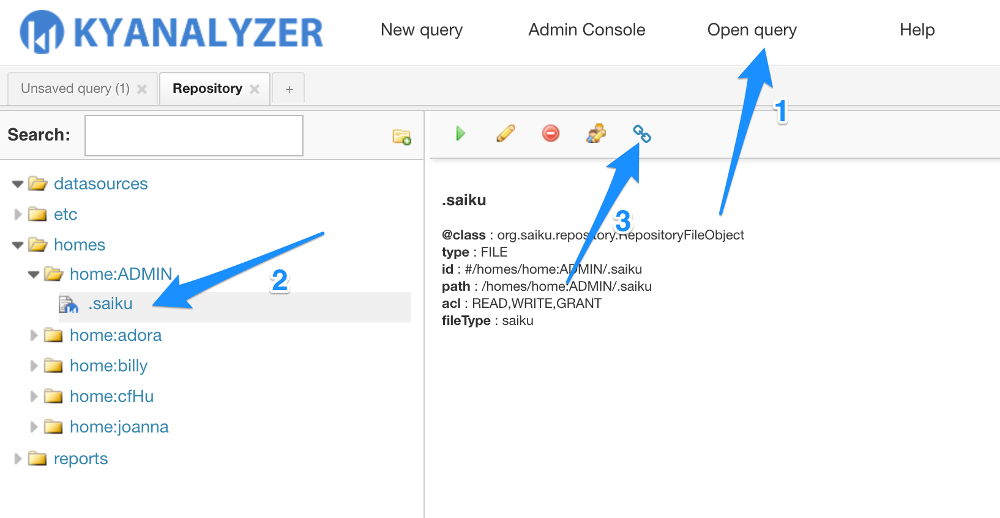

## Save and Share Results

### Save Query Results

The query results could be saved in KyAnalyzer, so next time when you log in, you don't need to select your dimensions and measures again.

### Open Query

### Execute Query

### Share Query
You may generate a query URL and share it to other KyAnalyzer users.

Copy the URL generated for your query and send it to other users. Others may need to log in to view this report.

