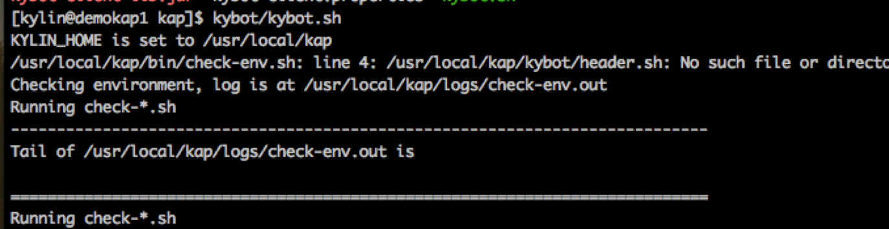
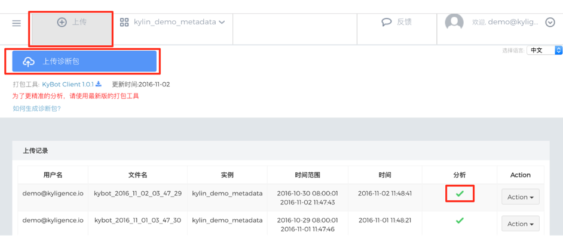
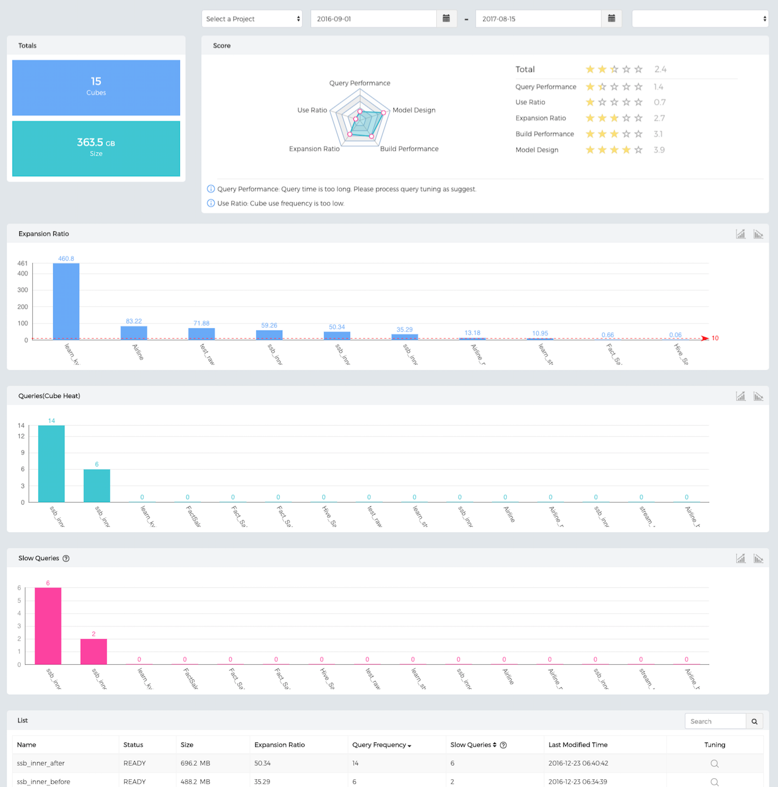
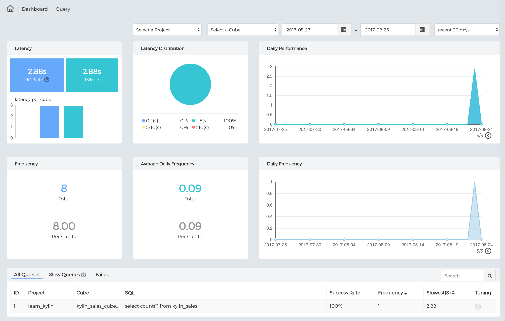
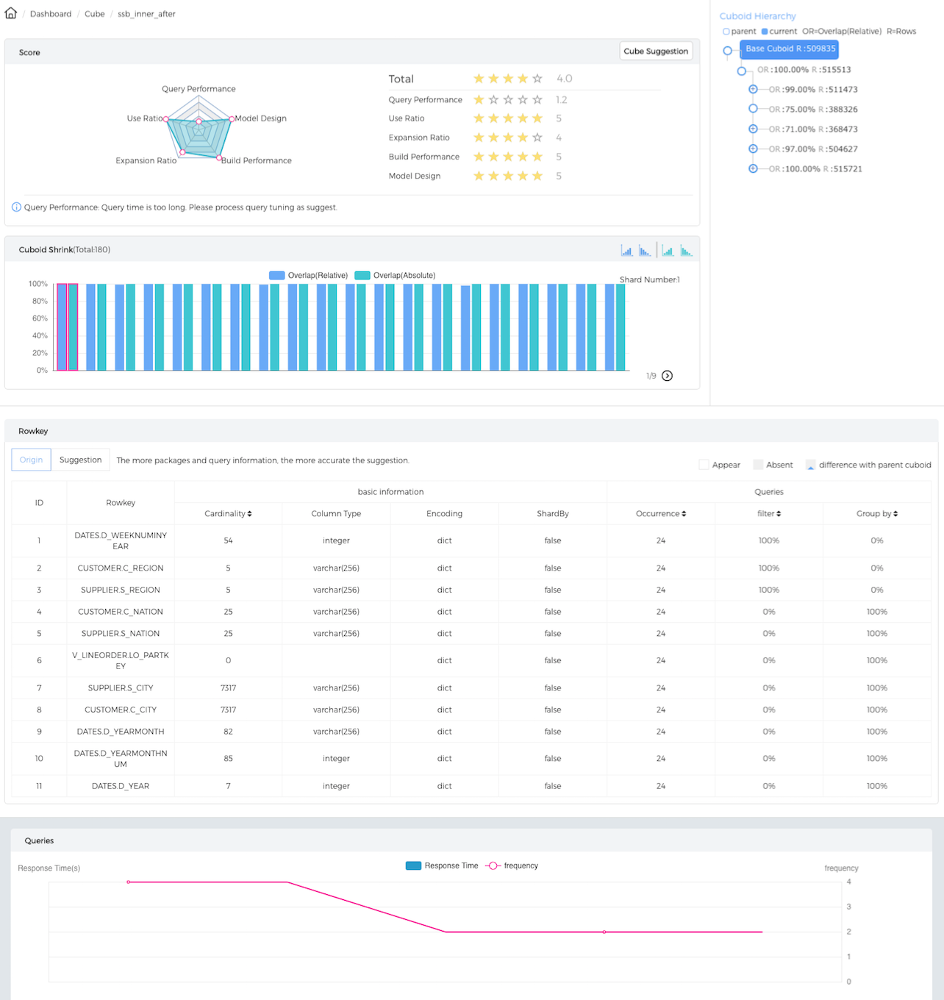
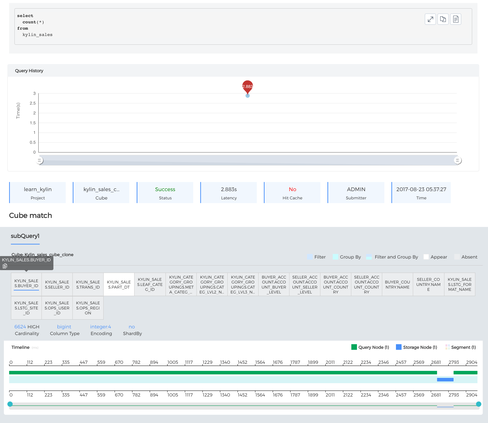
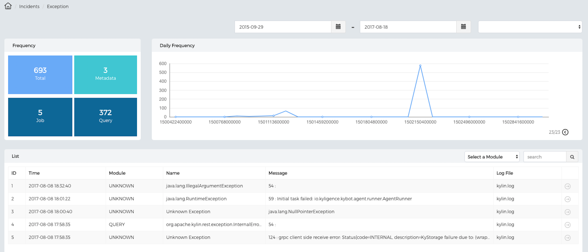
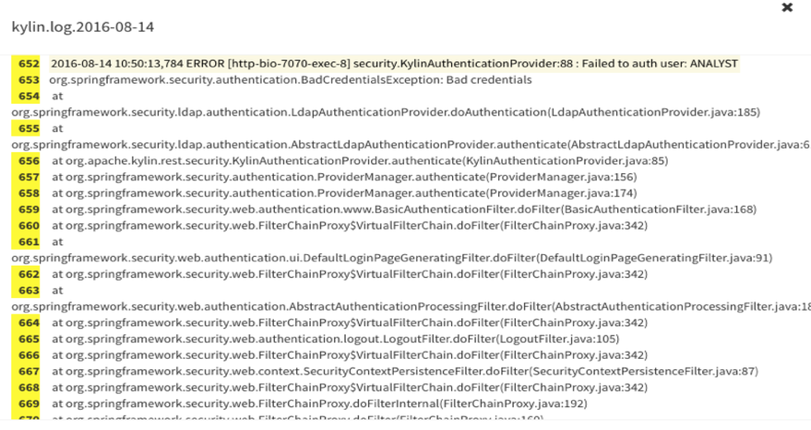
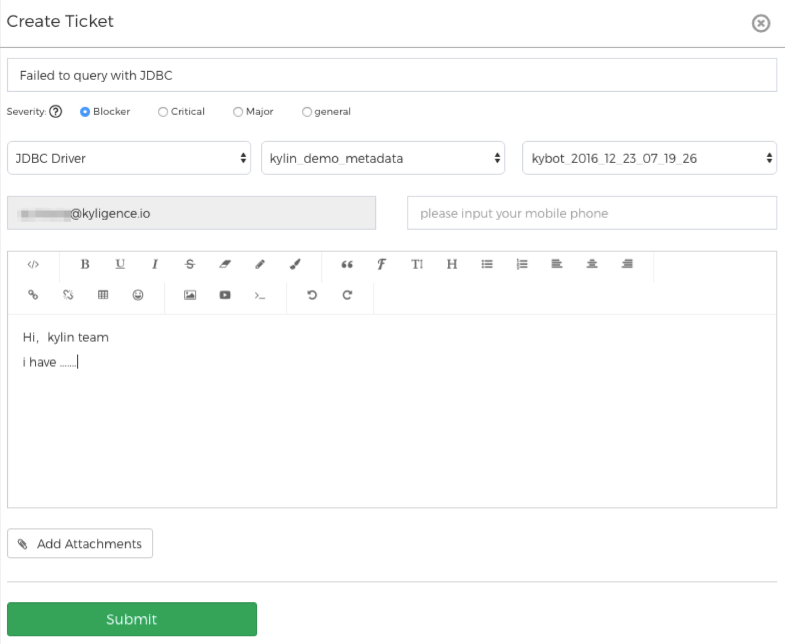

# KyBot Intro and Quick Start

## Introduction

With Apache Kylin's further application, Kylin clusters have been expanding, data storage has been increasing and users access Kylin more frequently,  the Kylin user group would have more common and urgent demand such as how to get deeper understanding and more analysis of Kylin cluster and the underlying storage, construction tasks; how to maximize the utilization of Hadoop's resources and optimize query performance; how to improve operational efficiency and ensure the stability of application.

As a poineering company behind Apache Kylin, Shanghai Kui Chi Information Technology Co.Ltd(Kyligence) launched KyBot cloud services, providing **online diagnosis, optimization and service for Apache Kylin and its commercial version(KAP)**. KyBot could provide visual dashboard, system optimization, trouble shooting, technical support and other services by analyzing Kylin log and its related information.

1. **Dashboard：** Show the related content of Kylin system in the form of visualization, including Cube, user access, query delay, statistics and storage of job building, and other aspect information. Provide insight from different dimensions for Kylin cluster and applications. 

2. **System Optimization：** Kylin provides the sub-second interactive analysis on the trillion scale of data set, so the optimization of query is the core of Kylin application. KyBot can analyze the corresponding log to offer users intuitive performance analysis, show the performance consumption of each stage through visualization, so as to help users locate bottlenecks quickly and so forth. Meanwhile,  through the analyzing of Cube log, KyBot help users to optimize the data model and Cube's design and storage, in order to find the best balance between storage, construction and query performance.    

3. **Troubleshooting：** For distributed system, exceptions and even running errors occur inevitably in the operation processes. How to locate and troubleshoot these problems quickly is the most importance in system operation. By parsing exception, KyBot can monitor fault information rapidly to provide diagnosis capability for users.  

4. **Technical Support：** Enterprise users are offered to submit corresponding support requests via a ticket. Combined with the relevant log submitted and analysis results, Kyligence support engineers would locate quickly and provide solutions, reducing the communication cost and improving service response capability.

   ​

## How does KyBot work?

## How to use KyBot?

### 1. Register and login

Default access address of KyBot: [https://kybot.io](https://kybot.io). Please complete the registration according to the prompt.

### 2. How to obscure sensitive information

- OBF=obfuscate RAW=none obfuscate
- Cardinality and mail account default to be obfuscated (obfuscated range: tiny: <20; small: <100; medium: <1000; high: <10,000; very high: <100,000; ultra high: >=100,000).
- If hostname defaults to be OBF, then the mode of hostname needs to be defined: such as kybot.obf.hostname.pattern=\*.kybot.io

### 3. Generate diagnostic package

- #### KAP Users

Log on to each KAP node of the UI WEB, then click "diagnose" button on the system page to generate diagnose package.

- #### Kylin Users

① Down load KyBot Client (support Apache Kylin1.5.0 and following version as well as all KAP versions) download path：Log on KyBot official website: https://kybot.io, click "upload" on the first page then click "packing tool": KyBot Client 1.0.1" is available for download.

② Extract to $KYLIN\_HOME/kybot directory of each Kylin node. 

③ Run $KYLIN_HOME/kybot/kybot.sh on each Kylin node to generate a diagnostic package.

### 4. Upload diagnose package

Log on KyBot website, click the "Upload" button at the top of the page to open the upload page; then click "upload diagnose package" button, and select a generated KyBot diagnostic package. If the diagnose package get uploaded, it will join analysis queue soon. Users could check the analyzing speed on the upload page, and use further functions after analysis completed.

## Dashboard function introduction

### 1. Dashboard

Get tp know the health status of KAP ( or Apache Kylin) clusters

- Cube usage statistics

- Query execution statistics

### 2. Optimization

Optimize Cube and query, find out system bottleneck, provide tuning recommendation

- #### Cube details and utilize analysis

- #### SQL query parsing and statistical analysis 

### 3. Troubleshooting

Founded on knowledge base and log analysis, provide effective incident solution

- #### Exception statistics

- #### Error tracing

### 4. Technical support

Kyligence is capable to provide support from the original Apache Kylin team, so users can submit ticket throught KyBot to get technical support from Kyligence. 
