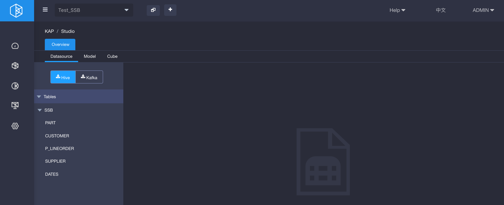
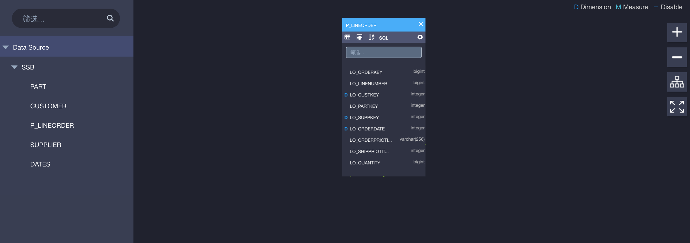
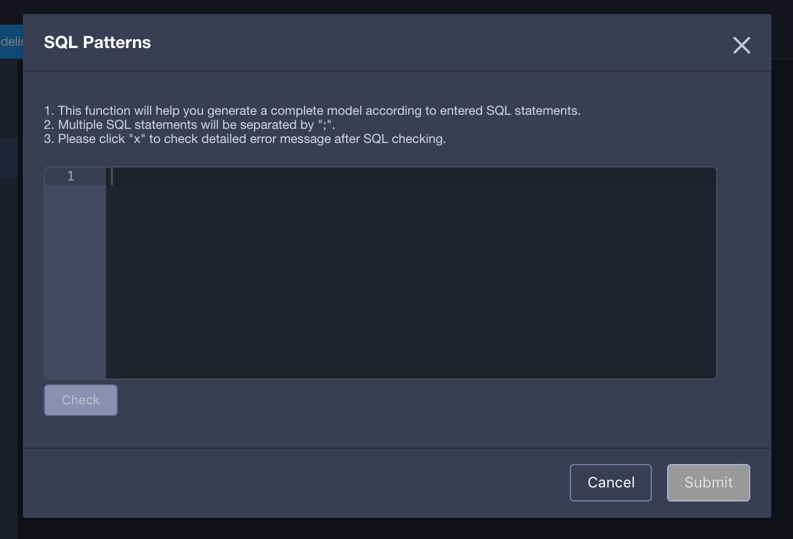
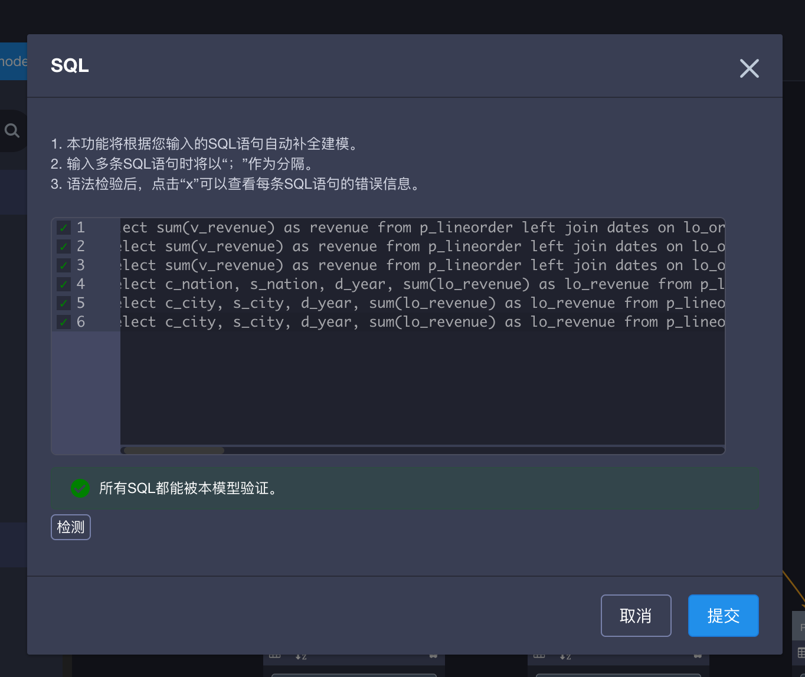
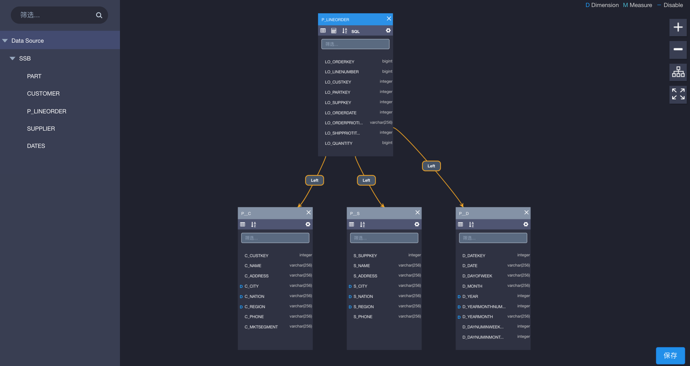

## Modeling Advisor

模型设计与创建是使用KAP的关键步骤。模型从0到1的部分，最为考验用户对业务逻辑和查询需求的理解。许多用户希望能够依据SQL查询语句，自动地创建好一个可用的模型，方便地进入后续的模型优化或调整中。从KAP 2.5开始，我们提供您根据指定的SQL查询语句与一张指定的事实表，自动的创建模型的能力。

### Apply SQL to generate  a desired model

Step 1, sync target tables to the project. 

Step 2, drag one table, which will be the fact table, to the model designer and set it as *fact*. Click ***SQL*** button to pop up a dialog to collect your SQL statements. 

<!--Note that only fact table will have this button and SQL queries here inputed should be the SQL you would query later.-->

Step 3, enter the SQLs that would cross this model. You should ***check***  these SQLs to make sure which can be used to generate model, because only correctly recoganized ones can work. If all SQLs are right to the model advisor, the dialog would look as follow picture.

Step 4, ***submit*** checked SQLs and you will get a initial model from your SQLs as below. Please do modify, check and re-submit SQLs via ***model advisor***.  When you find all good, save it.

