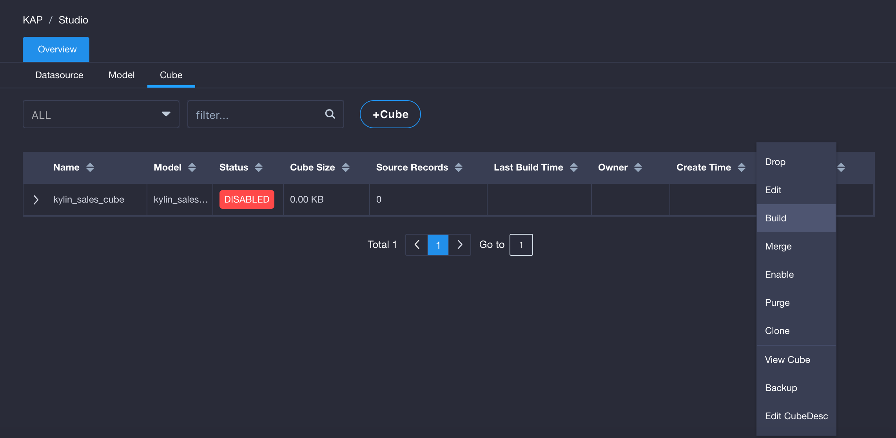
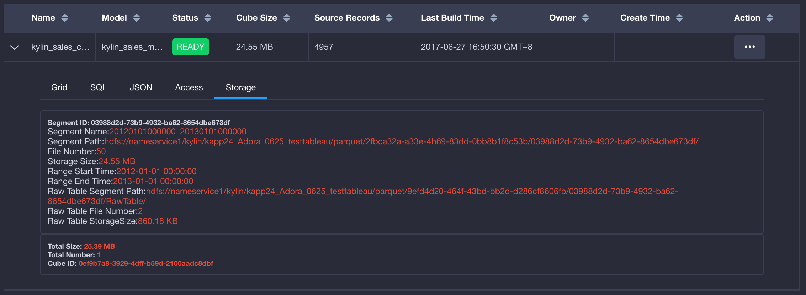

## Build Cube

After cube is created, it has to be built to serve queries. We will use KAP sample data to show the process of cube building.

### First Build

Open KAP web UI, select *learn_kylin* project, go to the *Model* page, and find the cube list.
Step1: Find the *Kylin_Sales_Cube* cube, right click the **Action** button, and select **Build** in the drop-down menu.

Step 2: In the build cube dialog, confirm the *Partition Date Column* is *DEFAULT.KYLIN_SALES.PART_DT*, and its start time is `2012-01-01 00:00:00`. In KAP, every build will create a new segment in cube, and all segments will participate in queries. Bigger segments are faster in query but takes longer to build and refresh. Smaller segments are easier to build and refresh but have a small penalty to query performance. In this case, we choose the end date of segment to be `2013-01-01 00:00:00`. Click **Submit** to continue.

> Note: User shall manage the granularity of segments. The time range of segments may depend on data volume, ETL data arrival time, and other business requirements. Typically new segments are kept small to allow quicker build and easier refresh. Later, as data ages, historical segments are merged into bigger ones, to control the overall number of segments. In this example, since the volume is small, the one-year segment can be built without any problem.

After submission, go to the *Monitor* page, a list of running jobs will be displayed. The first job (named *BUILD CUBE - kylin_sales_cube - 20120101000000_20130101000000 - GMT+08:00 2017-06-27 16:38:44*) is the job we just submitted. Double click the job (or single click the arrow icon on the left), the detail steps of the job will expand. When all steps complete, the status of the job will become *Finished*, and the first segment is ready. Go to the cube list, check if the cube status now is *Ready*.

### Incremental Build

After the first segment is built, we can build more segments incrementally to accommodate newly arrived data. First find the cube in the *Model* page, click the **Action** button and select **Build** in the drop-down menu. In the build dialog, confirm the start time is `2013-01-01 00:00:00`, which is the end date of last segment. To ensure continuity, a new segment always starts from the end of the last segment. Enter `2014-01-01 00:00:00` as the end of the new segment and submit the job.

When build completes, go to cube detail page and check, there should be two segments under the cube.

