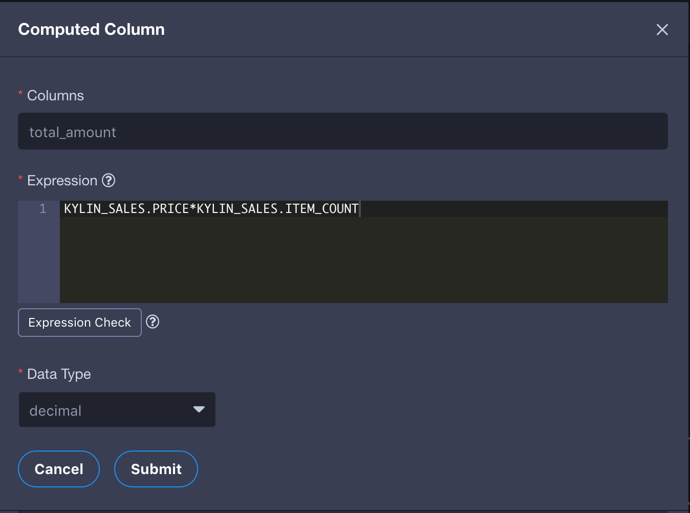
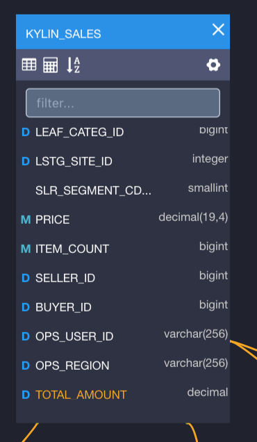

## Computed Column

**Computed Column** allows you to pre-define operations like data extraction/transformation/redefinition in modes, and thus enhance the data semantic abstraction. By replacing runtime calculation with offline cube construction, KAP's pre-calculation capability is fully utilized. As a result, query performance could improve significantly. It's allowed to use Hive UDF in computed column, so that existing business codes can be reused.

### For KAP 2.4.4 and versions above

#### Create Computed Column

KAP allows you to define computed columns for each model seperately. A column column is based on the fact table in the model and can use one or more columns from any table in the model to form an expression. For example, say you have a fact table named `kylin_sales` with following columns: `price` (price for each item in the transaction), `item_count` (number of sold items in the transaction) and `part_dt` (time when the transaction happens). You can define two more computed columns on `kylin_sales`: `total_amount = kylin_sales.price * kylin_sales.item_count` and `deal_year = year(kylin_sales.part_dt)`. Later when creating a cube, you can add computed columns total_amount/deal_year.

You can create computed columns by clicking the icon as the arrow points to:

The following information is required:

+ **Column**: Display the name of the created computed column.

+ **Expression**: Definition of the computed column. Columns in the expression can refer to any table in current model, however you have to make sure the column reference complies to **Table.Column**.

+ **Data Type**: The data type of the created column.

After successfully submitting and saving the computed column, you will see the new column `total_amount` appearing in the table:

After defining the computed columns in model, you need to use them to build cube (either as dimension or measure), so that computed column can be pre-calculated and performance advantages can be observed.

#### Explicit Query vs. Implicit Query

A computed column is logically appended to the table's column list after creation. You can query the computed column as if it was a normal column as long as it is pre-calculated in a Cube. Or if query pushdown is enabled in KAP, you can query the computed column directly regardless of whether the Cube containing the computed column is ready. Continuing with the last example, if you created and built a cube containing measure `sum(total_amount)`, KAP can answer queries like `select sum(total_amount) from kylin_sales`. We call it **Explicit Query** on computed columns. 

Or, the your can pretend that computed column is invisible from the table, and still use the expression behind the computed column to query. Continuing with the last example, when your query `select sum(price * item_count) from kylin_sales`, KAP will analyze the query and figure out that expression in `price * item_count` is replaceable by an existing computed column named `total_amount`. For better performance KAP will try to translate your original query to `select sum(total_amount) from kylin_sales`. We call it **Implicit Query** on computed columns.

When query pushdown is enabled and there is no cube can be hit on for your query on computed column, KAP will analyze the query and translate the computed column to the original formula. Continuing with the previous example, if you query `select sum(total_amount) from kylin_sales` when there is no Cube ready to answer, and query pushdown is enabled, this query will be translated into `select sum(price * item_count) from kylin_sales`, and be pushed down to underlying SQL on Hadoop engine. 

Implicit Query is **enabled** by default. To disable it you'll need to remove `kylin.query.transformers=io.kyligence.kap.query.util.ConvertToComputedColumn` in `KYLIN_HOME/conf/kylin.properties`

#### Rules on using Computed Column##

· Computed column must be defined on a face table.

. It's allowed to use any column from any tables in current model to consist computed column's expression.

· Under one project, there is one-to-one mapping between computed column and expression defined. That means under different models, computed column with same name can be defined on the condition that two computed columns share the same expression. 

· Under one project, computed column cannot duplicate with any other column in current model.

· If a user has been restricted access to the column that is used in the expression of a computed column, the user will not be able to query the computed column either. 

### Advanced Functions

Computed column is pushed down to data source to be calculated. Hive is the default data source for KAP, thus the syntax for computed need to follow hive's. 

Expressions can support rich advanced functions (specified at the end of this article), but please do not define the expression that contains the aggregations (as cube measures). For example that expression of a computed column cannot directly support count (distinct), such as "select count (distinct seller_ID) from kylin_sales".

It is possible to utilize Hive embedded function or Hive User Defined Function in computed column. To learn more about what function Hive SQL offers, please refer to Hive documentation below:

https://cwiki.apache.org/confluence/display/Hive/LanguageManual+UDF#LanguageManualUDF-StringFunctions

