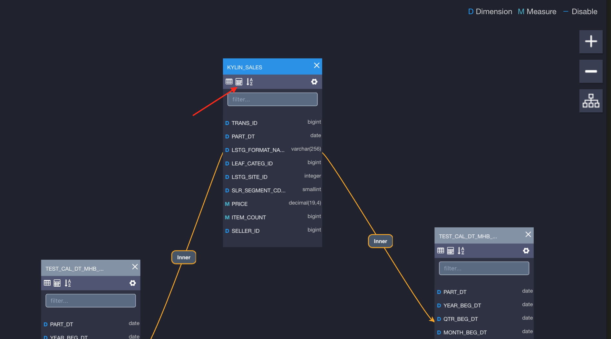
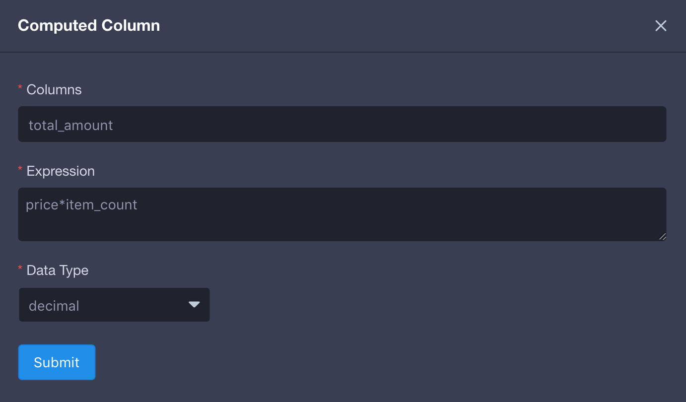
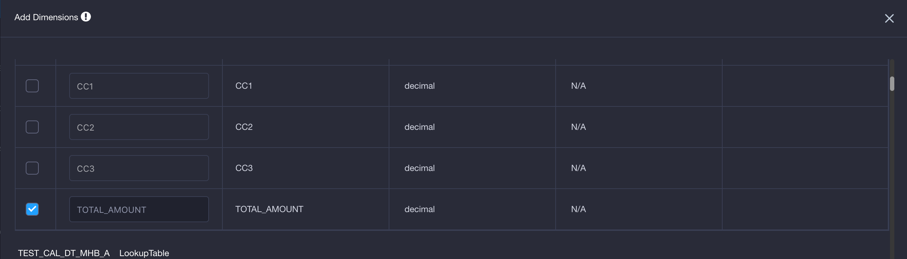

## Introduction to Computed Column

Computed Column allows user to pre-define operations like data extraction/transformation/redefinition in modes, and thus enhance the data semantic abstraction. By replacing runtime calculation with offline cube construction, KAP's pre-calculation capability is fully utilized. As a result, query performance could improve significantly. It's allowed to use Hive UDF in computed column, so that existing business codes can be reused.

## Create Computed Column

KAP allows user to define computed columns for each model seprately. A column column is based on specific table in the table, using one or more columns on that table to form an expression. For example, say we have a fact table named "kylin_sales" with following columns: "price" (price for each item in the transaction), "item_count" (number of sold items in the transaction) and "part_dt" (time when the transaction happens). Users can define two more computed columns on "kylin_sales": "total_amount = price * item_count" and "deal_year = year(part_dt)". Thus, later when creating a cube, user can not only define dimension/measures based on original columns price/item_count/part_dt, but also from newly added computed columns total_amount/deal_year.

User can create computed columns by clicking the calculator icon as the arrow points to:

the following information is required:

- *Column*：Display name of the created column
- *Expression*：Definition of the computed column. Notice no columns from other tables is allowed to appear here.
- *Data Type*：The data type of the created column

After defining the computed columns in model, user needs to use them to build cube (either in dimension or measure), so that computed column can be pre-calculated and performance advantages can be observed.

## Explicit Query vs. Implicit Query

A computed column is logically appended to the table's column list after creation. User can query the column as if it were normal columns under the premise that the computed column is included by a ready cube or Query Pushdown is enabled. Continuing with the last example, if the user created and built a cube containing measure sum(total_amount), KAP can answer queries like "select sum(total_amount) from kylin_sales". We call it "Explicit Query" on computed columns. 

Or, the user can pretend that computed column is invisible from the table, and still use the expression behind the computed column to query. Continuing with the last example, when user query "select sum(price * item_count) from kylin_sales", KAP will analyze the query and figure out that expression in "price * item_count" is replacable by an existing computed column named "total_amount". For better performance KAP will try to translate user's original query to "select sum(total_amount) from kylin_sales". We call it "Implicit Query" on computed columns.

"Implicit Query" is not enabled by default. To enable it you'll need to add `kylin.query.transformers=org.apache.kylin.query.util.ConvertToComputedColumn` in KYLIN_HOME/conf/kylin.properties

