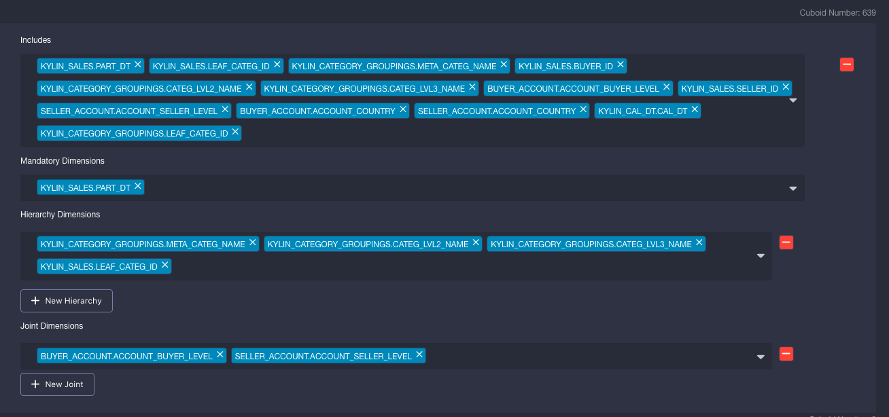
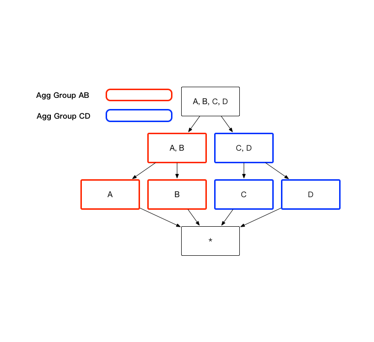
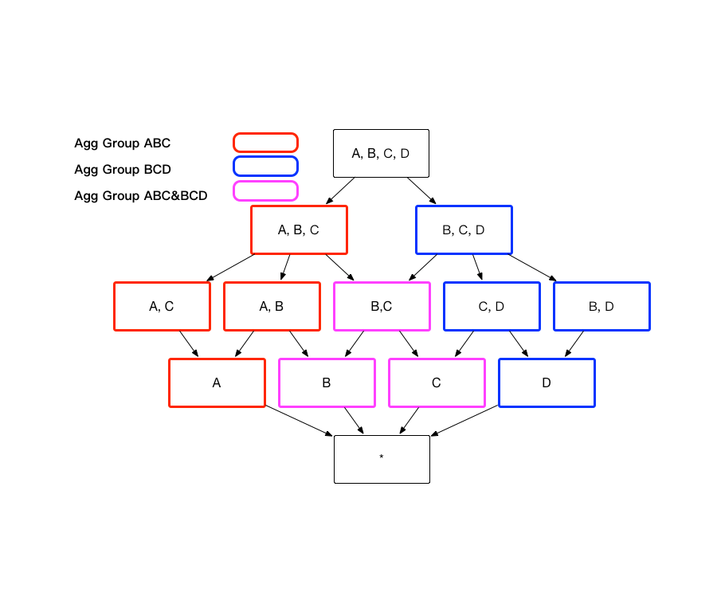

# Aggregation Group

Curse of dimension is an infamous problem for all of the OLAP engines based on pre-calculation. In versions prior to v1.5, Kylin tried to address the problem by some simple techniques, which relieved the problem to some degree. During our open source practices, we found these techniques lack of systematic design thinking, and incapable of addressing lots of common issues. In Kylin v1.5 we redesigned the aggregation group mechanism to make it better serve all kinds of cube design scenarios.

## Introduction

It is a known fact that Kylin speeds up query performance by pre-calculating Cubes, which in term contains different combination of all dimensions, a.k.a. Cuboids. The problem is that Cuboids grows exponentially with the #dimension. For example, there’re totally 8 possible Cuboids for a cube with 3 dimensions, however there are 16 possible Cuboids for a Cube with 4 dimensions. Even though Kylin is using scalable computation framework (MapReduce) and scalable storage (HBase) to compute and store the Cubes, it is still unacceptable if Cube size turns up to be times bigger than the original data source.

 Figure 1

To alleviate the pressure on Cube building, Apache Kylin has released a series of advanced setting to help end user filter actual neededCuboid. These advanced settings include Aggrgation Group, Joint Dimension,Hierarchy Dimension and Mandatory Dimension.  

User can pick from dimensions in the cube into one or many aggregation group, by selecting dimension under `Includes`  window. 

User can then set `Mandatory Dimension`, `Hierarchy Dimension` and `Hierarchy Dimension`. Dimensions under these three settings has to be included into  `Includes`  under this aggregation group first. Once set properly, on the top right corner of aggragation group, estimated Cuboid number will be calculated and displayed. This can help you understand the complexity of the cube build. 

Next, we will explain mechanism of these advanced settings and provide use cases in the following paragraphs. 

##Aggregation Group 

End user can divide combination of dimensions they focus on in several groups, and these groups is called **Aggregation Group.**  

As the cube shown in figure 1, if user only need dimension combination AB and CD, then cube can be divided into two aggregation group, group AB and group CD. As shown in figure 2, the number of cuboid can be reduced from 16 to 8. 

 Figure 2

The aggregation group end that user need might contain overlapping dimension, for example, aggregation ABC and aggregation BCD both contain dimension B and C. These aggregation groups will derive the sample cuboid, for example aggregation group ABC will derive cuboid BC, and so does aggregation group BCD. A cuboid will not be generated multiple times, if it can be derived from more than one aggregation group, as shown in figure 3.

With aggregation group, end user can then filter the granularity of cuboid to get the dimensionality he/she want. 

							

 Figure 3

### Use Case

Assume a transactional Cube, which contains below dimension: Customer ID`buyer_id`, Transaction Date`cal_dt`, Payment Type `pay_type`and Customer City`city`. Sometimes, analyst need to group dimension City, Cal_dt and Pay_Type to understand different payment type in differentcities. There are other times, analyst need to group dimension city, cal_dt andbuy_id together to understand customer behavior in different cities. As exampleshown above, it is recommended to build two aggregation group, includingdimension and groups as below:

 Figure 4

Aggregation Group 1： `[cal_dt,city, pay_type] `

Aggregation Group 2： `[cal_dt,city, buyer_id] `

 

Regardless of other situations, those two aggregation groups can reduce 3 unnecessary cuboid: [pay_type, buyer_id]、[city,pay_type, buyer_id] and [cal_dt, pay_type, buyer_id], thus storage space and build time can also be saved. 

 

Case1: Select cal_dt, city, pay_type, count(*) from table

​              Group by cal_dt, city, pay_type  will hit on Cuboid [cal_dt, city, pay_type]

Case2: Select cal_dt, city, buyer_id, count(*) from table

​             Group by cal_dt, city, buyer_id will hit on Cuboid [cal_dt, city, buyer_id]

Case 3: If one unusual query occur

​            Select pay_type, buyer_id,count(*) from table

​            Group by pay_type, buyer_id then nocuboid can be hit, Kylin will live calculate result based on existing cuboid. 

## Mandatory Dimension

Sometimes end user might be interested in analysis with one or a few specific dimensions, any query will include one specific dimension. In this case, this dimension can be set as **mandatory dimension**. once set, only the cuboid with this dimension will be calculated, as shown in figure 10. In the example of figure 1, if dimension A is set as mandatory, then cuboid will be calculated as figure 11. The numberof cuboid will be reduced from 16 to 9.

 

 Figure 10

 Figure 11

### Use case

Assume a transactional cube that include transaction date, transaction location, product, payment type. Transaction date is a frequently used group by dimension. If transactiondate is set as mandatory dimension, combination of dimensions will ascalculated as figure 12

 Figure 12

## Hierarchy Dimension

End user usually will use dimensions with hierarchical relationship, for example, Country, Province and city. In this case, hierarchical relationship can be set as **Hierachy Dimension**. From top to bottom, country, province and city are one-to-many relationship. That is to say, query to these three dimensions can be group into three types

1. group by country

1. group by country, province（equivalent to group by province）

1. group by country, province, city（equivalent to group by country, city or group by city）

As the cube shownin figure 7, assume dimension A =Country, dimension B= Province and dimensionC=City, then dimension ABC can be set as hierarchy dimension. And cuboid [A,C,D]=cuboid[A,B, C, D]，cuboid [B, D]=cuboid[A, B, D], thus cuboid[A,C,D] and Cuboid[B,D] can be saved. Figure 8 illustrates, based on method above,kylin can prune redundant cuboid and thus reduce cuboid from 16 to 8. 

 

 Figure 7

 Figure 8

 

### Use Case

Assume a transactional cube that include dimensions transaction city`city`,transaction province`province`, transaction country`country` and payment type`pay_type`. Analyst will group transaction country,transaction province, transaction city and payment type together to understand customer payment type preference in different geographical location. In this example above, it is recommended to create hierarchy dimension in existing aggregation group (Country/Province/City) that include dimension and combinationas shown in Figure 9:

 

 Figure 9

Aggregation Group: `[country, province, city，pay_type]`

Hierarchy Dimension: `[country, province, city] `

 

Case 1：Analyst want to understand city level customer payment type preferences

SELECT city, pay_type, count(*) FROM table GROUP BY city, pay_type can be retrieved from cuboid [country, province, city, pay_type].

Case 2: Analyst want to understand province level customer payment type preference

SELECT province, pay_type, count(*) FROM table GROUP BY province, pay_type can be retrieved from cuboid [country, province, pay_type].

Case3: SELECT country, pay_type, count(*) FROM table GROUP BY country, pay_type can be retrieved from cuboid [country, pay_type].

Case4: Analyst want to get different granularity of geographical dimension, with no exception, any combination can be obtained from cuboid in Figure 8.

##Joint Dimension

End user sometimes don’t need detail of some combination of dimensions, for example, user might query dimension A,B,C together in most cases, but not dimension A,C or dimension C alone. To enhance performance in this case, **Join Dimension** can be used. If A, B and C are defined as Join Dimension, Kylin will only build Cuboid ABC but not Cuboid AB, BC and A. Finally, Cube built will be as Figure 5. The number of Cuboid can then reduced from 16 to 4.

 

 Figure 5

### Use Case

 Assume a transactional Cube that include dimension transaction date`cal_dt`,transaction city`city`, customer gender`sex_id`, payment type`pay_type`. Analyst usually need to group transaction date, transaction city andcustomer gender to understand consumption preference for different gender in different city, in this case, `cal_dt, city,sex_id `will be grouped together. In this case above, it is recommended to assign them in joint dimension based on existing aggregation group that include following dimension and combination as shown in figure 6. 

 

 Figure 6

Aggregation group: `[cal_dt,city, sex_id，pay_type]`

Join Dimension:  `[cal_dt, city, sex_id] `

 

Case 1：SELECT cal_dt,city, sex_id, count(*) FROM table GROUP BY cal_dt, city, sex_id can retrieve data from cuboid [cal_dt, city, sex_id].

Case2 If one unusual query occur

SELECT cal_dt, city, count(*) FROM table GROUP BY cal_dt, city then no cuboid can be hit, Kylin will live calculate result based on existing cuboid. 

## Start using it

The new aggregation group mechanism should be available since Kylin v1.5 (KAP v2.1). For legacy users you will need to upgrade your metadata store from Kylin v1.2 or v1.3 to Kylin v1.5.
