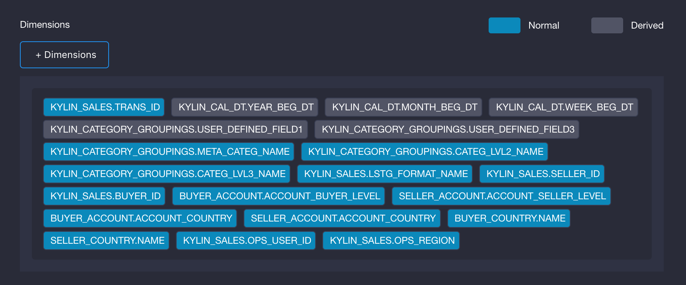
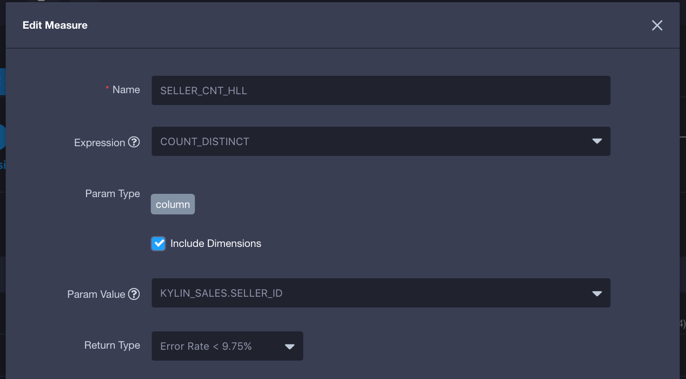
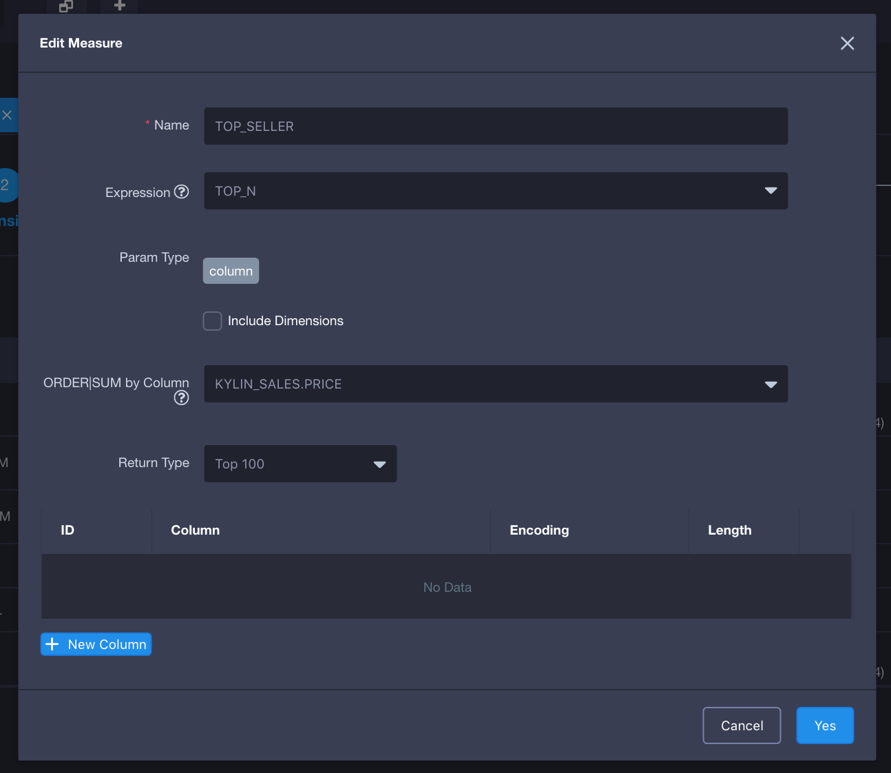
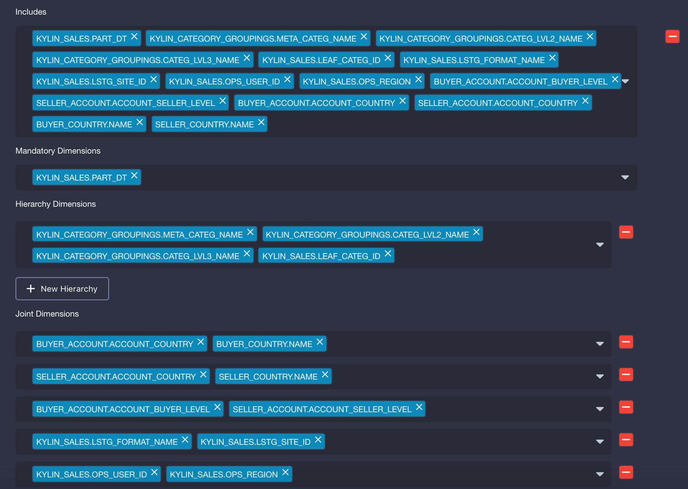
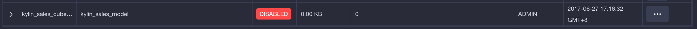

## Create Cube

We need to define dimension combinations and measure types based on existed data model. This process is called Cube design and create. This chapter will introduce Cube creation process with example data coming with KAP.

Open KAP Web UI, select project `KAP_Sample_1` in project list located at upper left corner. Cube creation is only accessible on `Cube` page.


Step 1: Select `Sample_Model_1` in `Data Model Name`, and enter Cube's name `Sample_Cube_1`. Keep other fields as they are. Click `Next` button.


Step 2: Select some dimension columns from data model as Cube dimensions. The number of selected columns will affect the number of Cuboid generated later, so as the size of Cube data.

In table `KYLIN_CATEGORY_GROUPINGS`, if three columns (`META_CATEG_NAME`, `CATEG_LVL2_NAME`, `CATEG_LVL3_NAME`) can be filter condition in query, they should be set as dimensions.  

Date usually appears in filter and aggregation condition in query, such as filter by week or aggregation by week. Here we take Week as an example, column `WEEK_BEG_DT` in table `KYLIN_CAL_DT` is required and derived from column `PART_DT`. So column `WEEK_BEG_DT` is set as derived dimension.

For the same reason, column `USER_DEFINED_FIELD1`, `USER_DEFINED_FIELD3` and `UPD_DATE、UPD_USER` in table `KYLIN_CATEGORY_GROUPINGS` are set as derived dimensions. Finally set column `LSTG_FORMAT_NAME` in fact table as normal dimension.

The result is shown in following figure:



Step 3: Define Cube measure types according to aggregation requirements in analysis. COUNT measure and SUM measure could be created automatically, which depend on data type, to demonstrate order amount and over all amount of item sold. Of course these defaulted measures can be modified or deleted later manually. In this case, `PRICE` is also an important in sales measurement. For example, total sales `SUM(PRICE)`, highest price `MAX(PRICE)` and lowest price `MIN(PRICE)`. They're all added manually as measures in this step.


Secondly we need to count sellers number by `COUNT(DISTINCT SELLER_ID)`. KAP adopts HyperLogLog algorithm, an approximation algorithm, by default in `COUNT_DISTINCT` computing. Low accuracy is enough in this case, so we choose "Error Rate < 9.75%". For the same reason we create another measure `COUNT(DISTINCT LSTG_FORMAT_NAME)`.



We usually need to figure out the best sellers in business cases where TOP-N measure is required. In this case, we execute following SQL query to get the best sellers' ID:

```
SELECT SELLER_ID, SUM(PRICE) FROM KYLIN_SALES 
GROUP BY SELLER_ID 
ORDER BY SUM(PRICE)
```

So we create a TOP-N measure, select PRICE column in SUM and ORDERBY and select SELLER_ID in GROUP BY. Select TOPN(100) as the measure accuracy.



The result is shown in the following figure:


Step 4: We configure cube's building and maintain. Filter and aggregation conditions of a SQL query are usually based on monthes or weeks. So Cube's set to automatically merge every week and month, meaning cube will be merged every 7 days and every 4 weeks (28 days). The settings are as bellow:


As there's demand to query orders histories, Cube auto cleanup is not turned on. Please set value of `Retention Threshold` to 0.

In previous sections, we mentioned that we want to build Cube incrementally and choose column `PART_DT` as the partition column. The start time of the Cube is required in creation process, we choose "2012-01-01 00:00:00" as the start time in this case.

Step 5: Optimize Cube's storage size and query speed through Cube's advanced settings, including aggregation group and rowkey. The number of cuboids can be reduced by adding aggregation groups, leveraging the hierarchy and containing relationships. In this case, three columns （`META_CATEG_NAME`,`CATEG_LVL2_NAME`,`CATEG_LVL3_NAME`）are in hierarchy relationship, such as the first level `META_CATEG_NAME` contains multiple the second level `CATEG_LVL2_NAME` , and the second level contains multiple the third level `CATEG_LVL3_NAME`. Let's create Hierarchy Dimensions for them. The design result is shown in the following figure:



Rowkey specifies how dimensions are organized together. Each dimension in the cube has a corresponding placeholder in the rowkey: For normal dimensions the placeholder is the column itself, and for derived dimensions in lookup table the placeholder could be the lookup table's corresponding FK in the fact table. Each placeholder of the rowkey has an encoding as below:  

1. `dict` Use dictionary to encode dimension values. Dict encoding is very compact but vulnerable for ultra high cardinality dimensions.
2. `boolean` Use 1 byte to encode boolean values, valid values include: true, false, TRUE, FALSE, True, False, t, f, T, F, yes, no, YES, NO, Yes, No, y, n, Y, N, 1, 0
3. `integer` Use N bytes to encode integer values, where N equals the length parameter and ranges from 1 to 8. [ -2^(8*N-1), 2^(8*N-1)) is supported for integer encoding with length of N. 
4. `int` Deprecated, use latest integer encoding instead. 
5. `date` Use 3 bytes to encode date dimension values. 
6. `time` Use 4 bytes to encode timestamps, supporting from 1970-01-01 00:00:00 to 2038/01/19 03:14:07. Millisecond is ignored. 
7. `fix_length` Use a fixed-length("length" parameter) byte array to encode integer dimension values, with potential value truncations. 
8. `fixed_length_hex` Use a fixed-length("length" parameter) byte array to encode the hex string dimension values, like 1A2BFF or FF00FF, with potential value truncations. Assign one length parameter for every two hex codes.
 
There're seven dimensions in our example, and we need to set encoding type for each column(placeholder). We use dict encoding for all of the dimensions except `LSTG_FORMAT_NAME`, which uses fixed_length (length 12) encoding. The order of rowkeys is important for speed up queries. In general the order of rowkeys is organized according to its frequency used in filter condition. The first rowkeys has the highest frequency, it's `PART_DT` in this case.

The rowkey setting result is shown in following figure:


​	


> **For Plus Version**: Raw Table is new feature in KAP Plus. If enabled, KAP will keep raw table records in additional to cubing result, to support high speed raw record queries. Raw Table is still in the beta stage. It can be enabled and disabled, however other related settings are not effective at the moment.

Step 6: Set Cube configuration override. The configuration added here can override the global ones read from file `kylin.properties`. We suggest don't change any configuration in this case.
​	
Step 7: Cube information overview. Please read the information carefully. Click `Save` button if everything is desired. Then click `Yes` button in pop-up menu.
​	
Finally Cube creation is done. The new Cube will be shown in Cube list in the refreshed Model page. The state of the Cube is disable for that it has not been built.


