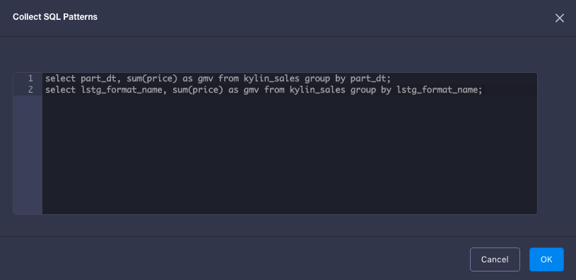
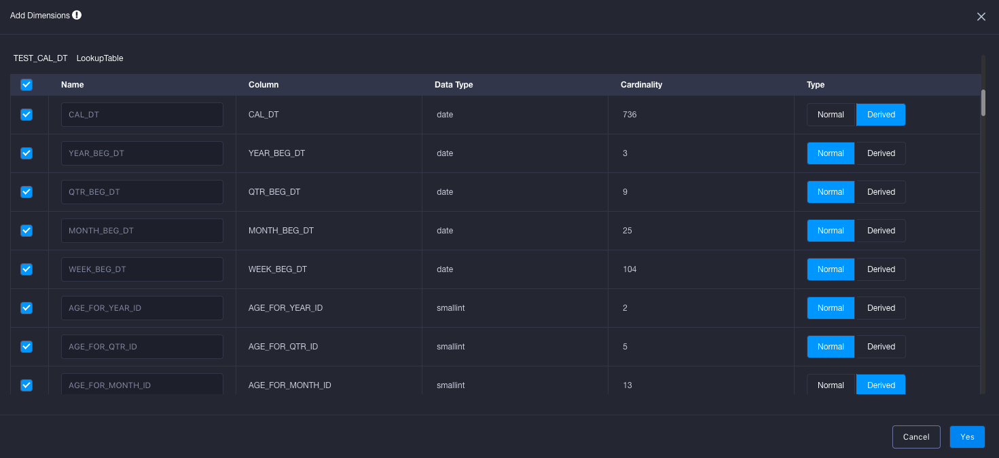
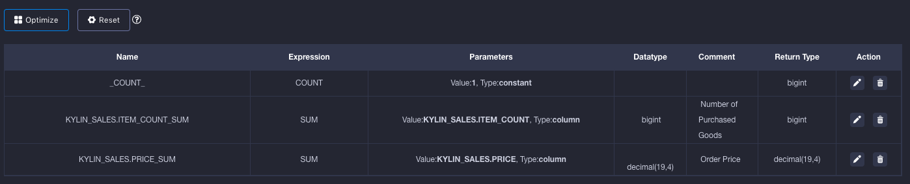

## Optimizer

Start from v2.4, KAP provides a Cube Optimizer for users to suggest cube designs, based on statistics of raw data and SQL patterns, which helps Cube expansion reduction and Query/Job performance improvement. After suggestion, users can make fine adjustment to meet specific requirements.

### Introduction

According to best pratices of Cube tuning, Optimizer analyzes statistics of raw data and SQL patterns, and suggests a optimized Cube design, which includes:

- Dimensions: Optimizer will suggest the type of dimensions, such as Normal or Derived.
- Measures: Optimizer will suggest common aggregation operator as measures, based on analysis of SQL patterns.
- Aggregation Groups: Optimizer will suggest select rules for each group, such as Joint, Hierarchy, Cuboid prune etc.
- Rowkey: Optimizer will suggest order and configuration for each Rowkeys, such as Encoding.

In order to achieve accurate suggestion, Optimizer need following items as input:

- Model check (Required): Model check must be completed before Optimize a cube, and the result is required input for Optimizer
- SQL patterns (Optional): Some history or target SQL statements, which guides the suggestion for Measures, Aggregation Groups and Rowkeys

### Steps

1. To finish model check. Skip if already passed. To get more about model check, please click [here](../model_check.en.md).

2. To create a cube with this model, and click "Collect SQL patterns" under "Cube Info" tabpage, and paste your SQL statements. For multiple SQLs, use ';' for seperation.

3. Click "+ Dimensions" button on "Dimensions" tabpage, and select required dimensions, whose default selection of dimension type is suggested by Optimzier. 

4. Click "Optimize" button under "Dimension optimizations" section, Aggregation groups will be filled with suggested rules, such as Mandatory, Hierarchy and Joint. Besides, configuration and order of Rowkeys will also be updated as suggestion.

5. Click "Optimize" button under "Measures" tabpage, Optimizer will fill measures with suggestions.

6. According to business requirements, users are able to make any adjustment to dimension, measures, aggregation groups, rowkeys, measures and so on. And save it at last.

