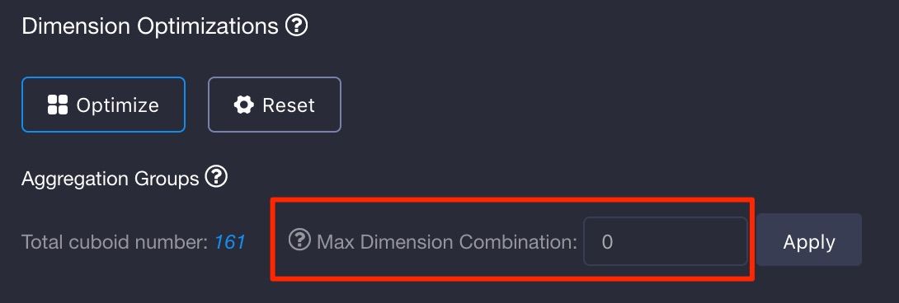
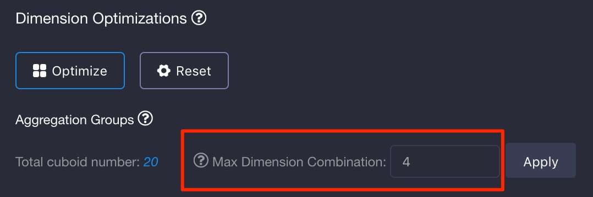

# Cuboid Pruning

Aggregation group and all its advanced settings help evade cuboid number explosion. To achieve better Cube design users have to understand the data model, which is hard for the junior ones. Fortunately KAP provides another simple cuboid pruning tool named **Max Dimension Combination (MDC)**. This tool limits the dimension number in a single cuboid, which means cuboids containing too many dimensions are not built in Cube Building process. It fits well in the situation where most queries only touch no more than N dimensions, N is MDC threshold that is configurable.

How to define how many dimensions a query touches? It's the union column number of group-by and filter columns. Here're some examples:

1. Query contains only group-by columns

```sql
-- 4 dimensions
select count(*) from table group by column1, column2, column3, column4
```

2. Query contains only filter

```sql
-- 4 dimensions
select count(*) from table where column1='a' and column2='b' or column3='c' and column4='d'
```

3. Query contains both group-by and filter

```sql
-- 3 dimensions
select count(*) from table where column1='a', column2='b' group by column2, column3
```

## Turn it on

We'll introduce how to leverage the tool in this section. It locates in Dimension Optimizations section of Cube dimension design, the second step of the whole Cube design process.



<p align="center"> Figure 1</p>

As shown in Figure 1, the default value is 0 meaning disable MDC. To enable MDC, enter a positive number, for example 4, and click apply. 



The cuboid number is reduced from 161 to 20 in this case. It's because the cuboids containing more than 4 dimensions are ignored except for base cuboid.

## Benefit and Tradeoff

On one hand MDC dimension pruning tool reduce the cuboids number and storage size significantly. On the other hand some complex queries that cover more dimensions may hit large cuboids, in which case online calculation cannot be avoided. Too much online calculation may make query response slower. 

Like other cube optimization tools, it's a kind of tradeoff. If most queries touch fewer dimensions in your case, MDC deserves a shot.