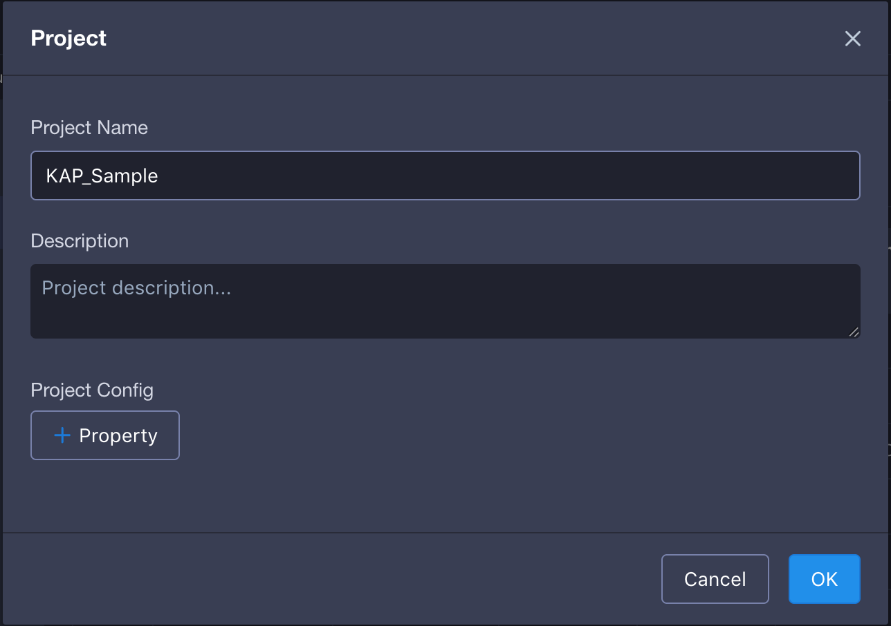
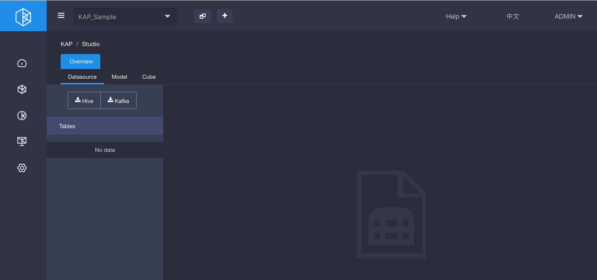

## Import Data

Currently, Hive is the default input data source of KAP. In order to use the sample data, it needs to be imported as Hive tables. In the `bin` folder of KAP installation directory, there is an executable script, run it to import the sample data into Hive：```$KYLIN_HOME/bin/sample.sh``` Once the script is executed successfully, try some commands in Hive shell to confirm the tables are loaded.

```hive
hive
hive> show tables;
OK
kylin_cal_dt
kylin_category_groupings
kylin_sales
Time taken: 0.127 seconds, Fetched: 3 row(s)
hive> select count(*) from kylin_sales;
Query ID = root_20160707221515_b040318d-1f08-44ab-b337-d1f858c46d7d
Total jobs = 1
Launching Job 1 out of 1
Number of reduce tasks determined at compile time: 1
In order to change the average load for a reducer (in bytes):
  set hive.exec.reducers.bytes.per.reducer=<number>
In order to limit the maximum number of reducers:
  set hive.exec.reducers.max=<number>
In order to set a constant number of reducers:
  set mapreduce.job.reduces=<number>
Starting Job = job_1467288198207_0129, Tracking URL = http://sandbox.hortonworks.com:8088/proxy/application_1467288198207_0129/
Kill Command = /usr/hdp/2.2.4.2-2/hadoop/bin/hadoop job  -kill job_1467288198207_0129
Hadoop job information for Stage-1: number of mappers: 1; number of reducers: 1
2016-07-07 22:15:11,897 Stage-1 map = 0%,  reduce = 0%
2016-07-07 22:15:17,502 Stage-1 map = 100%,  reduce = 0%, Cumulative CPU 1.64 sec
2016-07-07 22:15:25,039 Stage-1 map = 100%,  reduce = 100%, Cumulative CPU 3.37 sec
MapReduce Total cumulative CPU time: 3 seconds 370 msec
Ended Job = job_1467288198207_0129
MapReduce Jobs Launched:
Stage-Stage-1: Map: 1  Reduce: 1   Cumulative CPU: 3.37 sec   HDFS Read: 505033 HDFS Write: 6 SUCCESS
Total MapReduce CPU Time Spent: 3 seconds 370 msec
OK
10000
Time taken: 24.966 seconds, Fetched: 1 row(s)
```

### Create Project

In KAP, project is the workspace of tables, models and cubes. To create a sample project, open the web UI of KAP and click the plus icon at the top to create a new project like below.

Select the project you just created on the upper corner of the web UI, all our following operations will be within the project.

### Synchronize Hive Table

Hive tables need to be synchronized into KAP before they can be used. To make things easy, we synchronize by using graphical tree structure to load the Hive table, as shown below.

In the dialog box, expand the default database and select the desired three tables.

After importing, the system will automatically scan the tables to collect basic statistics of the data. Wait a few minutes, we can view the details under the "Data Source" tab.