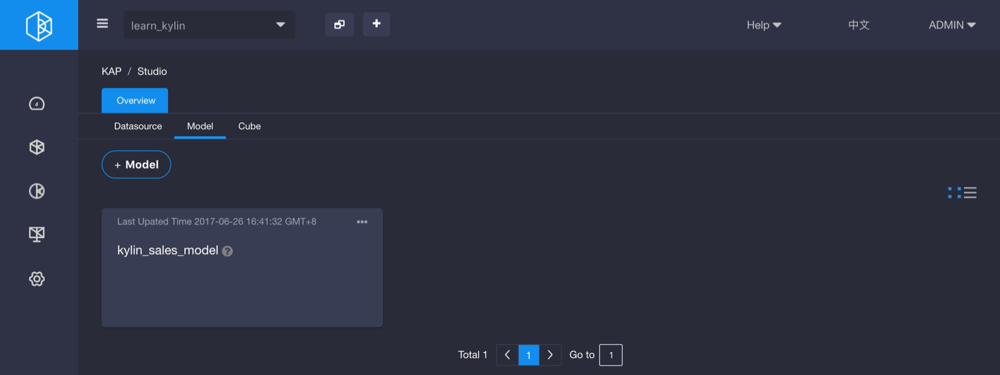
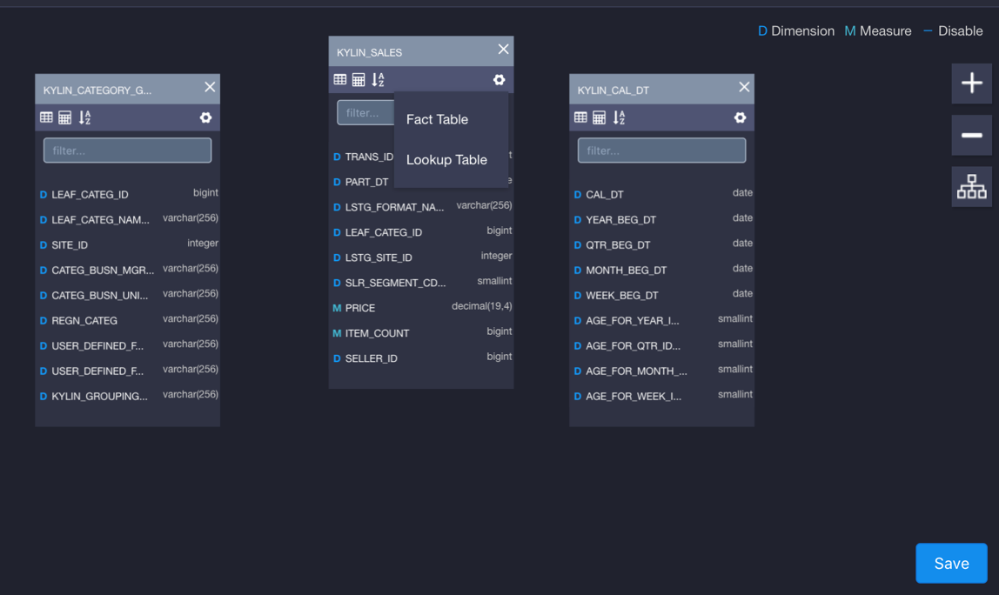
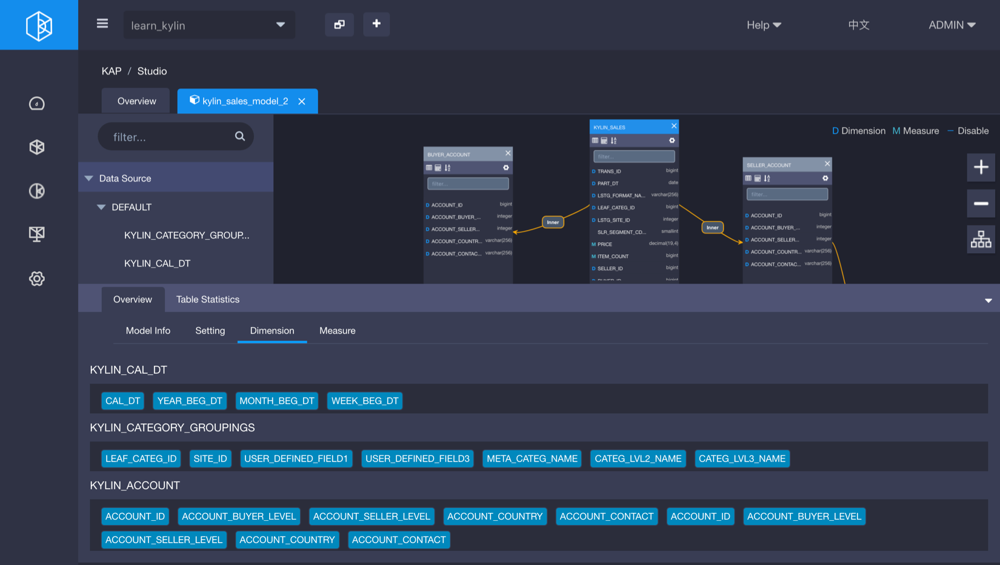
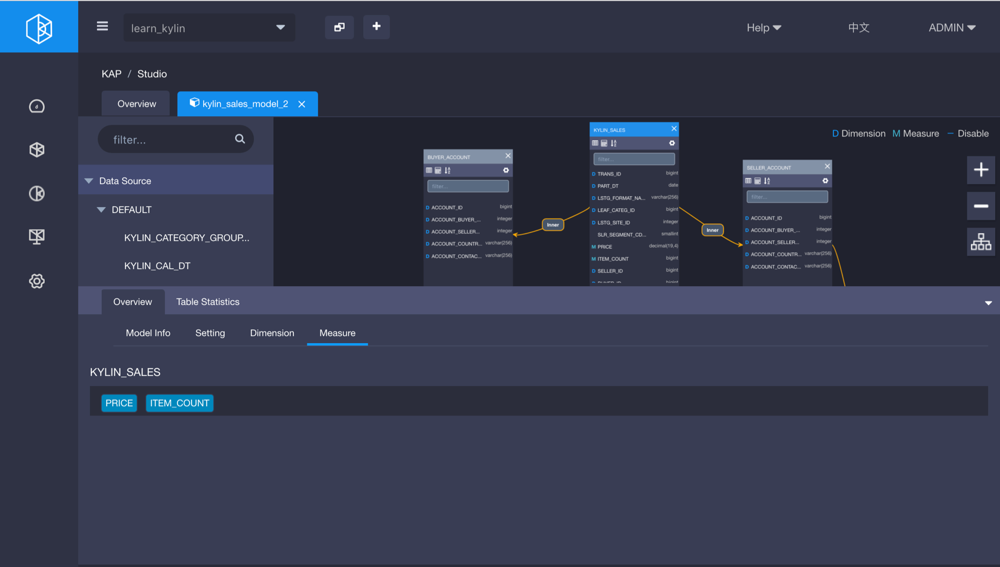
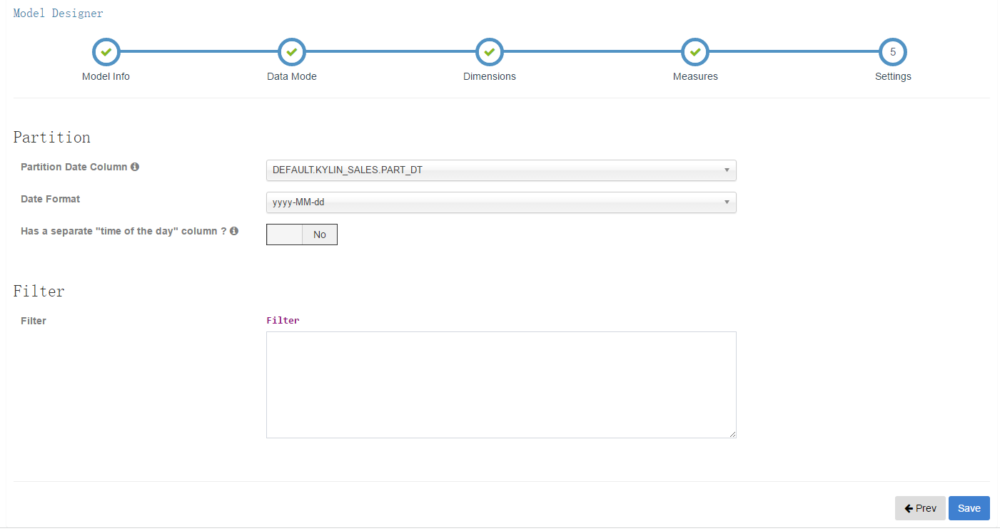

# Data Model

Data model is created based on data source. Take the data set coming with KAP as example, there are 1 fact table and 4 lookup tables in it, connected by foreign keys. In fact not all columns on the tables are required for analysis, so we only put the required ones into data model. Then analysts set these columns as dimensions or measures according to specific scenarios.

## Create Data Model

Step 1: Open KAP Web UI, select project `Learn_kylin` in project list located at upper left corner. Then create a new data model on `Model` page.

Step 2: Drag source tables from the left box to the canvas of model designer and exchange `kylin_sales` 's table type as fact table. Select one fact table (`KYLIN_SALES`) and four lookup tables (`KYLIN_CAL_DT`, `KYLIN_CATEGORY_GROUPINGS`,`KYLIN_ACCOUNT`, `KYLIN_COUNTRY`) for data model according to snowflake schema. 

Step 3: Set table join conditions as below. Actually as in KAP v2.4+, drag one dimension and drop it to a target lookup table can setup join condition among tables. For instance, set up join condition as “KYLIN_SALES *Inner Join* KYLIN\_CAL\_DT on KYLIN\_SALES.PART_DT=KYLIN\_CAL\_DT.CAL\_DT”, then you should drag `PART_DT` from `KYLIN_SALES` to the table`KYLIN_CAL_DT`, the following window will  be poped up.

1. KYLIN_SALES *Inner Join* KYLIN\_CAL\_DT 

   Connect Condition：

   DEFAULT.KYLIN\_SALES.PART_DT = DEFAULT.KYLIN\_CAL\_DT.CAL\_DT

2. KYLIN_SALES *Inner Join* KYLIN\_CATEGORY_GROUPINGS 

   Connect Condition: 

   KYLIN_SALES.LEAF_CATEG_ID=KYLIN\_CATEGORY\_GROUPINGS.LEAF_CATEG_ID

   KYLIN_SALES.LSTG_SITE_ID=KYLIN\_CATEGORY\_GROUPINGS.SITE_ID 

3. KYLIN_SALES *Inner Join* BUYER_ACCOUNT (alias of KYLIN_ACCOUNT)

   Connect Condition: 

   KYLIN_SALES.BUYER_ID=BUYER_ACCOUNT.ACCOUNT_ID 

4. KYLIN_SALES *Inner Join* SELLER_ACCOUNT (alias of KYLIN_ACCOUNT) 

   Connect Condition: 

   KYLIN_SALES.SELLER_ID=SELLER_ACCOUNT.ACCOUNT_ID 

5. BUYER_ACCOUNT (alias of KYLIN_ACCOUNT) *Inner Join* BUYER_COUNTRY(alias of KYLIN\_COUNTRY) 

   Connect Condition: 

   BUYER_ACCOUNT.ACCOUNT_COUNTRY=BUYER_COUNTRY.COUNTRY 

6. SELLER_ACCOUNT (alias of KYLIN_ACCOUNT) *Inner Join* SELLER_COUNTRY(alias of KYLIN\_COUNTRY)

   Connect Condition: 

   SELLER_ACCOUNT.ACCOUNT_COUNTRY=SELLER_COUNTRY.COUNTRY

The result is shown in the following figure(if you click "inner" as join type, it will show you details of this join condition). 

Step 4: Select dimension columns from fact and lookup tables. Date column is usually selected as filter condition, so it's required. Other columns such as `Category` and `Seller ID` are also selected as dimensions. All dimensions labeled as **D** on the model canvas and dimension summary can be view if you click the overview bar on the bottom of screen. 

Step 5: Select measures from fact table according to business requirement. For instance, `PRICE` is used to measure sales price, `ITEM_COUNT` is used to measure sales amount, etc. Same as dimension summary, measures summary can be view if you click the "measure" tab besides the dimension overview.

Step 6: Click `Save` button, then select date partition column. New data comes to Hive through ETL every day in general, based on which Cube is build incrementally. Let's select column `DEFAULT.KYLIN_SALES.PART_DT` as partition column and specify the date format as `yyyy-MM-dd`.Finally click `Submit` button, data model is created.