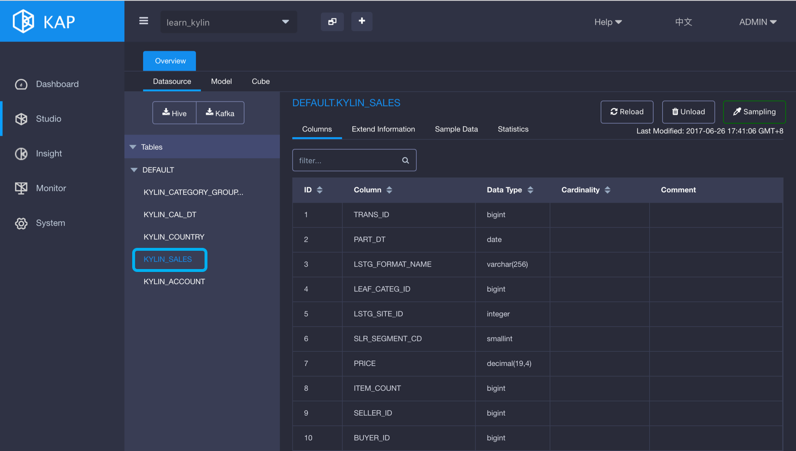
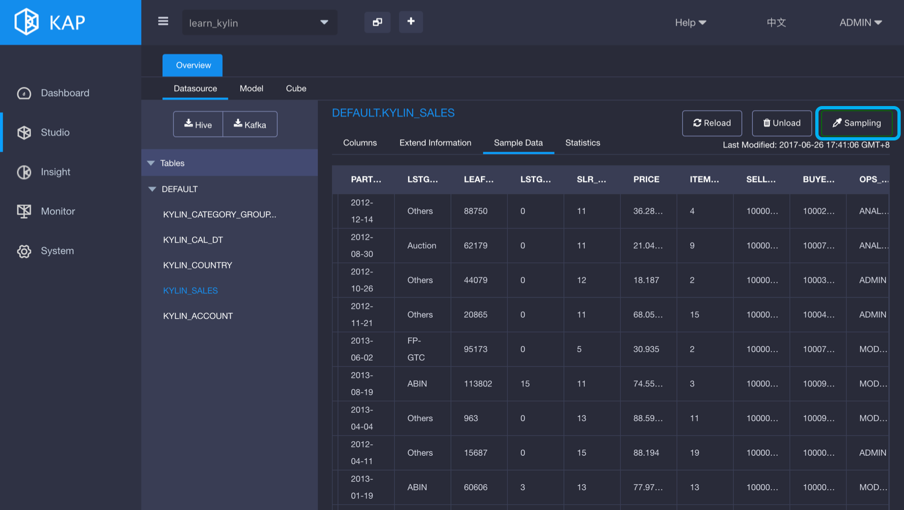
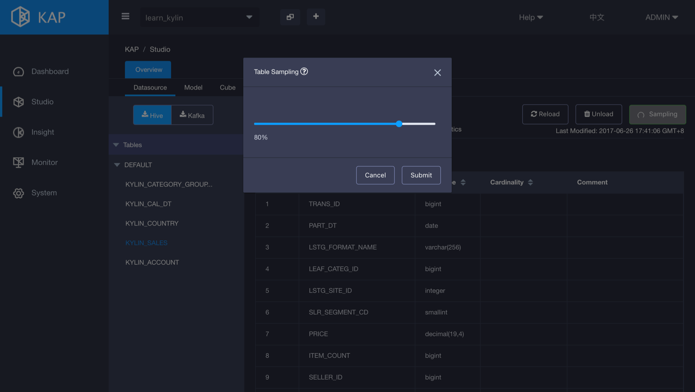
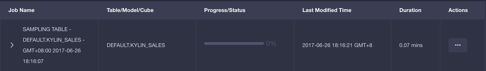
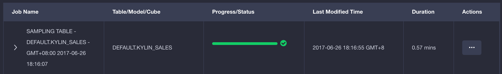
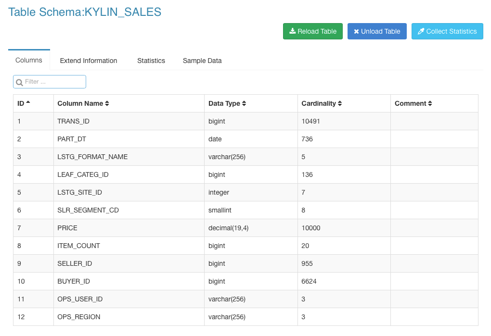
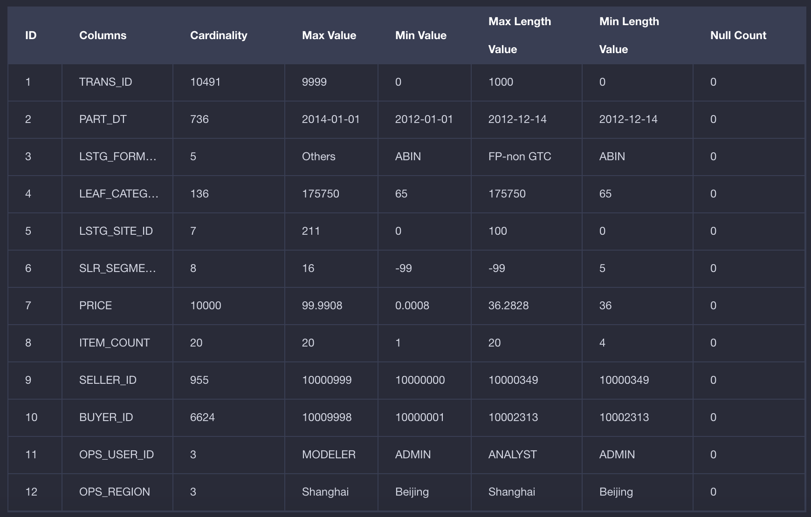

## Collect Table Statistics

Table's statistics include column cardinality, sample data and other statistics, which are helpful in Data Model and Cube design. This chapter will introduce how to collect table's statistics in KAP.

Open KAP Web UI, select project `learn_kylin`, click `Studio` tab on the left and click `Data Source` in the Overview tab. Select the the table you want to collect statistics via "Sampling", here we select table `KYLIN_SALES`. 

Click button `Sampling` on the right side.

A dialog window pops up. Leave the sampling bar 100% by default if you want to scan the whole table, otherwise drag the bar to the percentile desired. Click button `Submit` to start statistics collecting job.

Click `Monitor` on the left side, you can view a job for table sampling.

Wait until the job complete.

Return to `Data Source` tab and select table `KYLIN_SALES`. You can see the table statistics information by clicking tabs `Columns`, `Extend Information`, `Statistics` and `Sample Data`.

