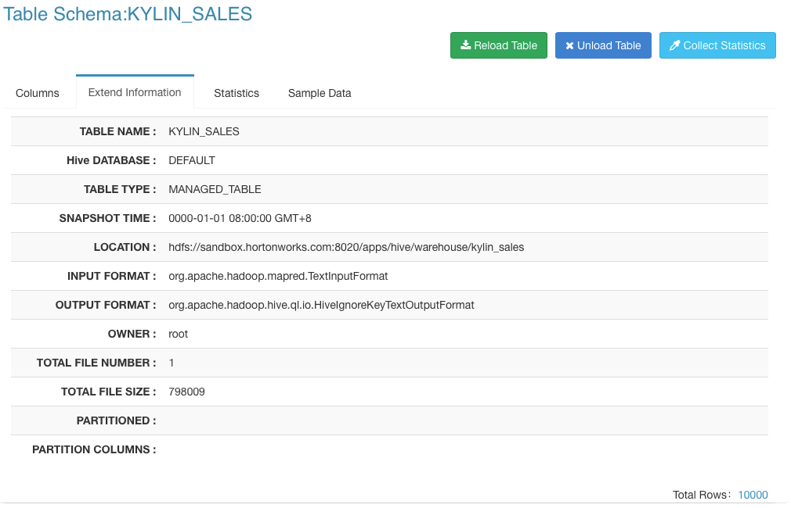
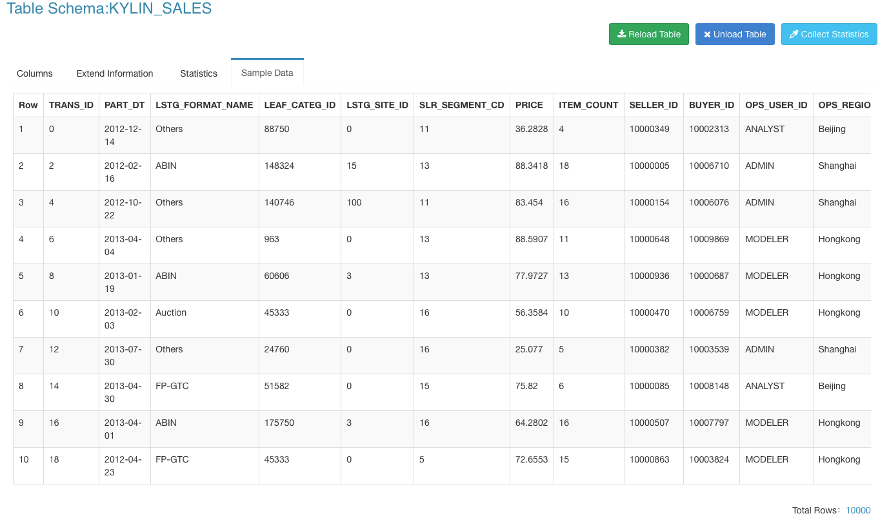

## Collect Table Statistics

Table's statistics include column cardinality, sample data and other statistics, which are helpful in Data Model and Cube design. This chapter will introduce how to collect table's statistics in KAP.

Open KAP Web UI, select project `KAP_Sample_1`, click `Model` tab on top bar and click `Data Source` tab in Model page. Select the the table you want to collect statistics, here we select table `KYLIN_SALES`. 

Click button `Collect Statistics` on the right side.

A dialog window pops up. Leave the text field empty if you want to scan the whole table, otherwise enter the scan row number. Click button `Statistics` to start statistics collecting job.

Click `Monitor` on the top bar, you can see a task for statistics collecting.

Wait until the job complete.

Return to `Data Source` tab and select table `KYLIN_SALES`. You can see the table statistics information by clicking tabs `Columns`, `Extend Information`, `Statistics` and `Sample Data`.

