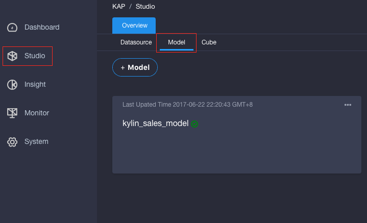
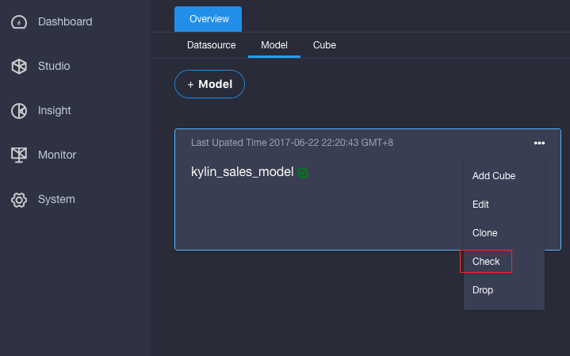
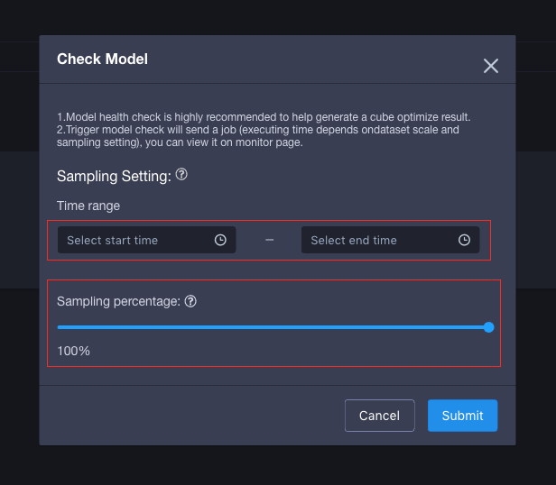
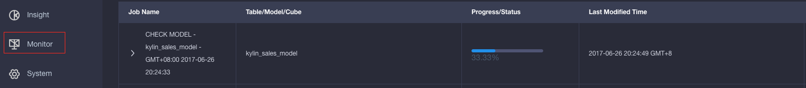
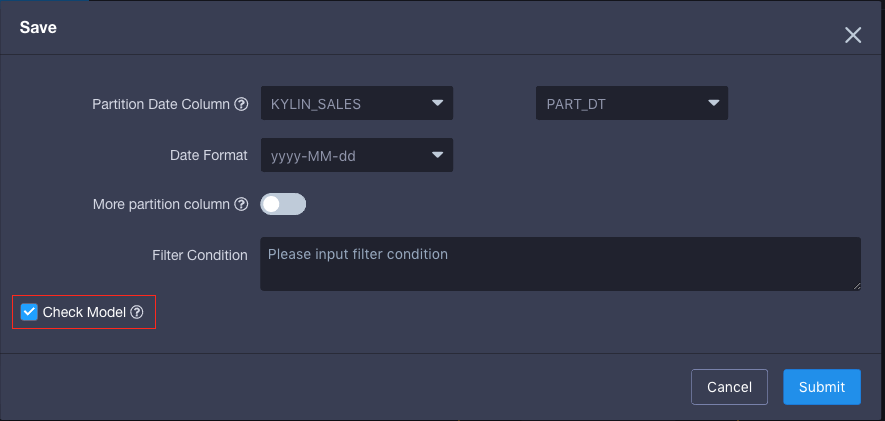
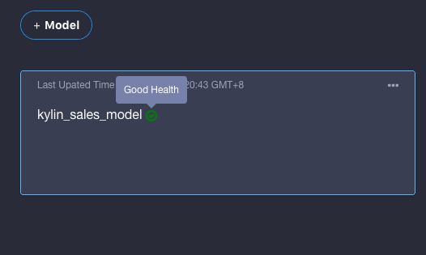

## Model Check

When the model is created, it is hard to say if it is reasonable or not, thus KAP provides a check procedure to inspect the model before building a cube with using it.

The procedure includes four small steps:

1. Check if there are the duplications in primary key of lookup tables.
2. Check if the source data of foreigner key is distributed uniformly.
3. Check if the join condition is reasonable.
4. Calculate single and double columns cardinality.

**Step1.** Start KAP and go to UI，pick a project, such as *learn_kylin*,  then click **Studio** in the left navigator, after that click **Model** tab.

**Step2.** For the models already exist, such as kylin_sales_model, click the menu on the top right conner and click **Check** button.

**Step3. Configuration**

Time Range. It asks for selecting a start time and end time if the partition column has been set during creating model. With the time range condition it could reduce the source data, instead of scanning whole data. By default, it will check the whole data.

Sampling percentage. It means it only checks the data in the given ratio, such as 50% will check one line in each two lines.

**Step4.** After all configuration is done, click **Submit** button and it starts a check job. The job status can be observed after clicking **Monitor** in the left navigator.

If creating or editting a model, after clicking **save**, it shows a checkbox to ask user if starting a check model job. By default, it stats the check job.

If the model check job is done without any exceptions, it can observe the check result on the model list. In this case, che check result is health，there are other check status and details if the model has some issues.

As mentioned in the beginning, The Model Check includes 3 different check tasks:

1. Check if there are the duplications in primary key of lookup tables. If there are the duplication and it is over the given threshold will terminates the check job immediately. In this case, it's better to remove the duplication.
2. Check if the source data on the foreigner key is distributed uniformly. When the data is not distributed uniformly, might cause the whole job can not finish until the latest reducer which possesses the skew data completes its task. It suggests to have some efforts to avoid the this situation before starting the cubing job. 
3. Check if the join condition is reasonable. It will generate a flat table and check the join result. According to the result, it could have basic judgement that if the given join condition is good or bad. If the condition is totally good, there could be some issues in the source data.

With the above checks, it defines five model check status:

1. Not Checked Yet. Once a model is created, it will be in this state.
2. On Checking. It means a model check job is running.
3. Good Health. It means there are no any check errors .
4. Warn. It indicates there is one check error.
5. Error. It show there are at least check errors.