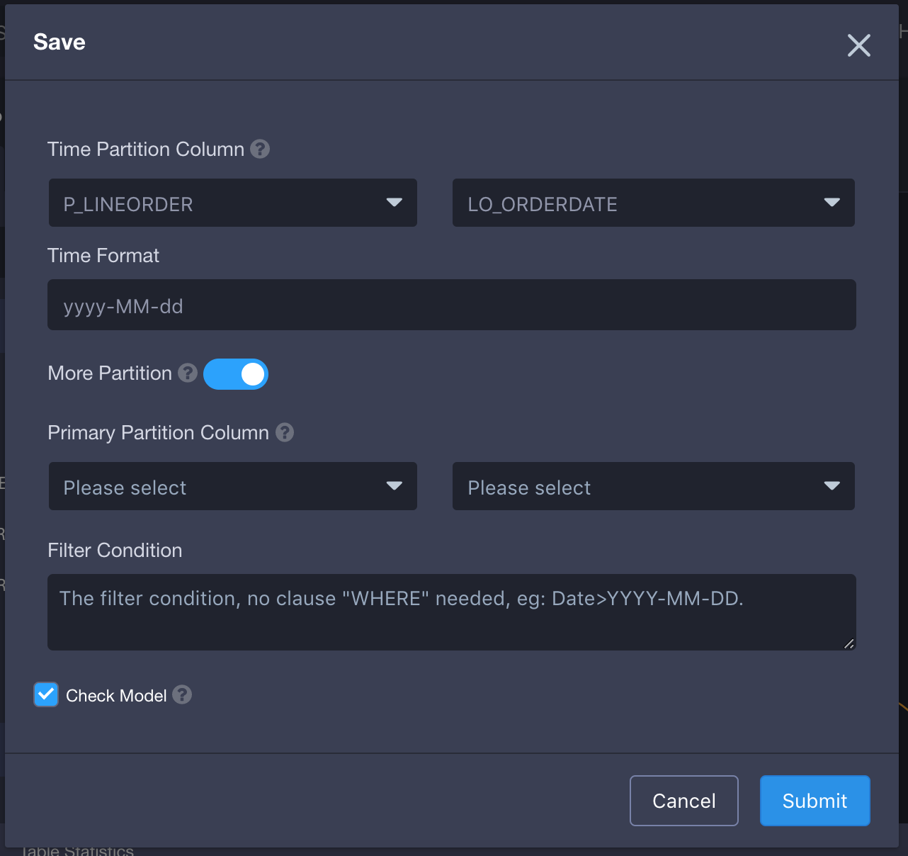
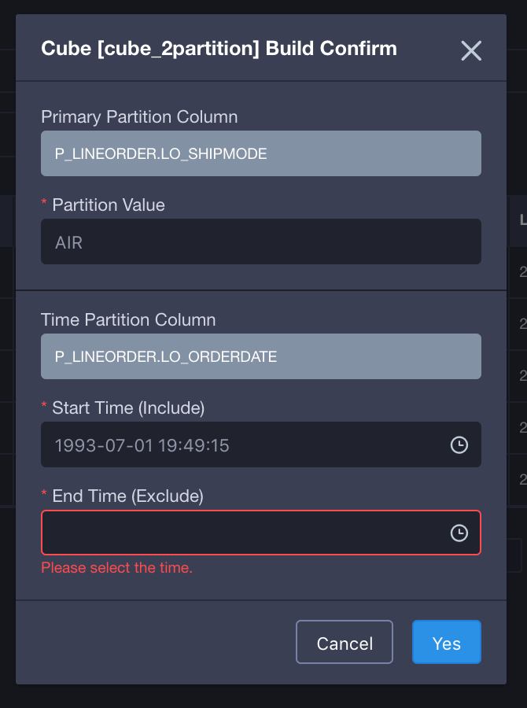

## Multi-Partition Model

The common model is usually partitioned by time. But in the multi-tenant scenarios, we need another partition (partition column), besides time partition, to distinguish different subsidiaries or subbusinesses. Here, we call the new partition, except for the time partition, collectively as Multi-Partition. The time partition and primary partition are supported in KAP since KAP V2.5.2.

### Concept of Multi-Partition

- Basic concept: the partition column includes the time partition column and multi-partition column. Currently, adding only one partition (Primary Partition) is supported.
- Common concepts:
  - Time Partition Column: supports date or finer granularity time partition.
  - Multi-Partition Column: the partition dimension except for Time Partition Column. Currently, adding one partition (Primary Partition) is supported.
  - Partition value: the specific value in the primary partition column when being built.   The segment is often built incrementally on the partition value. 

### Basic Usage

1. For the general process of creating a model, please refer to [Data Model](data_modeling.en.md).

2. When saving a model, if you choose **More Partition** under Time Partition Column, then multi partitions will be created (currently you can add one partition).

   

3. When a cube is built, if the cube has multi-partition column, you need to choose multi-partition column and the corresponding time partition column.

   

