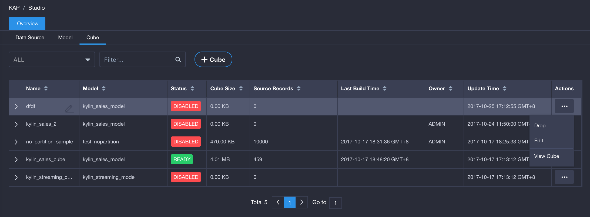
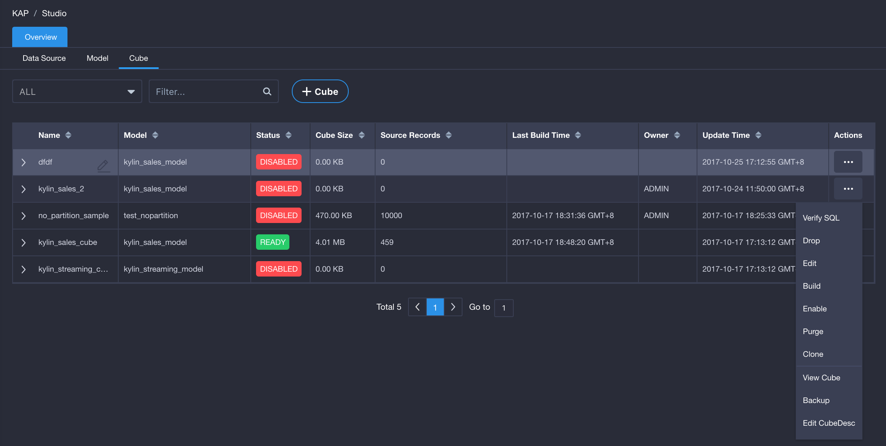
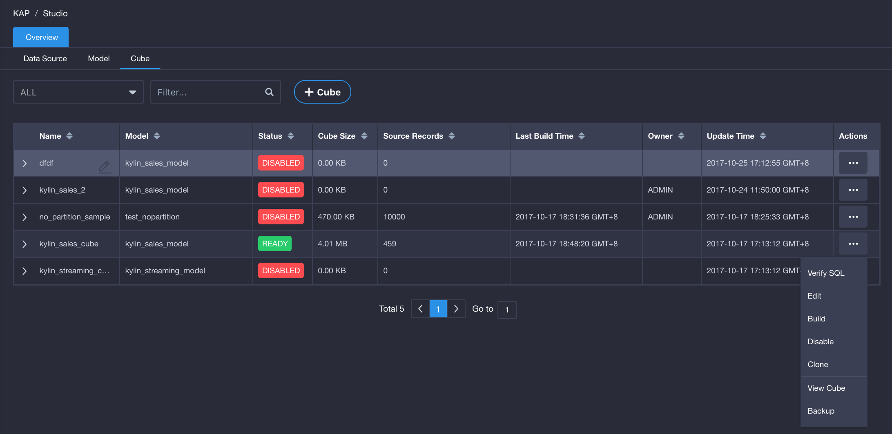
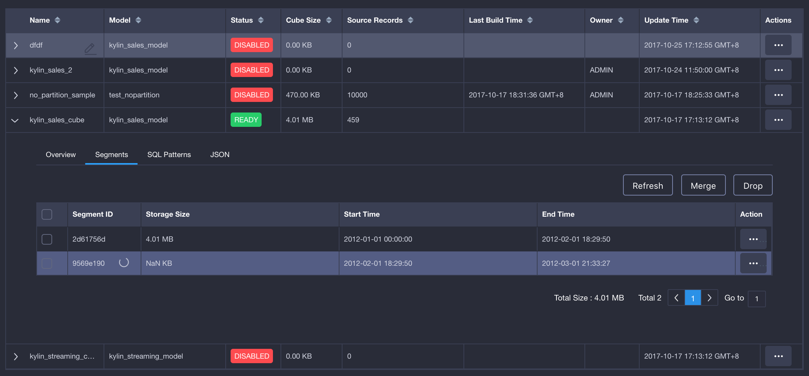
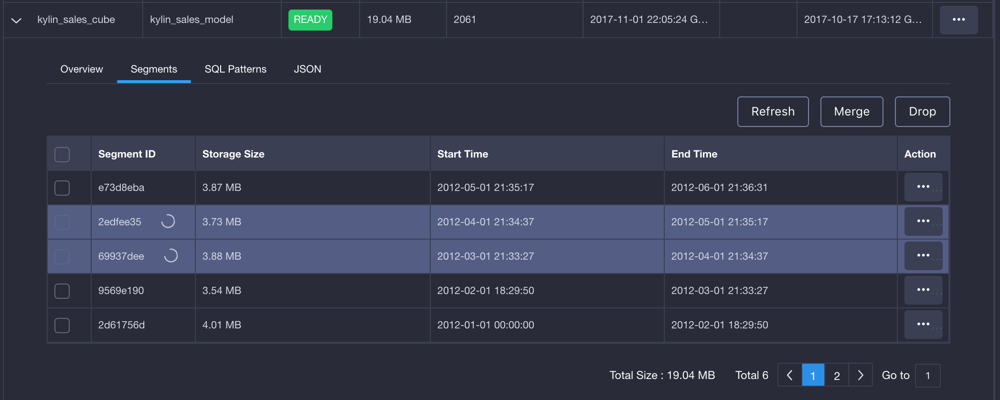
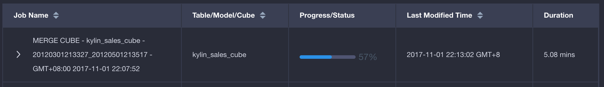

## Cube and Segment Management

### Cube Status and Managment Actions

- Draft : A cube with this status means it has not been saved yet. You may continiue to edit, delete and view it (view the cube's description).

  

- Disable: A cube with Disable status means it cannot be queried. The status will be converted to Ready automatically when it is built.

  - Common executable actions: validate SQL, delete, edit, build, ready (convert a cube with a segment to Ready), purge (empty all segments under a cube), clone (copy a cube, but do not copy a segment), view cube (view a cube's description), backup (backup a cube's metadata), edit cube's details (view or edit a cube's json).

  

- Ready: A cube with Ready status means it has a segment and can be queried, but cannot be deleted or purged directly.
  - Common executable actions: validate SQL, edit, disable (convert a Ready cube to Disable), clone (copy a cube, but do not copy a segment), view cube (view a cube's description), backup (backup a cube's metadata) 

  

- Broken: A cube with Broken status means it is abnormal because its metadata is broken.

### Segment Status and Management Actions

When a cube is built, the segment data will be generated. The segment is divided by partition column. 

Common executable actions: refresh (rebuild the segment), merge (merge several segments into one, even if they are discontinous), and delete.

> Tips: clicking an ID of a segment being built, refreshed or merged may guide you to the tasks associated with the Monitor page.  

- After a cube is built, you may view the segment(s) under the cube. The segment being built is shown in the figure below.

- To refresh a segment equals to rebuild this segment. The segment being refreshed is also shown in the figure below.

  

- When merging segments, the old segment will be rebuilt, as shown in the figure below.

  

Clicking a segment ID (e.g. 2edfee35 in the figure above) will guide you to the Monitor page and you will see the task of Merge Cube, as shown in the figure below.

