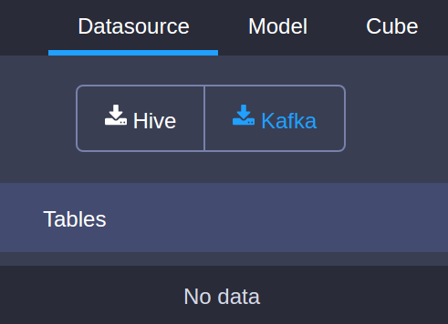
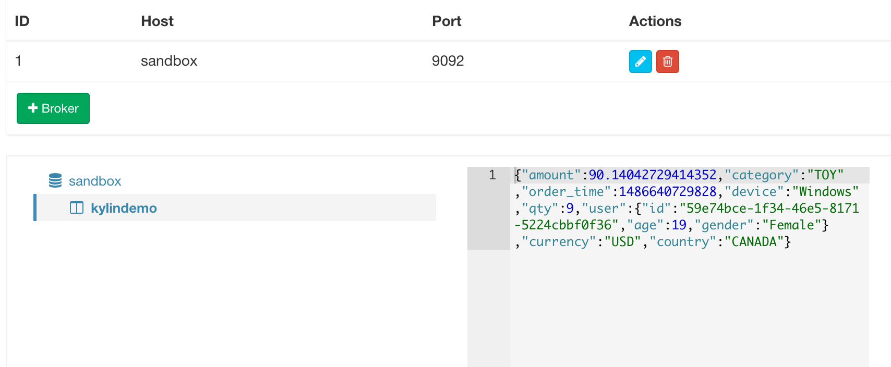
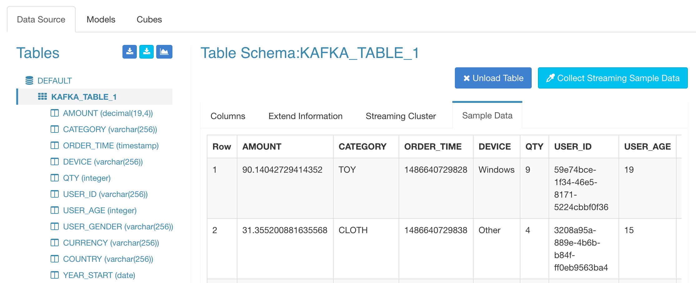
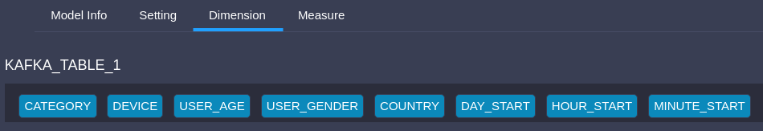
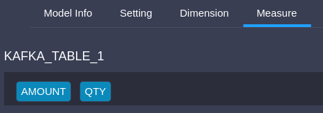
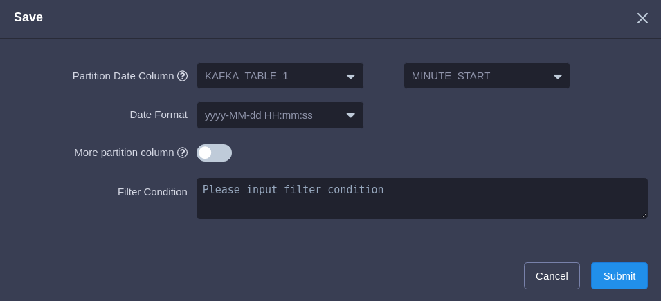
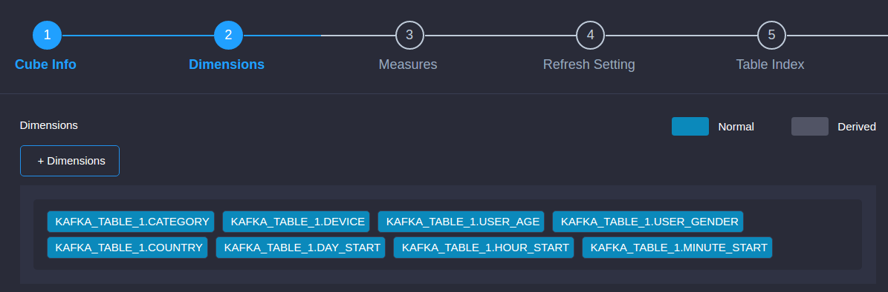
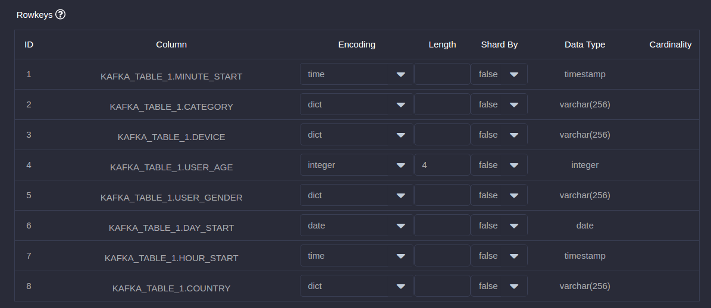

##  Streaming Cube

KAP 2.3.x releases the scalable streaming cubing function, it leverages Hadoop to consume the data from Kafka to build the cube. This doc is a step by step tutorial, illustrating how to create and build a streaming cube.

## Preparation
To finish this tutorial, you need a Hadoop environment which has KAP 2.3 or above installed, and have Kafka be ready to use. In this tutorial, we use Hortonworks HDP 2.4 Sandbox VM as the Hadoop environment.

## Create sample Kafka topic and populate data

Firstly, we need a Kafka topic for the incoming data. A sample topic "kylin_demo" will be created here:

	curl -s http://mirrors.tuna.tsinghua.edu.cn/apache/kafka/0.10.1.0/kafka_2.10-0.10.1.0.tgz | tar -xz -C /usr/local/
	cd /usr/local/kafka_2.10-0.10.1.0/
	./bin/kafka-server-start.sh config/server.properties &

Secondly, we need to put some sample data to this topic. KAP has an utility class which can do this. Assuming KAP is installed in ${KYLIN_HOME}

	bin/kafka-topics.sh --create --zookeeper localhost:2181 --replication-factor 1 --partitions 3 --topic kylindemo
	export KAFKA_HOME=/usr/local/kafka_2.10-0.10.1.0
	cd $KYLIN_HOME
	./bin/kylin.sh org.apache.kylin.source.kafka.util.KafkaSampleProducer --topic kylindemo --broker localhost:9092

This tool sends 100 records to Kafka per second. Please keep it running during this tutorial. You can check the sample messages by running kafka-console-consumer.sh 

	cd $KAFKA_HOME
	bin/kafka-console-consumer.sh --zookeeper localhost:2181 --bootstrap-server localhost:9092 --topic kylindemo --from-beginning

## Define a table from streaming
1. Start KAP server, login KAP web GUI, select or create a project. Click "Studio" -> "Data Source", then click the icon "Kafka".

   

2.Input your broker info.
   

3.Click √ to confirm your broker info, then click Get Cluster Info -> sandbox -> kylindemo, the kafka sample message would appear in the right box, click Convert.
   

4.You need to give a logic table name for this streaming data source. The name will be used for SQL query later. Here please enter "KAFKA_TABLE_1" in the "Table Name" field.
   

5.Review the table schema, make sure there is at least one column chosen as 'timestamp'.

   

6.Set parser

Parser Name: org.apache.kylin.source.kafka.TimedJsonStreamParser (default), you can also use customized parser

Parser Timestamp Field: you are required to set a timestamp field for the parser. In this example, we use order_time

ParserProperties: Properties of the parser should as least include the timestamp field. In this example, tsColName=order_time. You can further define customized properties.

7.click 'submit'

## Create data model
With the table defined in previous step, let's create the data model. This step is pretty same as creating a normal data model, but please notice:

* For a streaming cube, it doesn't support joining with lookup tables. So when you define the data model, only select "DEFAULT.KAFKA_TABLE_1 " as the fact table, no lookup tables.
* Select "MINUTE_START" as the cube's partition date column, as we will do incremental building at minute level.

Here we pick 8 dimension columns and 2 measure columns:

 	

Select 'MINUTE_START' as partition column. Save the data model.

## Create cube

The streaming cube is almost the same as a normal cube. A couple of points need your attention here:

* Don't use "order\_time" as dimension as that is pretty fine-grained, here we suggest to use "mintue\_start", "hour\_start" or other, depending on how you inspect the data.
* In the "refersh setting" step, you should create more merge ranges, like 0.5 hour, 4 hours, 1 day, and 7 days. This helps control the cube segment amount.
* In the "rowkeys" section, drag the "minute\_start" to the head position. For streaming queries, the time condition is used frequently. So putting it to the head will help narrow down the scan range.

 

 
 ​	
 

 

Save the cube.

## Run a build

You can trigger the build job from web GUI, by clicking “Actions” -> “Build”, or sending a request to KAP RESTful API with ‘curl’ command:

	curl -X PUT --user ADMIN:KYLIN -H "Accept: application/vnd.apache.kylin-v2+json" -H "Content-Type:application/json" -H "Accept-Language: en" -d '{ "sourceOffsetStart": 0, "sourceOffsetEnd": 9223372036854775807, "buildType": "BUILD"}' http://localhost:7070/kylin/api/cubes/{your_cube_name}/build_streaming

Please notice that the API endpoint is different from a normal cube (this URL ends with “build_streaming”).

Here 0 means it is from the last position, and 9223372036854775807 (Long.MAX_VALUE) means to the end position on Kafka topic. If it is the first time to build (no previous segment), KAP will seek the beginning of the topics as the start position.

In the “Monitor” page, a new job is generated; Wait it 100% finished.

Enter the “Insight” page, compose a SQL to run, e.g.:

	SELECT MINUTE_START, COUNT(*), SUM(AMOUNT), SUM(QTY) FROM KAFKA_TABLE_1 GROUP BY MINUTE_START ORDER BY MINUTE_START

## Automate the build

Once the first build and query got successfully, you can schedule incremental builds at a certain frequency. KAP records the offsets of each build; when receives a build request, it will start from the last end position, and then seeks the latest offsets from Kafka. You can invoke RESTful API with any scheduler tools like Linux crontab to build periodically:

    crontab -e　*/5 * * * * curl -X PUT --user ADMIN:KYLIN -H "Accept: application/vnd.apache.kylin-v2+json" -H "Content-Type:application/json" -H "Accept-Language: en" -d '{ "sourceOffsetStart": 0, "sourceOffsetEnd": 9223372036854775807, "buildType": "BUILD"}' http://localhost:7070/kylin/api/cubes/{your_cube_name}/build_streaming

Now you can find the cube is automatically built from streaming. And when the cube segments accumulate to a longer time range, KAP will automatically merge them into a larger segment.

##Trouble shootings

You may encounter the following error when run “kylin.sh”:

    Exception in thread "main" java.lang.NoClassDefFoundError: org/apache/kafka/clients/producer/Producer
    at java.lang.Class.getDeclaredMethods0(Native Method)
    at java.lang.Class.privateGetDeclaredMethods(Class.java:2615)
    at java.lang.Class.getMethod0(Class.java:2856)
    at java.lang.Class.getMethod(Class.java:1668)
    at sun.launcher.LauncherHelper.getMainMethod(LauncherHelper.java:494)
    at sun.launcher.LauncherHelper.checkAndLoadMain(LauncherHelper.java:486)
    Caused by: java.lang.ClassNotFoundException: org.apache.kafka.clients.producer.Producer
    at java.net.URLClassLoader$1.run(URLClassLoader.java:366)
    at java.net.URLClassLoader$1.run(URLClassLoader.java:355)
    at java.security.AccessController.doPrivileged(Native Method)
    at java.net.URLClassLoader.findClass(URLClassLoader.java:354)
    at java.lang.ClassLoader.loadClass(ClassLoader.java:425)
    at sun.misc.Launcher$AppClassLoader.loadClass(Launcher.java:308)
    at java.lang.ClassLoader.loadClass(ClassLoader.java:358)
    ... 6 more

The reason is KAP wasn’t able to find the proper Kafka client jars. Make sure you have properly set “KAFKA_HOME” environment variable.

    Get “killed by admin” error in the “Build Cube” step

Within a Sandbox VM, YARN may not allocate the requested memory resource to MR job, as the “inmem” cubing algorithm requests more memory resource. You can bypass this by requesting less memory: edit “conf/kylin_job_conf_inmem.xml”, change the following two parameters like this:

	<property>
	    <name>mapreduce.map.memory.mb</name>
	    <value>1072</value>
	    <description></description>
	</property>
	
	<property>
	    <name>mapreduce.map.java.opts</name>
	    <value>-Xmx800m</value>
	    <description></description>
	</property>

If there already exist bunch of history messages in Kafka and you'd better not to build from the very beginning, you can trigger a call to set the current end position as the start for the cube:

	curl -X PUT --user ADMIN:KYLIN -H "Accept: application/vnd.apache.kylin-v2+json" -H "Content-Type:application/json" -H "Accept-Language: en" -d '{ "sourceOffsetStart": 0, "sourceOffsetEnd": 9223372036854775807, "buildType": "BUILD"}' http://localhost:7070/kylin/api/cubes/{your_cube_name}/init_start_offsets

If some build jobs got error and you discard them, there will be a hole (or say gap) left in the Cube. Since each time KAP will build from the last position, you couldn't expect the hole be filled by normal builds. KAP provides API to check and fill the holes

Check holes:

	curl -X GET --user ADMINN:KYLIN -H "Accept: application/vnd.apache.kylin-v2+json" -H "Content-Type:application/json" -H "Accept-Language: en" http://localhost:7070/kylin/api/cubes/{your_cube_name}/holes

If the result is an empty array, it means there is no hole. Otherwise, trigger KAP to fill them:

	curl -X PUT --user ADMINN:KYLIN -H "Accept: application/vnd.apache.kylin-v2+json" -H "Content-Type:application/json" -H "Accept-Language: en" http://localhost:7070/kylin/api/cubes/{your_cube_name}/holes

