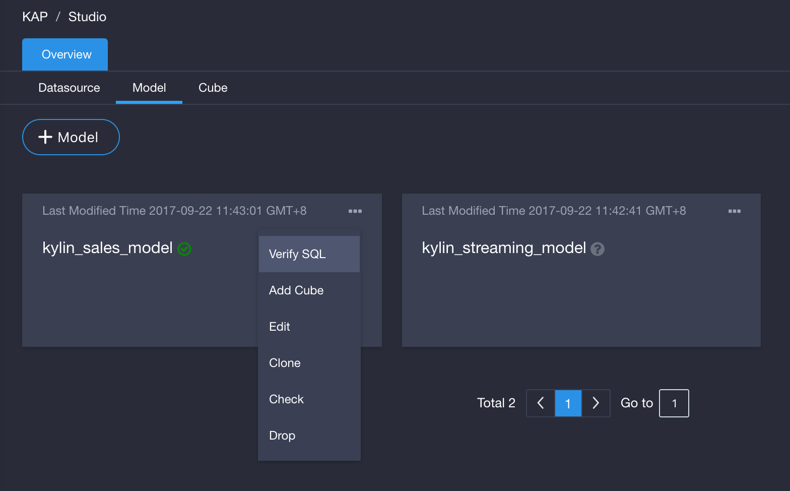
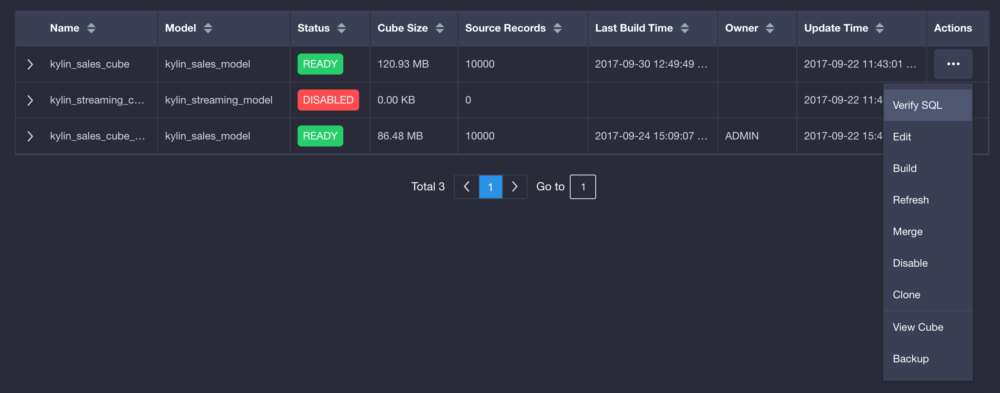
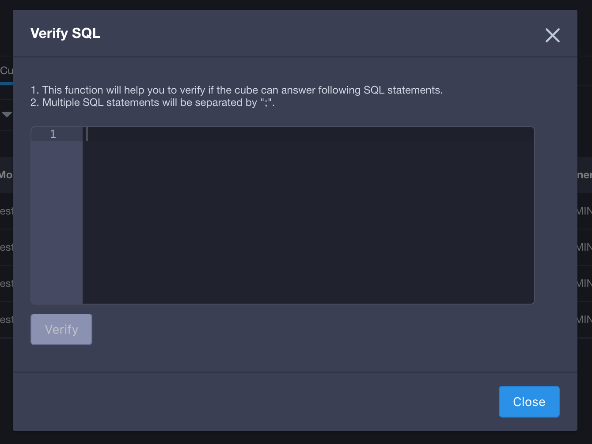
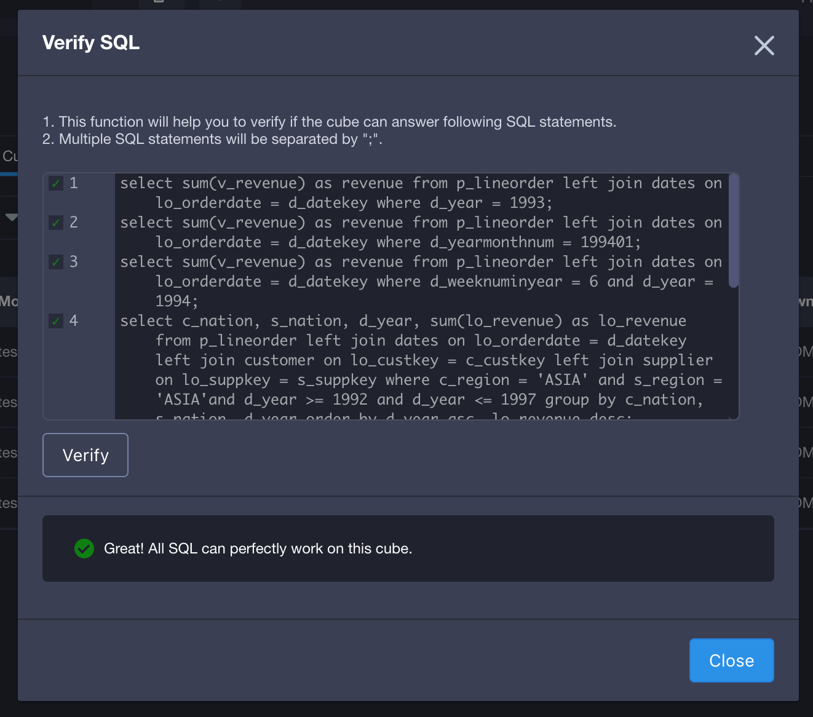
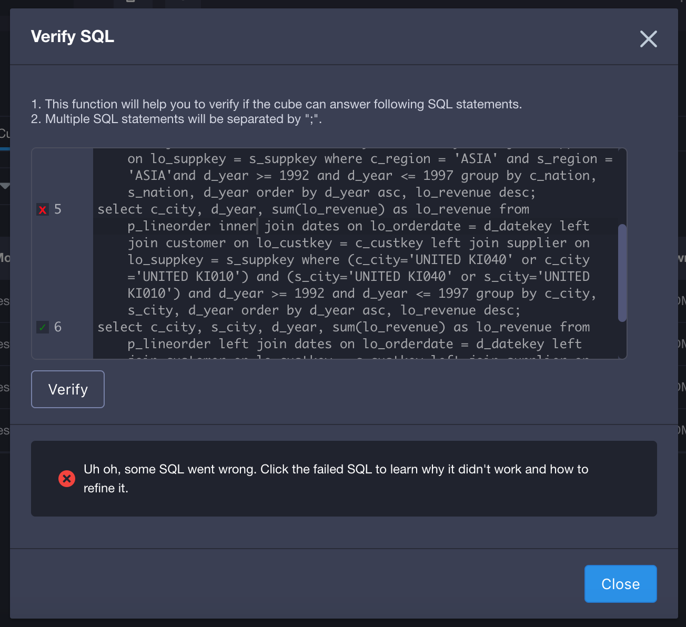
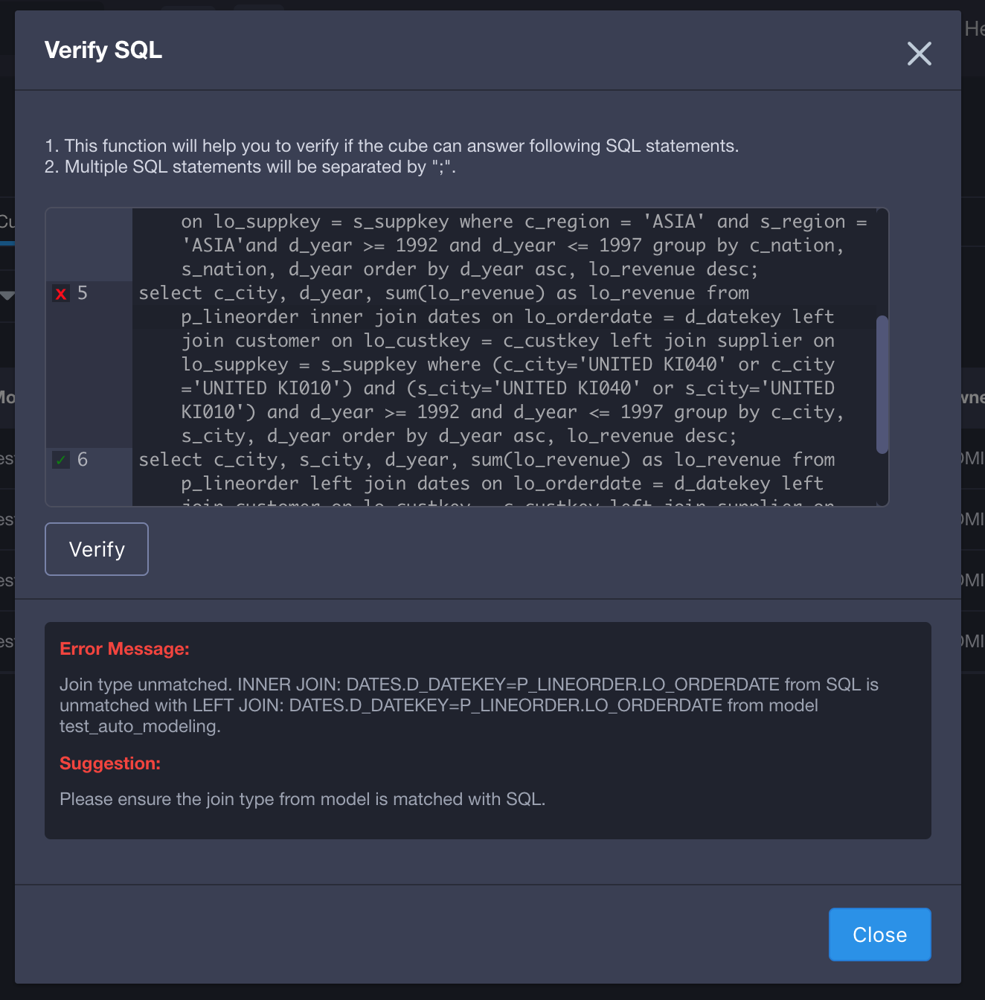

## Verify SQL 

There is a huge question mark in your mind that when you design and save a cube/model: does this cube/model can answer all SQLs you often query? KAP v2.5 features this demand and provide you a pre-action,  ***Verify SQL*** action, before build the cube to relief your worries here. 

### Verify approach

Step 1, when you done with cube/model design and save it, you can do the ***verify SQL*** action from action list on the cube/model. 

Step 2, paste or manually enter SQLs you want to verify, which are often queried. 

Step 3, click ***verify*** and this action may take a while. If the cube/model designed perfect fine, it can answer all queries entered, you will get the following figure.

Step 4, if there are queries cannot pass the verify test, it will be listed after "x". You can click the "x" to get details about ***why*** this query cannot work and ***how*** to refine SQL or cube/model to get it work. 

