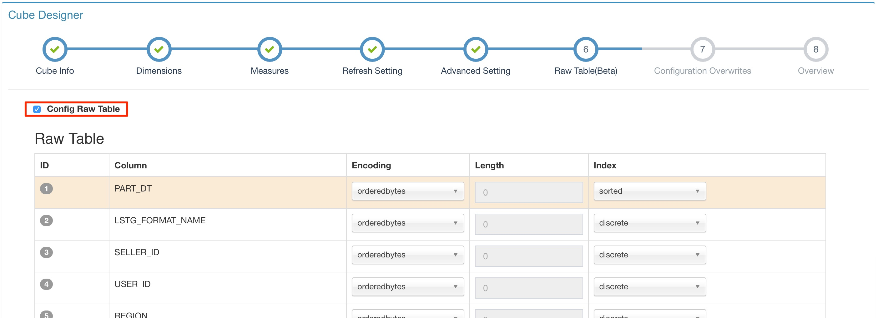
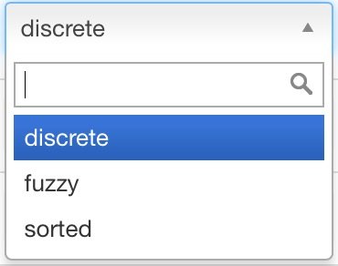

## Create Raw Table

Raw Table is introduced for detailed data query and its creation process is embeded in Cube's. This chapter will introduce Raw Table creation process with example data coming with KAP.

Open KAP Web UI, select project `KAP_Sample_1` in project list located at upper left corner. Cube creation happens on `Cube` page.

Raw Table definition is in Step 6 and it's disabled by default. 

Selecting `Config Raw Table` shows the default Raw Table definition.

### Encoding

Click `Encoding` dropdown on each row, user can select encoding for each line. The default encoding is `orderedbytes`.

1. `date` encoding is for date string, such as "20160101" or "2016-01-02". It only stores the day information excluding hour, minute and second, which means 4pm or 6am is the same in this encoding. The data is stored as Long type in storage.
2. `boolean` encoding is for boolean data, such as "true" or "false". The data is stored as Boolean type in storage.
3. `fixed_length` encoding is for string and the `Length` is required to tell how many charactors are stored there. Strings longer than that Length will be cut down to fit that length. `Length` is defined in the next column to `Encoding`.
4. `time` encoding is for time string. It's different from date encoding for it's stored the information of day, hour, minute, second and even millisecond. The data is stored as Long type in storage.
5. `integer` encoding is only for integer and long type. The `Length` is also required in this encoding and it supports up to 8 width. You can always set the width to 8, it's safe for all possible long values. Smaller length value helps save storage. For instance,  if your data's range is from -2 to 89, only one byte is enough, so set length to 1 is the best choise in this case.
6. `int` encoding is deprecated. For new user, please select `integer` encoding.  
7. `var` encoding is a special encoding. System will pick up one encoding for this column according to its hive column type.
8. `orderedbytes` encoding is for all types. It keeps data's order when encoding. It's the default encoding type and is required if the column is set as `sorted` in index. The index explanation is in next section.

### Index

Click `Index` dropdown on each row, user can select index type for each line. The default encoding is `discrete`.

1. `discrete` index is the default index, it means only equal index is build for this line.
2. `fuzzy` index is for query with `Like` filter. If the column will in `Like` filter, please set the index as `fuzzy`.
3. `sorted` index means the row is sorted and currently there must be one and only one column set as `sorted` in a table. By default, the partition line in data model is picked as `sorted` line.