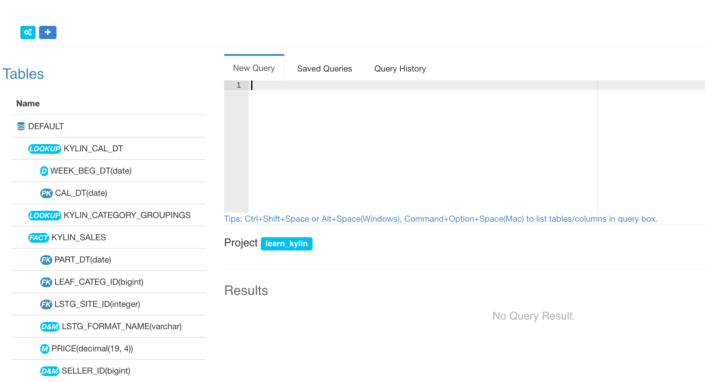
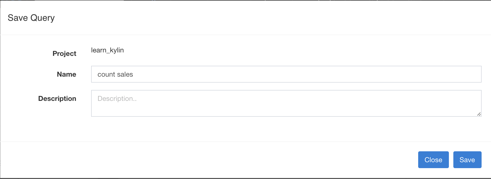

> **Supported Browsers**
>
> Windows: Google Chrome, FireFox
>
> Mac: Google Chrome, FireFox, Safari

## Query Page Overview
Click *Insight* on KAP navigation header, all query-able tables will be listed on the left side of page. The tables will be shown only after the cube build successfully. Enter SQL in textbox on the right side of page, query result will be shown at the below textbox.

* **FACT** - Fact Table 
* **LOOKUP** - Dimension Table

## Query with SQL
> **Query Limitations**
>
> 1. Only support SQL
>
> 2. SQL will not be routed to the source, such as hive, if the realization in cube is not found.

Enter SQL and click *Submit*, you will see query results. One more thing, there's a *LIMIT* field at the bottom right of the page. If there's no *LIMIT* field in your SQL, the default limit will be *50000*. If you want to disable the limit, just replace *50000* with *0*.

## Save Query
User could click *Save SQL* button at right bottom to save queries, the query is associated with current user.

## Query History
All query histories will show in *Query History* tab. Click *Query History* tab, you can resubmit your sql. If the browser cookies are cleared, all histories will be lost. 

