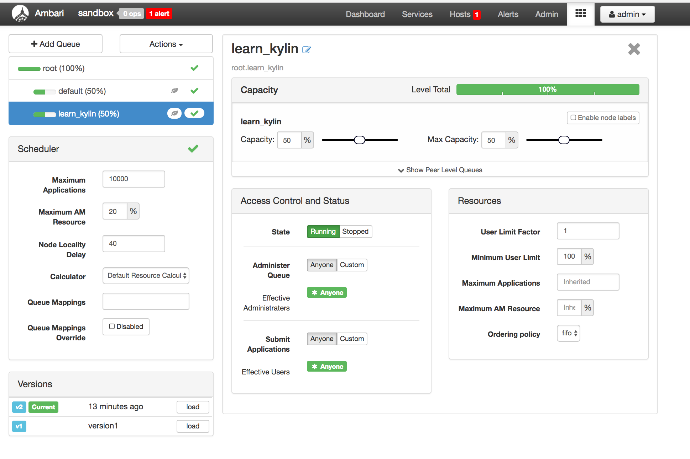
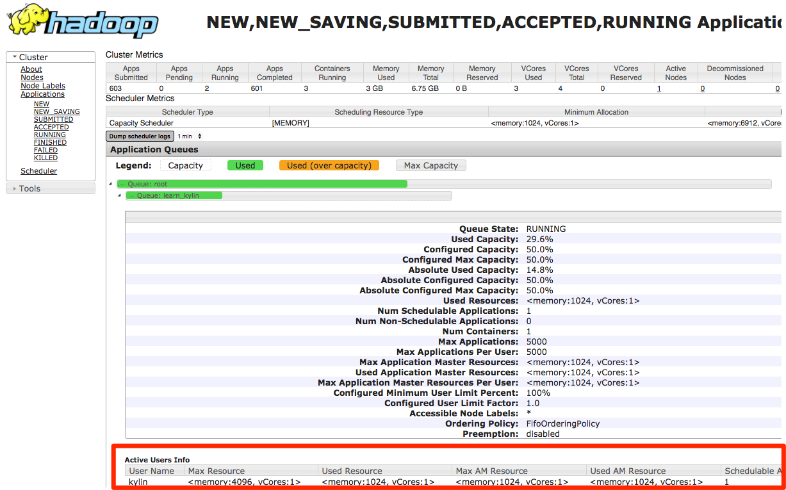

## Hadoop Queue Configuration

In the case of multiple-tenants environment, to securely share a large cluster, each tenant needs to have allocated resources in a timely manner under constraints of allocated capacities. With the assumption that each tenant owns a separate project in KAP, to achieve computing resources allocation and separation, each project can be configured to use different Hadoop queue. 

To achieve this, first, you may need to create a new YARN capacity scheduler queue. By default, job sent out by KAP will go to default Hadoop queue.

In the screenshot below, a new queue *learn_kylin* has been setup.

1. In KAP, go to project setting page, you may choose the project you are intended to switch the queue.
2. Edit the page and click `+property` to add key value pair as shown below. 

`Kylin.engine.mr.config-override.mapreduce.job.queuename = YOUR_QUEUE_NAME`

`Kylin.source.hive.config-override.mapreduce.job.queuename = YOUR_QUEUE_NAME`

You will need to change the YOUR_QUEUE_NAME to your queue name. 

In this example, queue for project learn_kylin has been changed to *learn_kylin* as shown in the above screenshot, let's test out if this change has been effective by triggering a cube building job in project learn_kylin.

Now, go to Hadoop Resource Manager on the cluster, you may observe that this job has goes under queue *Learn_kylin*. 

Similarly, you may set up Hadoop queue for other projects to achieve computing resource separation.