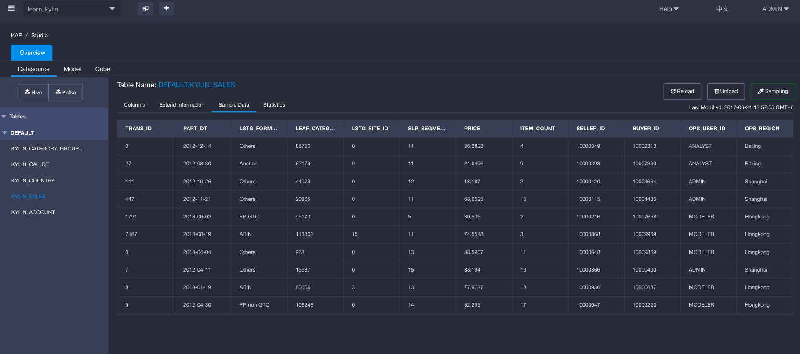

# Intersect Function

Retention or conversion rate is important in data analysis for most internet enterprises. In general, the value can be calculated based on the intersection of two data sets, with some same dimensions (city, category, or so on) and one varied dimension (date, or so forth). KAP has supported retention calculation based on the bitmap and UDAF **intersect_count**. This article would introduce you how to use this function.


## Intersect query

The SQL **INTERSECT** clause/operator is used to combine two SELECT statements, but returns rows only from the first SELECT statement that are identical to a row in the second SELECT statement. This means 
INTERSECT returns only common rows returned by the two SELECT statements.

Moreover, detailed using rules of intersect_count could be described as below:

`intersect_count(column To Count, column To Filter, filter Value List)`

`column To Count` refers to the column to be calculated and applied on distinct count;

`column To Filter` refers to the varied dimension;

`filter Value List` refers to the value of the varied dimension, and it should be listed in "array[ ]";


## Precondition

To apply retention calculation in KAP, sql query needs to meet requirements as below:

- Only one dimension can be varied;
- The measure to be calculated must have been defined as a precise count distinct measure(check [precise count distinct](../../model/cube/count_distinct_precise.en.md) for help);


## Example

Select a default **Data Source** named as `learn_kylin`, then the table structure would present below: there are one fact table (`KYLIN_SALES`) and two lookup tables (`KYLIN_CAL_DT` and `KYLIN_CATEGORY_GROUPINGS`). Take a minute to check the `KYLIN_SALES` as well as its sample data, and we'll use it later.



The  `KYLIN_SALES`  table is mocked an online transaction records table, which involves both sellers and users. So we could get a seller retention rate to illustrate how much percentile of sellers are trading on this online marketplace day by day for the New year period(2012.01.01-2012.01.03). Input the query like:

```
select LSTG_FORMAT_NAME,
intersect_count(seller_id, part_dt, array[date'2012-01-01']) as first_day,
intersect_count(seller_id, part_dt, array[date'2012-01-02']) as second_day,
intersect_count(seller_id, part_dt, array[date'2012-01-03']) as third_day,
intersect_count(seller_id, part_dt, array[date'2012-01-01',date'2012-01-02']) as retention_oneday,
intersect_count(seller_id, part_dt, array[date'2012-01-01',date'2012-01-02',date'2012-01-03']) as retention_twoday
from kylin_sales
where part_dt in (date'2012-01-01',date'2012-01-02',date'2012-01-03')
group by LSTG_FORMAT_NAME
```

Then it would return a result looks as below. The result shows that there is no seller keeps trading constantly within this period.

