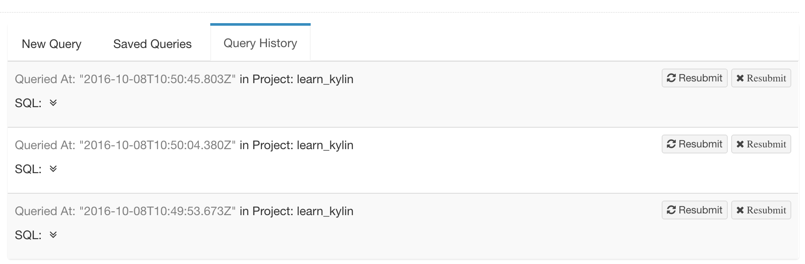
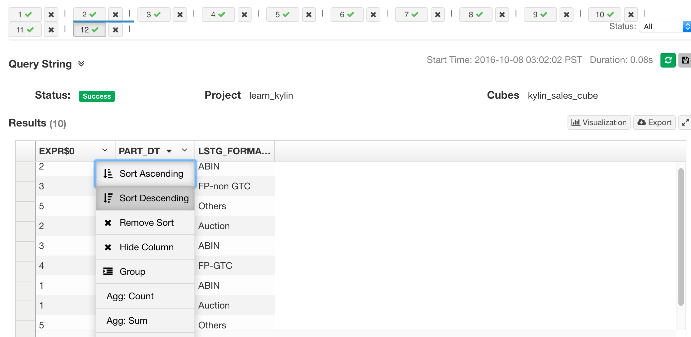

## Insight

> **Supported Browsers**
>
> Windows: Google Chrome, FireFox
>
> Mac: Google Chrome, FireFox, Safari

### Query Page Overview
Click *Insight* on KAP navigation header, all query-able tables will be listed on the left side of page. The tables will be shown only after the cube build successfully. Enter SQL in textbox on the right side of page, query result will be shown at the below textbox.

* **FACT** - Fact Table 
* **LOOKUP** - Dimension Table

### Query with SQL
> **Query Limitations**
>
> 1. Only support SQL
>
> 2. SQL will not be routed to the source, such as hive, if the realization in cube is not found.

Enter SQL and click *Submit*, you will see query results. One more thing, there's a *LIMIT* field at the bottom right of the page. If there's no *LIMIT* field in your SQL, the default limit will be *50000*. If you want to disable the limit, just replace *50000* with *0*.

### Save Query
User could click *Save SQL* button at right bottom to save queries, the query is associated with current user.

### Query History
All query histories will show in *Query History* tab. Click *Query History* tab, you can resubmit your sql. If the browser cookies are cleared, all histories will be lost. 

### Query Pushdown

KAP supports query pushdown from version 2.4. When queries which cannot be fulfilled with customized Cubes bother you, you can simply leverage query pushdown to redirect the query to Spark SQL or Hive, making a trade-off  between query latency and query flexibility to obtain a better experience. 

Query pushdown is turned off in default. To turn on it, remove the comment character # ahead of the configuration item `kylin.query.ad-hoc.runner-class-name=io.kyligence.kap.storage.parquet.adhoc.AdHocRunnerSparkImp` in file `kylin.properties` to bring it into  effect. With query pushdown turned on, queries cannot get results from Cubes will be redirected to Spark SQL in default. You can also configure it manually, and choose Hive as the default engine to be redirected. Please refer to [Important Configurations](../config/settings.en.md) for more configuration settings. 

### Data Visualization in KAP

#### Table

KAP displays query result in table by default, the result data could be sorted in ascending or descending order. You can also hide the column and export results in CSV.

Click *Visulization* button, you can display query result in chart. KAP supports *line chart*, *bar chart*, *pie chart* by default.

#### Chart

- Line Chart

- Bar Chart

- Pie Chart

