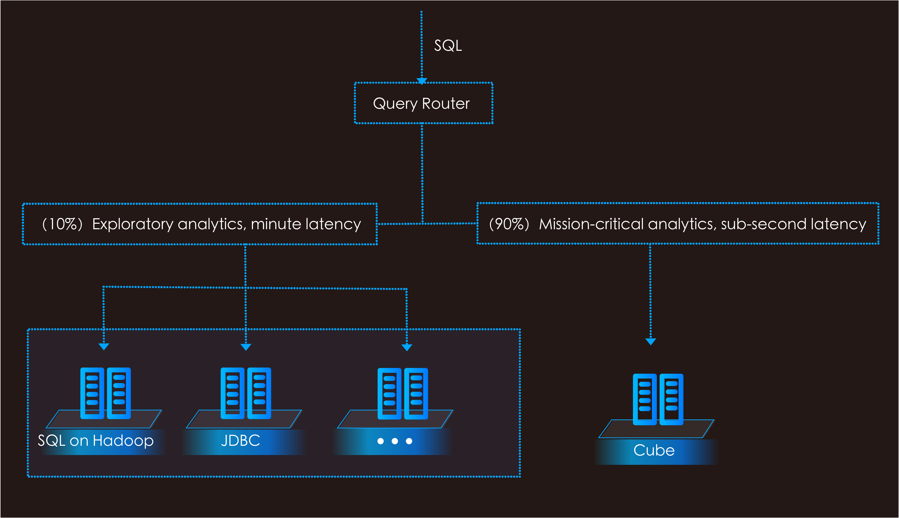
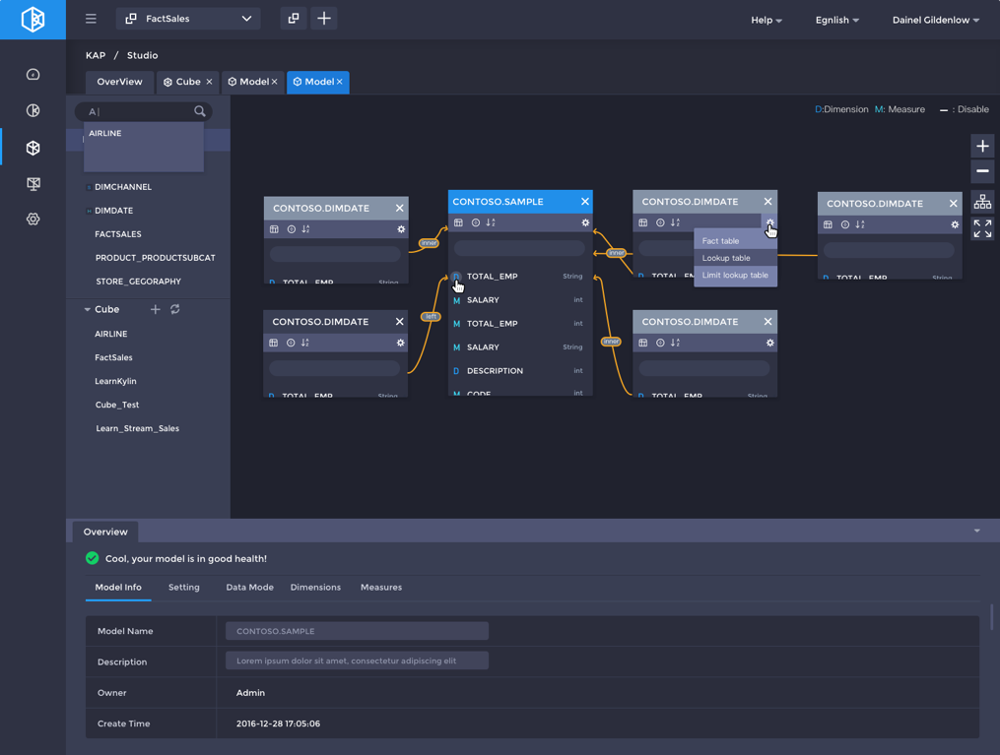
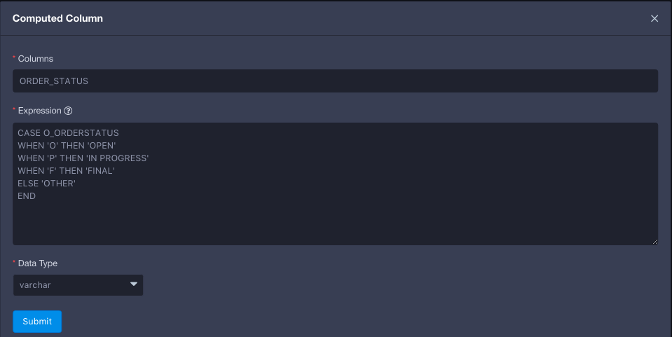

## KAP 2.4 Release Notes

In this release, KAP has envolved from MOLAP (Multidimensional OLAP) to **HOLAP** (Hybrid OLAP) , which supports popular SQL on Hadoop technologies in multiple analytics scenarios. Furthermore, KAP 2.4 has extended its semantic layer by introducing **Snowflake** schema and **Computed Column**, transferring complex business logic to data model accurately.

#### **Introduced HOLAP (Hybrid OLAP)**

**Query Pushdown** 

Query Pushdown routes the query that can’t be answered by Cube to underlying SQL engine. KAP has embedded Spark SQL and Hive as its pushdown engines, and other SQL on Hadoop engines will be coming in following releases. KAP supports mission-critical and exploratory analytics (Ad-Hoc) by leveraging cube-based sub-second performance query and pushdown-based query respectively.

**Seamless Integration with SQL on Hadoop** 

KAP seamlessly integrates with existing SQL on Hadoop and reuses existing analytics capability. KAP brings the transparent speedup power to data access layer and empowers the unified query gateway for all BI applications. By taking full advantage of pre-calculation technology, KAP enables BI to analyze massive data interactively and fills the gap between BI and Hadoop.

#### **Enhanced Data Modeling**

**KyStudio: New Data Modeling Tool**

KyStudio is an intuitive model structure that brings new visual experience. With drag-and-drop modeling process, KyStudio enables the analysts to load metadata, design model/cube, build cube, and process works more smoothly through a self-served interface.

**Model Health Inspection**

Model Health Inspection can figure out the potential modeling issues, such as primary-foreign key mismatch and data skew. The inspection result guides users to improve the model design directly and efficiently.

**Cube Optimizer**

Cube Optimizer will first analyze source data characters and inputted SQL patterns, and then suggests cube design that includes dimensions, aggregation group settings, measurement settings, encoding algorithms, and rowkey orders. This method reduces the modeling learning curve and helps users to follow the modeling steps by simple clicks.

**Efficient Cubing**

KAP offers the efficient cubing by following the Max Dimension Combination (the biggest usage of dimension combination number during queries) setting defined by users. The efficient cubing algorithm avoids the rarely-used cube build, reduces the cubing time, and resolves the cube explosion problem. In some real-cases, it saves over 90% storage

#### Enriched Semantic Layer

**Computed Column**

The semantic layer is enriched by introducing computed column technology. KAP allows users to define computed column on the original source table to extract/transform/redefine the original column into a new virtual column. The computed column works like other original column which will be pre-calculated during cubing phase. The computed column enables analysts to do data clean/transform all by themselves without their IT teams. It also improves the query performance by pre-calculated the filter condition. Hive User Defined Function(UDF) is supported on computed column, and this allows users to reuse existing code and libraries. 

**Support Snowflake**

With both star schema and snowflake schema supported, KAP provides a hold of complex business logic.

#### **Easy to DevOps**

**Installation Environment Inspection**

Full environment check scripts are provided. It inspects the environment dependency, permission, version, and other necessary resources. The inspection result will indicate the potential issues and provide solutions before KAP starts.

**New Metadata Storage**

Relational databases, such as MySQL, can be used as the KAP metadata store. By moving the metadata from HBase to relational database, the database operation strategies are followed. Without HBase, the total operation cost and risks are reduced dramatically.

**Cube Building Scheduler**

Cube Building Scheduler enables users to build the cube on schedule. It reduces the operating cost and enables analysts to build the cube by themselves with automatic scheduler service. Offering better operating experience and reliability, the Cube Build Scheduler works well with Kafka in streaming cubing case.

#### **Kylin Core and Compatibility**

#### Upgrade Apache Kylin to 2.0

KAP is built upon Apache Kylin core and is 100% compatible with Apache Kylin. KAP 2.4 upgrades Apache Kylin to 2.0, and the complete Kylin release notes could be found on the [Kylin website](http://kylin.apache.org/blog/2017/02/25/v2.0.0-beta-ready/). The highlight features including:

KYLIN-2467: Support TPCH queries

KYLIN-2331: Spark cubing engine

KYLIN-2006: Job Engine HA

KYLIN-2351: Support cloud-based storage

#### More enhancement and bug-fix

KYLIN-2521: Upgrade Apache Calcite to 1.12

KYLIN-490: Support Distinct Count for multiple columns

Table Index supports multiple sorted by/shard by definitions, improves the detailed query

Build engine upgraded, reduces the IO cost, and accelerates the cubing 

Allow to set the time range for KyBot diagnostic package, reduces the log size

Support save model and cube as draft, improve the modeling experience

Support cluster service discovery based on ZooKeeper, eliminates the manual mistakes. 

Support customized measure precision 

Easy to upgrade, all configurations are back-compatible

KyAnalyzer access control is integrated with KAP backend

#### Hadoop Distribution Support

 Certificated distributions ：

  	Cloudera CDH 5.7+

  Compatible distributions：

  	Apache Hadoop 2.2+，HBase 0.98+，Hive 0.14+

  	Hortonworks HDP 2.2+

  	Microsoft HDInsight

  	Amazon EMR

  	Huawei FusionInsight C50/C60

#### **Download**

The KAP 2.4 is available for download, please visit[ KAP Product ](http://kyligence.io/products/#kap)for more details.