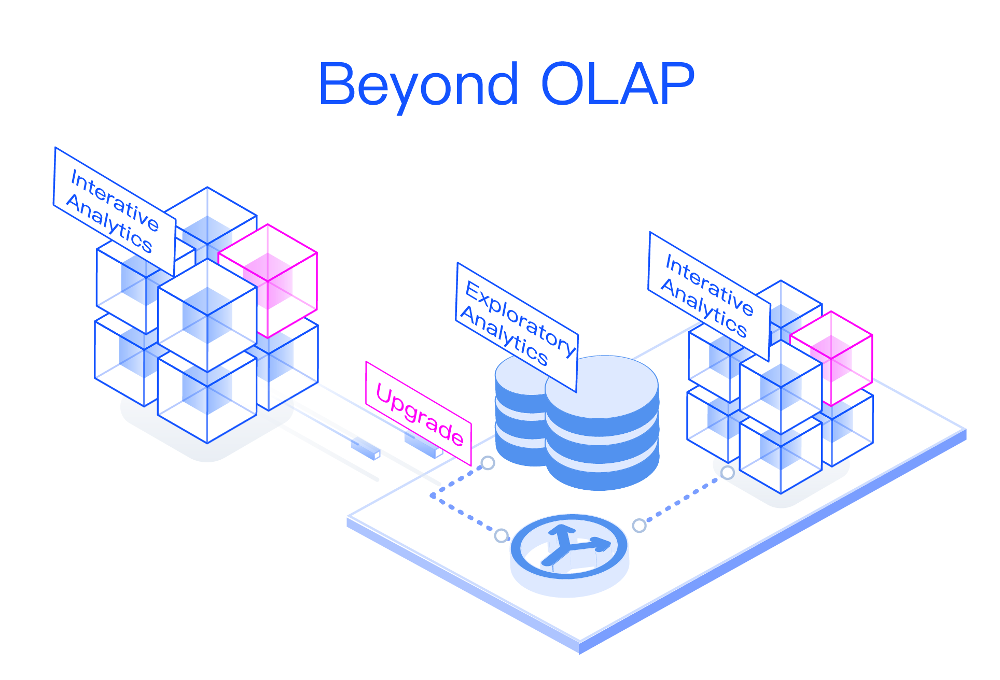
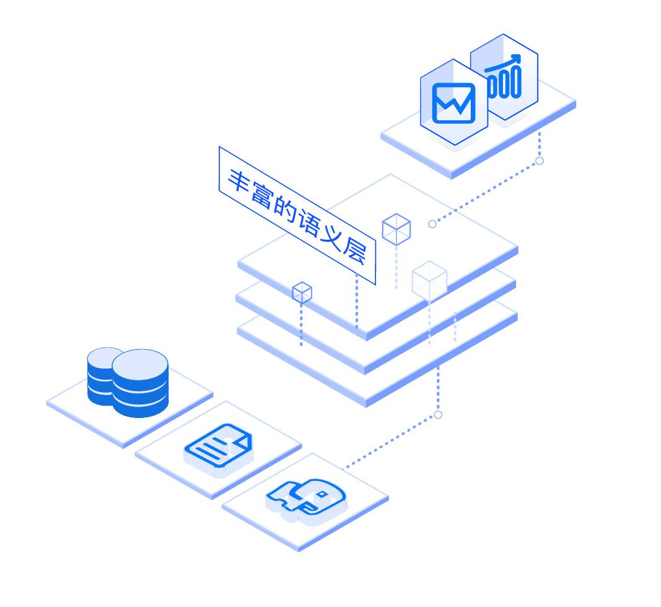

## KAP 2.4 Release Notes

### KAP 2.4 Highlight Features

The highlight features introduced by KAP 2.4 are as follow:

#### Redesigned User Experience

**KyStudio: Modeling Tool**

KyStudio is a totally redesigned modeling GUI, with intuitive model structure and drag-and-drop modeling process. It brings new look and feel, and allows analysts to ingest data, design model, build cube via self-service.  

**Support Snowflake Model**

KAP extends the modeling design capability to support Snowflake schema. Both Star schema and snowflake schema are supported by KAP now. By leveraging optimized index technology, KAP supports ultra-high dimension lookup table and resolves huge table join problem.  

#### Extended Query Capability

**Query Pushdown** 

Traditionally KAP could answer cube-based query only, now KAP could route the cube incapable query to another SQL engine by enabling Query Pushdown. KAP has embedded Spark SQL and Hive as the pushdown engines, other SQL on Hadoop engines will be onboard soon. KAP supports both mission-critical and exploratory analytics, by cube-based sub-second high performance query and pushdown-based query.   

**Hybrid-OLAP Architecture** 

KAP upgrades Kylin's architecture from MOLAP(Multidimensional OLAP) to HOLAP(Hybrid OLAP). It supports both aggregation query and detailed-data query, to meet multiple analytics scenario requirement. 

**Seamless Integration with SQL on Hadoop** 

KAP integrates with existing SQL on Hadoop seamlessly, no data movement and no model redesign required. It enables to reuse existing analytics capability. KAP brings the transparent speedup power to data access layer. KAP empowers the unified query gateway for all BI applications, by taking full advantage of pre-calculation technology, KAP enables BI to analyze massive data on Hadoop directly, fills the gap between BI and Hadoop.  

#### Enriched Semantic Layer

**Computed Column**

The semantic layer is enriched by introducing computed column technology. KAP allows user to define computed column on the original source table to extract/transform/redefine original column value into new virtual column. The computed column works like standard column which will be pre-calculated during cubing phase. The computed column enables analyst to do data clean/transform without IT team, all by themselves. It also improves the query performance by pre-calculated the filter condition. Hive UDF is supported on computed column, this allow user to reuse existing code and libraries. 

#### Enhanced Intelligent Modeling

**Model Health Check**

Model Health Check is enabled by running statistics algorithm. It will figure out the modeling potential  issues, such as primary-foreign key mismatch and data skew. The check result indicates how to improve the model design directly and efficiently. 

**Cube Optimizer**

Cube Optimizer analyzes source data characters and inputted SQL patterns first, and generates the suggested cube design, including suggested dimensions, aggregation group settings, measures settings, encoding algorithm and rowkey order. This lowers the model study curve, help user finish the modeling steps by simple clicks. 

**Max Dimension Combination based Cuboid Pruning**

Max Dimension Combination is most used dimension combination number during queries. KAP would prune the cuboid combination by the Max Dimension Combination rule. The cuboid pruning avoids the rarely used cuboid build, reduces the cubing time, and resolves the cuboid explosion problem. In some real-cases, it shrinks the cuboid more than 90%. 

#### New Cube Scheduler

**Cube Build Scheduler**

Cube Build Scheduler enables to build the cube on schedule, minutely, hourly and daily. It reduces the operation cost, and allow analyst to self-service build the cube with automatic scheduler service. The Cube Build Scheduler works very well with Kafka in streaming cubing case, with better operation experience and reliability. 

#### Easy to Operation  

**Installation Environment Check**

Full environment check scripts are provided, it checks the environment dependency, permission, version and other necessary resource. The check result indicates the potential issues and should be fixed before KAP starts. 

**New Metadata Storage**

Relational databases, such as MySQL, are used to be the KAP metadata store. By moving the metadata from HBase to relational database, the database operation rules and specification could be followed.  Since no more HBase needed, the total operation cost and risk are reduced dramatically.

#### Upgrade Apache Kylin to 2.0

KAP is built based on Apache Kylin core, and 100% compatible with Apache Kylin. KAP 2.4 upgrades Apache Kylin to 2.0, and the complete Kylin release notes could be found on the Kylin website. The highlight features including:

KYLIN-2467: Support TPCH queries

KYLIN-2331: Spark cubing engine

KYLIN-2006: Job Engine HA

KYLIN-2351: Support cloud-based storage

#### Other enhancement and bug-fix

KYLIN-2521: Upgrade Apache Calcite to 1.12

KYLIN-490: Support Distinct Count for multiple columns

Table Index supports multiple sorted by/shard by definitions, improves the detailed query

Build engine upgraded, reduces the IO cost, and accelerates the cubing 

Allow to set the time range for KyBot diagnostic package, reduces the log size

Support save model and cube as draft, improve the modeling experience

Support cluster service discovery based on ZooKeeper, eliminates the manual mistakes. 

Support customized measure precision 

Easy to upgrade, all configurations are back-compatible

KyAnalyzer access control is integrated with KAP backend

#### Hadoop Distribution Support

 Certificated distributions ：

  	Cloudera CDH 5.7+

  Compatible distributions：

  	Apache Hadoop 2.2+，HBase 0.98+，Hive 0.14+

  	Hortonworks HDP 2.2+

  	Microsoft HDInsight

  	Amazon EMR

  	Huawei FusionInsight C50/C60