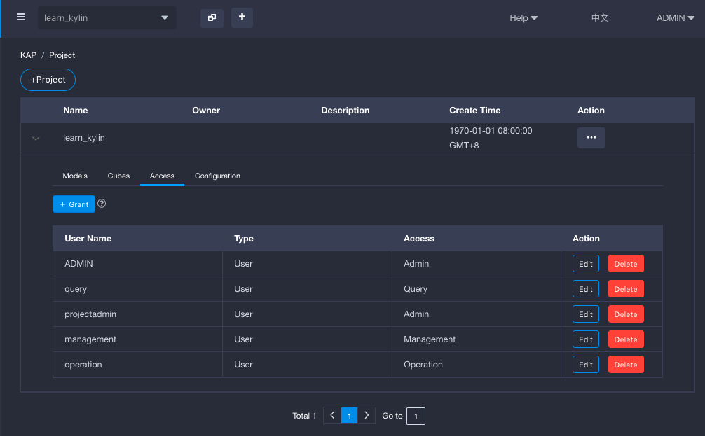

## Manage Access Permission

When a user uses KAP, whether a user can access a project and use some functionalities within the project is determined by project-level access control, there are four types of access permission role set at the project-level in KAP. They are *ADMIN*, *MANAGEMENT*, *OPERATION* and *QUERY*. Each role defines a list of functionality user may perform in KAP system. 

- *QUERY*: designed to be used by analysts who only need access permission to query tables/cubes in the project.
- *OPERATION*: designed to be used by operation team in a corporate/organization who need permission to maintain the Cube. OPERATION access permission includes QUERY.
- *MANAGEMENT*: designed to be used by Modeler or Designer who is fully knowledgeable of business meaning of the data/model, Cube will be in charge of Model and Cube design. MANAGEMENT access permission includes OPERATION, and QUERY.
- *ADMIN*: Designed to fully manage the project. ADMIN access permission includes MANAGEMENT, OPERATION and QUERY.

Access permissions are independent between different projects. 

###How Access Permission is Determined

Once project-level access permission has been set for a user, access permission on data source, model and Cube will be inherited based on the access permission role defined on project-level. For detailed functionalities, each access permission role can have access to, see table below. 

| Functionality                            | SYSTEM ADMIN | PROJECT ADMIN | MANAGEMENT | OPERATION | QUERY |
| ---------------------------------------- | ------------ | ------------- | ---------- | --------- | ----- |
| Add/Delete  project                      | Yes          | No            | No         | No        | No    |
| Edit/Back up  project                    | Yes          | Yes           | No         | No        | No    |
| View project  Detail                     | Yes          | Yes           | Yes        | Yes       | Yes   |
| Add, edit,  Delete project access        | Yes          | Yes           | No         | No        | No    |
| View System  Dashboard                   | Yes          | Yes           | Yes        | Yes       | Yes   |
| View Studio                              | Yes          | Yes           | Yes        | Yes       | Yes   |
| View Data  Source page                   | Yes          | Yes           | Yes        | No        | No    |
| Load, unload,reload data source          | Yes          | Yes           | No         | No        | No    |
| configure  KAFKA data source             | Yes          | yes           | No         | No        | No    |
| View table,  row, and column-level access control | Yes          | Yes           | Yes        | No        | No    |
| Add, modify,  delete table, row and column-level access control | Yes          | Yes           | No         | No        | No    |
| View Model  page                         | Yes          | Yes           | Yes        | Yes       | Yes   |
| view models                              | Yes          | Yes           | Yes        | Yes       | Yes   |
| add, edit, clone, delete model. perform model health check | Yes          | Yes           | Yes        | No        | No    |
| View cube page                           | Yes          | Yes           | Yes        | Yes       | Yes   |
| view cube detail                         | Yes          | Yes           | Yes        | Yes       | Yes   |
| Edit Cube  Description                   | Yes          | Yes           | Yes        | No        | No    |
| Add,  enable/disable, clone, purge cube  | Yes          | Yes           | Yes        | No        | No    |
| Build, manage  Cube                      | Yes          | Yes           | Yes        | Yes       | No    |
| Add, edit,  delete Cube access           | Yes          | Yes           | Yes        | No        | No    |
| View, edit and  delete Cube draft        | Yes          | Yes           | Yes        | No        | No    |
| View Insight  page                       | Yes          | Yes           | Yes        | Yes       | Yes   |
| Query Insight  page                      | Yes          | Yes           | Yes        | Yes       | Yes   |
| View Monitor  page                       | Yes          | Yes           | Yes        | Yes       | Yes   |
| View System  page                        | Yes          | No            | No         | No        | No    |
| Manage system                            | Yes          | No            | No         | No        | No    |
| Manage user                              | Yes          | No            | No         | No        | No    |

Additionally, when Query Pushdown is enabled, QUERY access permission on a project allows users to issue push down queries on all tables in the project even though no cube could serve them. It's impossible if a user is not yet granted QUERY permission at project-level.

### Manage Access Permission at Project-level

#### Grant Access 

Follow below steps to grant access at project-level: 

1. Click on project icon on the right side of project list on the navigation bar.
2. Expand a project on the project list.
3. Click `Access` menu  and then click `+Grant` menu to grant a user access.
4. Fill in a user name, access permission and click `save`. 

#### Modify Access

Follow below steps to modify access at project-level: 

1. Click on project icon on the right side of project list on the navigation bar.
2. Expand a project on the project list.
3. Click `Access` menu and click `Edit` 
4. Modify user's access permission and click `save`. 

####Revoke Access

Follow below steps to revoke access at project-level: 

1. Click on project icon on the right side of project list on the navigation bar.
2. Expand a project on the project list.
3. click `Access` menu, choose a user, and then click `Delete` .

When user's project access permission has been revoked, all access permission on this project will be revoked/dropped subsequently, this may include table-level, row-level and column-level if there is any. 

