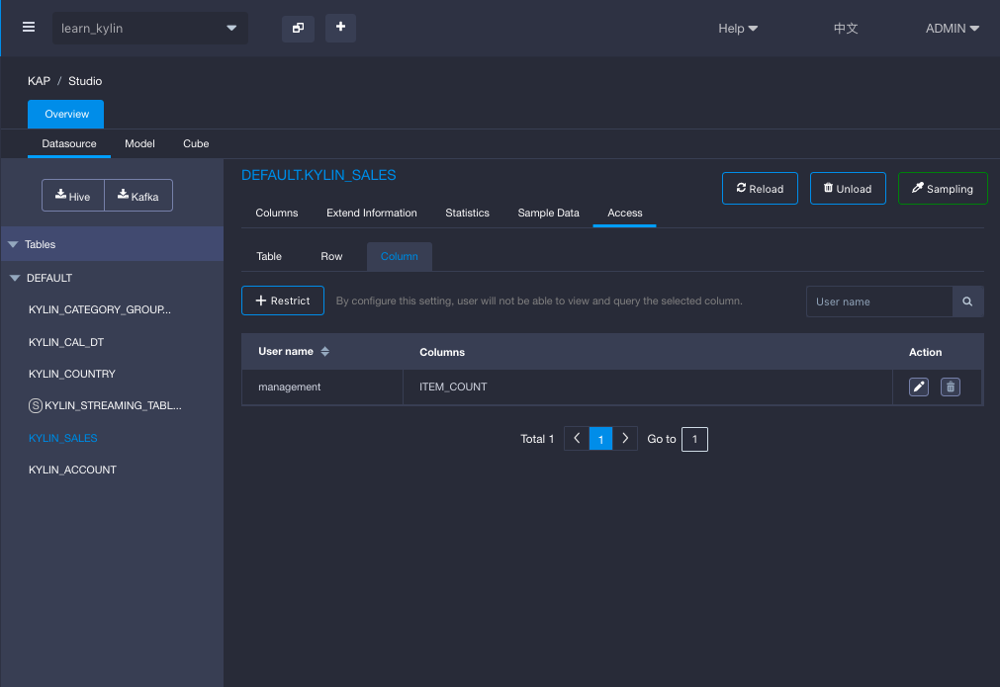
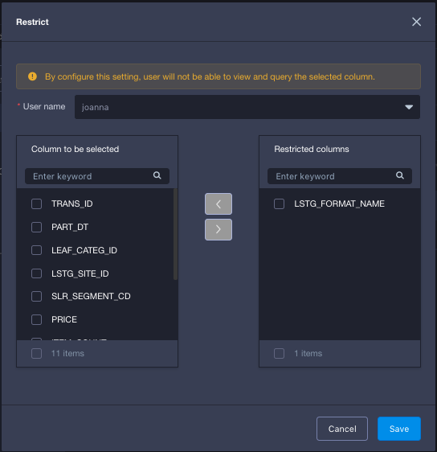
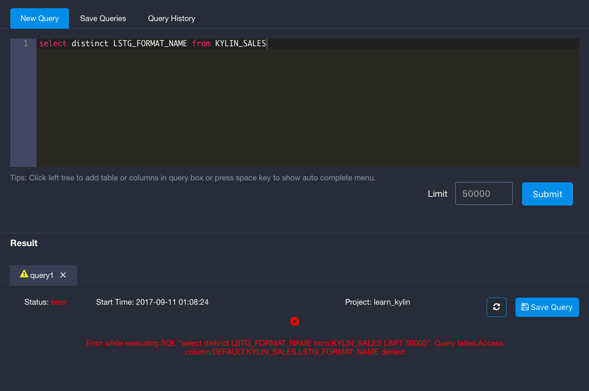

## Column-level Access Control

**Column-level Access Control** restrict user's access to a table without having access to a specific column. If a user's access to a column on a table is revoked, this user will not be able to query against this column, regardless through Cube, Table Index or Query  Push Down. The user can still query against the cube that contains the forbidden column as long as the forbidden column is not explicitly used in the query. 

When a user sends `Select * from table` query on the table that contains forbidden column, the query will still run and return the result without the forbidden column. 

When you load the table for the first time into a project or upgrade KAP from a lower version, by default, there is no column-level access control being set for any user.

Column-level access control needs to be set by project basis. That means even if you load the same Hive or KAFKA table from data source twice in different projects, column-level access control needs to be set independently for those two projects. 

### Manage Column-level Access Control

#### Grant Access

Follow below steps to grant access at column-level:

1. Go to `Studio` on the left hand side navigation bar.
2. Go to `Data Source`, click on a loaded table.
3. For that table, click `Access` tab, choose `column`.
4. Click `+ Restrict` to restrict access. 
5. On the pop-up window, choose a user. 
6. Multipe-select columns and then click the right arrow to move the column to be restricted. 
7. Save.

#### Modify Access

Follow below steps to modify access at column-level:

1. Go to `Studio` on the left hand side navigation bar.
2. Go to `Data Source`, click on a loaded table.
3. For that table, click `Access` tab, choose column.
4. Under `Action`, click `Modify` button. 
5. On the pop-up window, modify restricted column as you wish.
6. Save.

#### Revoke Access

Follow below steps to modify access at column-level:

1. Go to `Studio` on the left hand side navigation bar.
2. Go to `Data Source`, click on a loaded table.
3. For that table, click `Access` tab, choose column.
4. Under `Action`, click `Delete` button. 

#### Validate Column-level Access Control

In this example, user `joanna` is a user who has access to `learn_kylin ` project and has been restricted access to column `LSTG_FORMA_NAME` from `Kylin_sales`table.

Login as user `joanna`, go to insight page, and try to query column `LSTG_FORMA_NAME` to validate whether column-level access control has been effective.

As shown in the screenshot below, access is denied when user `joanna` try to query column `LSTG_FORMA_NAME`.

