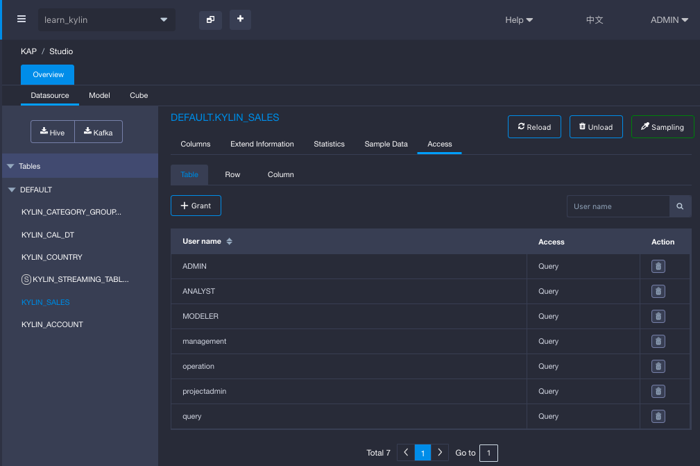
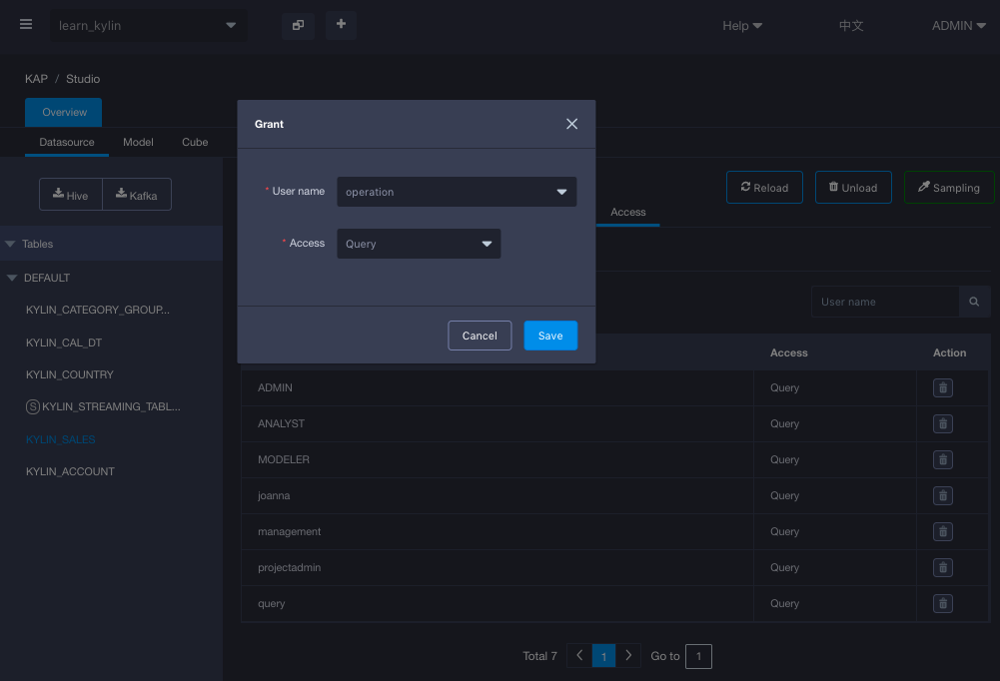

## Table-level Access Control 

**Table-level Access Control** allows KAP system admin to control who can access data of Hive or KAFKA tables that have been loaded into KAP. When a user has been revoked of query access to a table, this user will not be able to **query** data in this table regardless of through Cube, Table Index or Query Pushdown. The user can still query the Cube that has a reference to the forbidden table, as long as the query itself does not refer to the forbidden table. 

When you load the table for the first time into a project or upgrade KAP from a lower version, by default, every user has access to all tables that have been loaded into the project. 

Table-level Access Control needs to be set by project basis. That means even if you sync the same Hive or Kafka table from data source twice in different projects, table-level access control need to be set independently for those two projects. 

###Manage Table-level Access Control 

#### Grant Access

Follow below steps to grant access at table-level:

1. Go to `Studio` on the left hand side navigation bar.
2. Go to Data Source, click on a loaded table.
3. For that table, click Access tab, choose table. 
4. Click `+Grant` to grant table access to user. 
5. On the pop-up window, choose the user and save. 

#### Revoke Access

Follow below steps to revoke access at table-level:

1. Go to `Studio` on the left hand side navigation bar.
2. Go to `Data Source`, click on a loaded table.
3. For that table, click `Access` tab, choose table. 
4. Choose a user that you want to revoke table-level access. 
5. Under `Action`, click `delete` button.  

### Validate Table-level Access Control

In this example, user `joanna` is a user who has access to `learn_kylin ` project and has been revoked access of table `Kylin_sales` . 

Login as user `joanna`, go to insight page, and try to query `kylin_sales` table to validate whether table-level access control has been effective. 

As shown in the screenshot below, access is denied when user `joanna` try to query table `Kylie_sales`

