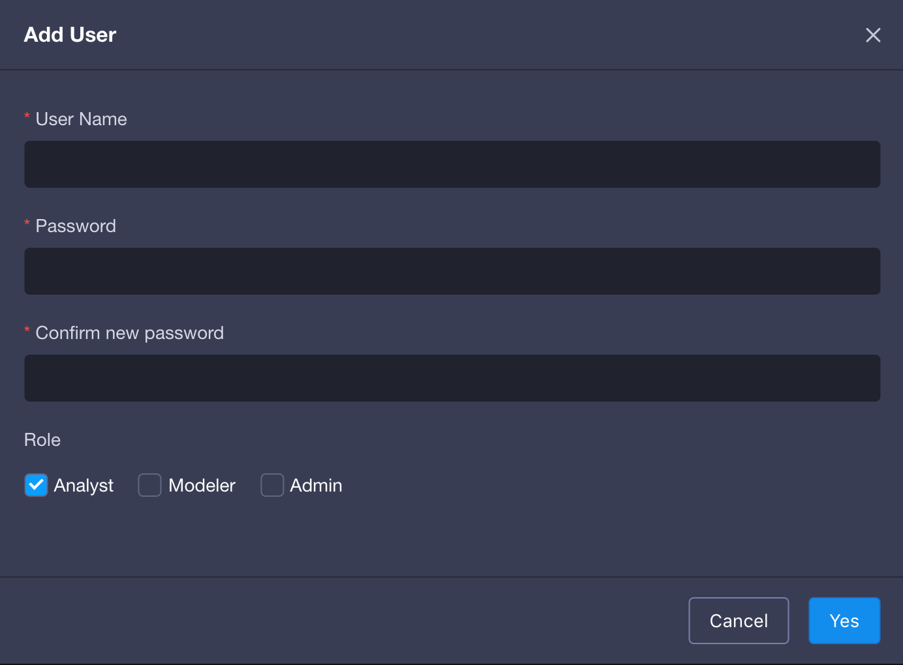
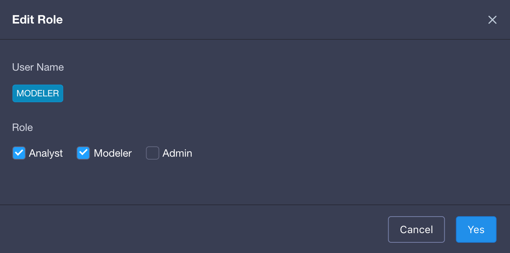
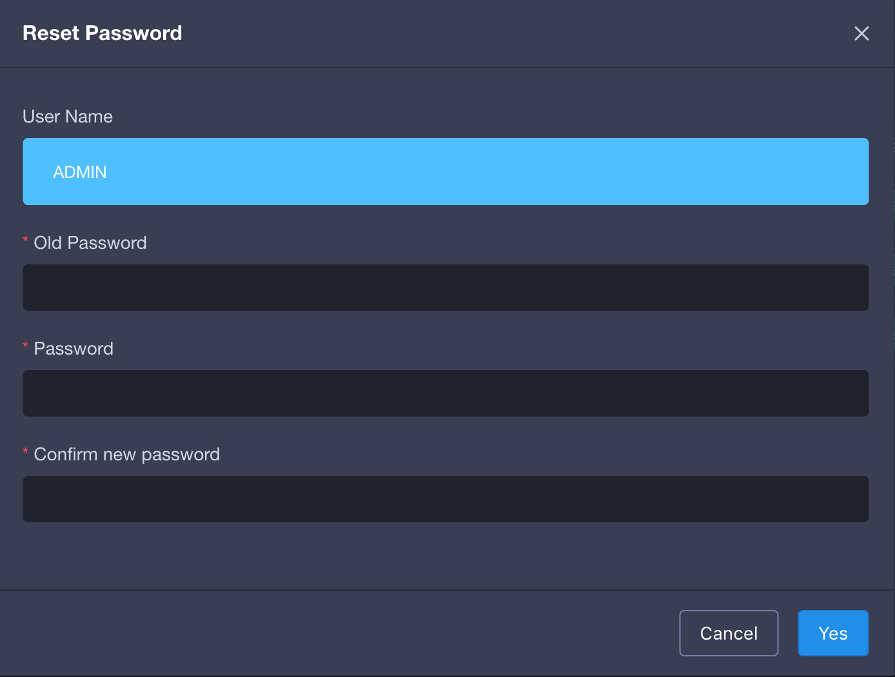
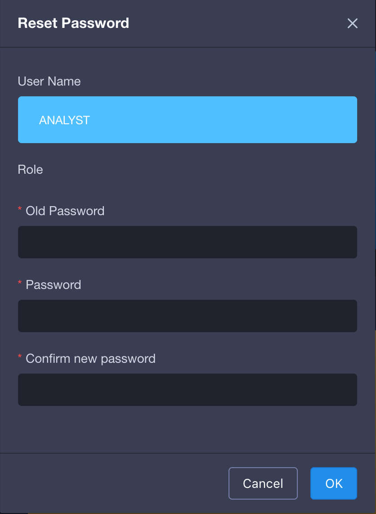

## User management

Login on KAP, users can click `system button` on navigation bar to enter system management page. Then click user bar on the left side to enter users management page. Only administrator could get the access to the user management page. 

KAP is set to initial three users, and corresponding account information would be admin (ADMIN/KYLIN), modeler(MODELER/MODELER), analyst(ANALYST/ANALYST).

### Characters
The KAP system defaults to three characters: administrator, modeler and analyst.
Administrator has whole authority related to system. 

Analyst has main authority to query, such as checking authorized entity information(project, model, Cube and so on) and querying built data.

Modeler is capable to build model, Cube, and other actions(such as building, editing, deleting, cleaning, enabling, disabling, which including all authorities of the analyst).

### Add users
Administrator could add new users and input user name, password and character information. 

### Edit user information
Once users are added, administrator would be able to edit user's character information.

### Change password
Administrator is able to change password and only needs to input twice the new password. 

### Reset password

The default password is changed while the first login. If you want to reset password to the default password, please execute command(kylin.sh admin-password-reset) in the KYLIN_HOME. Other account would remain the same.

### Delete users

Administrator could delete users within the page. Please be noticed that deleted users cannot be restored. 

### Enable/disable users
Administrator could enable or disable users and disabled users cannot login the system. 

### Change password as normal users
Click the `welcome tag` on the far right side of navigation bar, then users could choose the `setting` option and click it to enter the personal change password page.      

