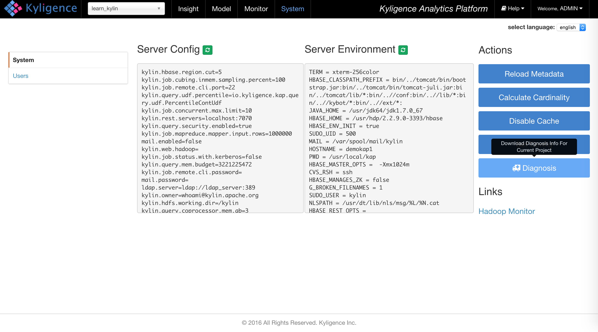
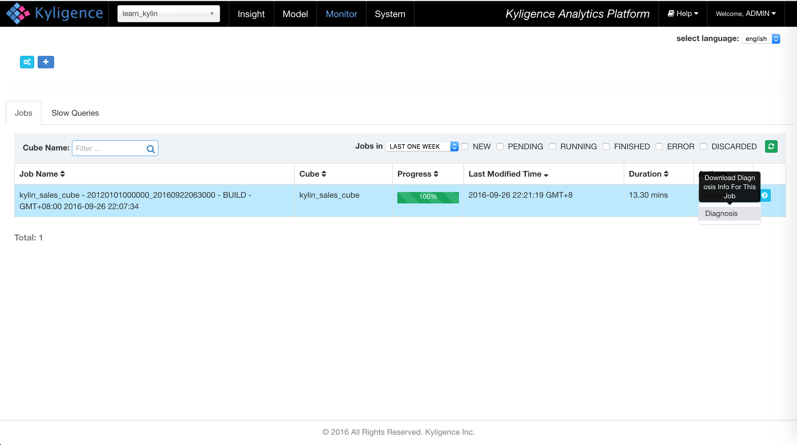

KAP users may face some hard work such as cube building failed, SQL executing failed, query latency timeout etc. OPS team need to dump related information for trouble shooting. Besides, users have the needs to ask experts for help, in which situation user could leverage Kyligence's online support service -- KyBot, based on exports knowledge base, to diagnose/tune their KAP instances and ask technical support.

# Diagnosis
KAP provides a function called "Diagnosis" on Web UI, which will extract related system information into a zip package, to help OPS team for trouble shooting.

## System Diagnosis
Click 'Diagnosis' button on System page, then package of Kylin instance's information will be genrated.

## Job Diagnosis
Click 'Diagnosis' button under one job on Monitor page, then package of current job will be genrated.

# Leverage KyBot
KyBot is an online analyzing, trouble shooting, optimization support service for Apache Kylin, provided by Kyligence. User can generate diagnosis package with KyBot Agent, and upload to KyBot platform, to get insight of KAP healthy, such as performance, storage etc.

## User login
KyBot login: http://kybot.io

Please register an account before first login, and your company email address is required.

About how to use KyBot, please refer to: [KyBot Intro and Quick Start](../kybot/kybot.en.html)
