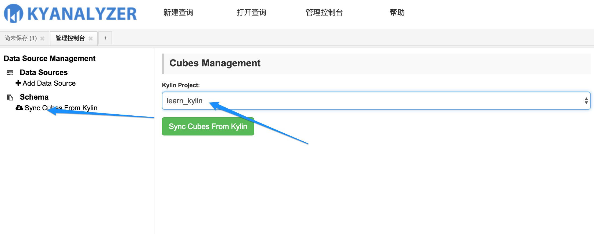
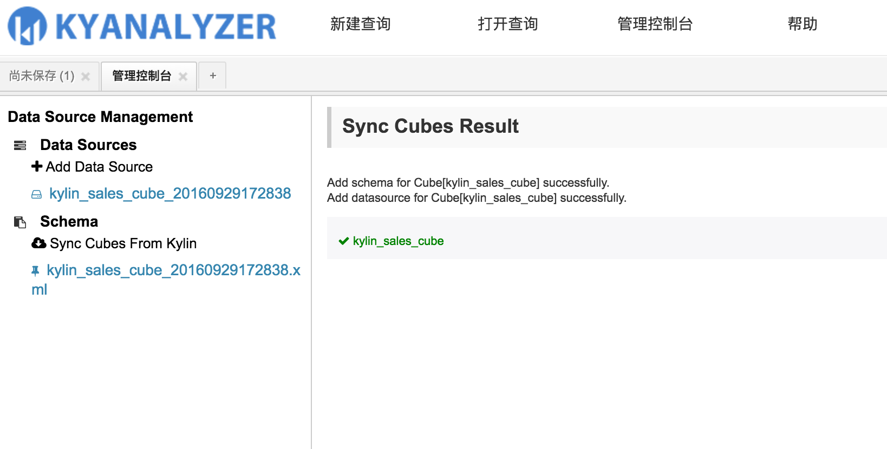
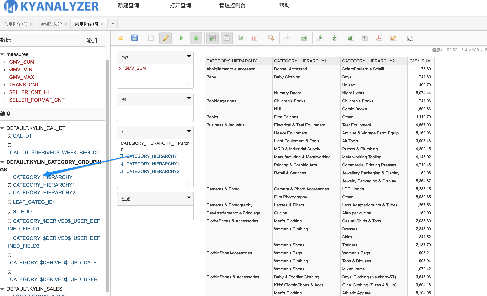
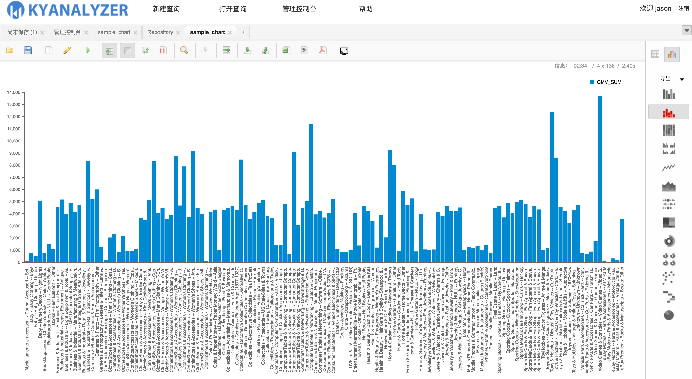

> KyAnalyzer由Kyligence公司基于saiku进行二次开发，将一些对用户而言不必要的流程自动化掉，让用户以最简单快捷的方式访问KAP的数据。
> 本篇文档主要基于0.2版对KyAnalyzer进行介绍。
>

###使用KyAnalyzer的前提条件
* KAP版本需为2.1或之后版本
* Apache Kylin版本需为1.5.4.1或之后版本
* KyAnalyzer暂不支持left join查询，使用者构建Cube模型时需指定join关系为inner

### 安装
通过Kyligence公司获得定制版的KyAnalyzer安装包 KyAnalyzer-{version}.zip，同时需要下载对应KAP版本的Mondrian包，请下载mondrian-kylin-{version}.jar。对应Mondrian包可在GitHub kylin-mondrian 仓库: (https://github.com/Kyligence/kylin-mondrian/blob/master/build/) 上获得。
解压KyAnalyzer安装包，把下载的mondrian-kylin对应的jar包拷到 saiku-server/tomcat/webapps/saiku/WEB-INF/lib 目录下, 版本若有变动请下载最新版本。
在WEB-INF目录下有个配置文件kyanalyzer-beans.properties， 需要在该文件中配置好KAP的IP及端口信息，*kap.host*为KAP的IP，*kap.port*为KAP REST API的端口，默认7070。

通过saiku-server 目录下的 start-saiku.sh启动KyAnalyzer，默认端口为8080,可通过 http://{hostname}:8080 访问页面。如果要停掉应用执行stop-saiku.sh即可。如果在启动过程中遇到问题页面打不开，可以到tomcat/logs目录下查看具体出错信息。

根目录下文件信息

KyAnalyzer的数据信息主要存储在根目录下的repository和data目录下，如果需要进行升级，可备份这两个目录。

### 认证
KyAnalyzer的用户认证是通过KAP认证，所以只需要输入KAP的账号密码即可登录。用户的管理也是通过KAP进行。KAP中的管理员在KyAnalyzer中同样具有Admin角色。

### 管理控制台
该页面仅管理员可见。
为了同步KAP中的Cube，针对每一个Cube，Saiku中都必须创建一个对应的schema文件，同时配置对应的数据源。Saiku将通过这些配置信息组成SQL发送给KAP。KyAnalyzer将这一块自动化掉，用户不需要手动创建schema以及数据源。只需要点击页面左侧的**Sync Cubes From Kylin**，右侧下拉框会列出KAP中所有的Project。

选中项目后，点击绿色的按钮**Sync Cubes From Kylin**，KAP中该项目下所有状态为*READY*的Cube信息将会被同步到过来。

KyAnalyzer提供了对schema的在线编辑功能，对mondrian schema用户熟悉的用户可以根据需要修改，正常情况下不需要修改这块。

### 新建查询
点击导航栏的新建查询按钮，点击刷新按钮获取最新的数据，在'选择多维数据' 下拉框中选中要查询的Cube， 点击自己要查询的数据自由查询。

KyAnalyzer支持多种展现形式，表格，柱状图，堆积柱状图，百分比堆积柱状图，折线图，面积图，热点图，树状地图，环形图，散点图，瀑布图等，下面列举部分。

#### 柱状图

#### 饼图

#### 数据透视表

#### 对COUNT DISTINCT的支持

#### 对层级维度进行层次化展示

### 数据过滤
对于查询的结果，通过点击行下对应的维度名称，会弹出针对该维度的过滤框，在输入框中输入对应模式缩小筛选范围，然后勾选要过滤的数据，可以通过包含(Include)和排除（Exclude）的方式进行过滤。

### 查询结果保存
查询对应的表格和图标都可以成文件或图片

#### 导出表格

#### 导出图表

### 保存查询结果
我们也可以将当前的查询保存到KyAnalyzer中，下次登录时直接打开即可，不用重复点击。

#### 保存查询

#### 打开查询

#### 执行查询

