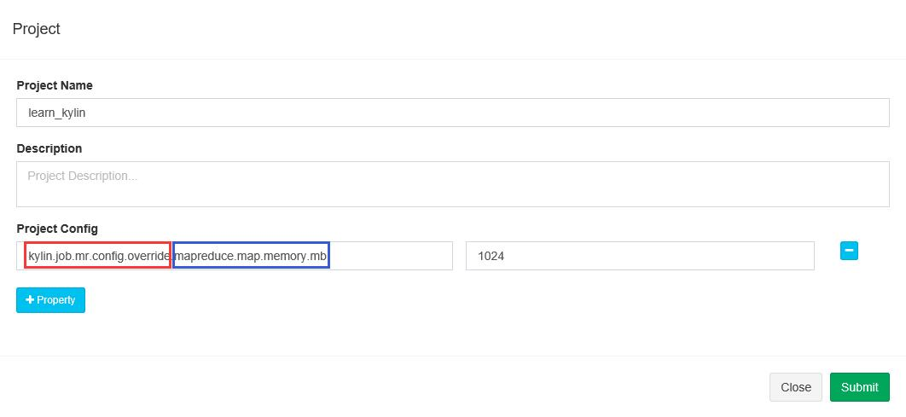
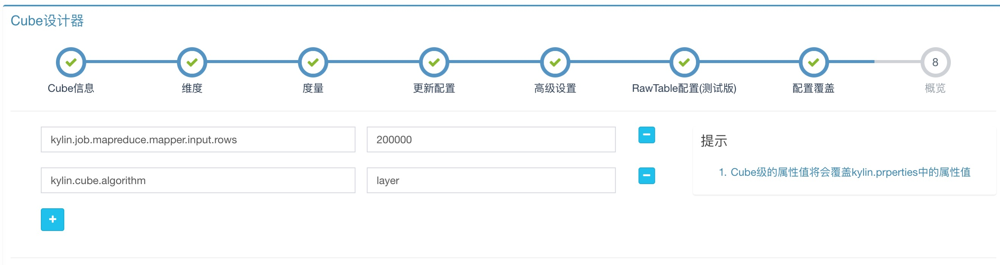

## 配置重写

`KAP_HOME/conf/`下的部分配置项可以在KAP GUI中重写。配置重写有两个作用域，分别是project级别和cube级别。Project级别的配置继承于全局配置文件，cube级别的配置继承于project；而配置的覆盖优先级关系是：cube级别配置项 > project级别配置项 > 配置文件（kylin.properties）。

### 项目配置重写

在项目管理（Project Management）页面中打开某一项目的编辑页面，可以添加配置项，这些配置项将覆盖配置文件中的默认值。如图所示：

 

### Cube配置重写

在cube设计的`配置覆盖`步骤中，可以添加配置项，这些配置项将覆盖project级别和配置文件中的默认值。如图所示：

 

### 覆盖kylin.properties中参数

目前kylin.properties中的下列配置项可以使用上述方法进行重定义：

*kylin.hbase.default.compression.codec*，默认值none，其他有效值包括snappy，lzo，gzip，lz4；

*kylin.storage.hbase.region-cut-gb*，默认值5；

*kylin.storage.hbase.hfile-size-gb*，默认值2；

*kylin.storage.hbase.min-region-count*，默认值1；

*kylin.storage.hbase.max-region-count*，默认值500；

*kylin.job.sampling-percentage*，默认值100；

*kylin.engine.mr.reduce-input-mb*，默认值500；

*kylin.engine.mr.max-reducer-number*，默认值500；

*kylin.engine.mr.mapper-input-rows*，默认值1000000；

*kylin.cube.algorithm*，默认值auto，其它有效值包括inmem，layer；

*kylin.cube.algorithm.layer-or-inmem-threshold*，默认值8；

*kylin.cube.aggrgroup.max-combination*，默认值4096；

*kylin.table.snapshot.max-mb*，默认值300；

### 覆盖kylin_hive_conf.xml中参数

KAP支持通过KAP GUI覆盖kylin_hive_conf.xml中的参数，以Key/Value的形式，按照如下格式替换：

kylin.hive.config.override.*key* = *value*

**注意：需要在参数名之前加上前缀*kylin.hive.config.override* **。

### 覆盖kylin_job_conf.xml和kylin_job_conf_inmem.xml中参数

KAP支持通过KAP GUI覆盖kylin_job_conf.xml和kylin_job_conf_inmem.xml中的参数，以Key/Value的形式，按照如下格式替换：

kylin.job.mr.config.override.*key* = *value*

**注意：需要在参数名之前加上前缀*kylin.job.mr.config.override* **。举例如图：

其中红色矩形框内的部分为前缀，蓝色矩形框内的部分为参数名，二者之间用英文“.”连接。
