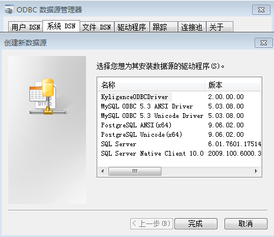

## Kyligence ODBC 驱动程序

Kyligence ODBC 驱动程序是 Kyligence 公司自主研发的一款 ODBC 驱动程序。它仅支持与 KAP 连接，并支持 Apache Kylin ODBC 驱动程序的全部功能，支持 ODBC 接口的应用可以通过该驱动程序访问 KAP 进行数据查询。

Kyligence ODBC 驱动程序是 KAP 商业发行版中的一部分，用户无需另外付费。有效的 KAP License 可以直接使用 Kyligence ODBC Driver。Kyligence ODBC Driver 的有效使用期限与 KAP 一致。

Kyligence ODBC 驱动程序目前仅支持 Windows 环境。

在本文中，我们以 Windows 7 为例，介绍 ODBC 驱动程序的安装和使用步骤。

## 前提条件 

1. 在安装 Kyligence ODBC 驱动程序的过程中，系统会首先自行安装 Microsoft Visual C++ 2015 Redistributable。如果操作系统中已经安装了 Microsoft Visual C++ 2015 Redistributable，安装步骤会跳过此步。

2. Kyligence ODBC 驱动程序会连接 KAP 服务器，务必先确保 KAP 服务已正常运行。

## 安装

1.  如果机器上已经安装过 Kyligence ODBC 驱动程序，首先卸载已有 Kyligence ODBC 驱动程序。

2.  在 [Kyligence Account 页面](http://account.kyligence.io)申请下载 Kyligence ODBC 驱动程序，并运行安装。

    32 位应用程序：请安装使用 kyligence_odbc.x86.exe

    64 位应用程序：请安装使用 kyligence_odbc.x64.exe

## 配置 DSN

1.  打开 ODBC 数据源管理器：

    32 位 ODBC 驱动：单击**开始 -> 运行**，并打开 C:\Windows\SysWOW64\odbcad32.exe

    64 位 ODBC 驱动：单击**控制面板 ->管理工具**，找到并打开**数据源(ODBC)**

2.  切换至**系统 DSN** 选项卡，单击**添加**，在弹出的驱动程序选择框中选择 **KyligenceODBCDriver**，然后单击**完成**按钮。

3.  在弹出的对话框中输入 KAP 服务器信息，如图所示：

其中，各项参数介绍如下：

* Data Source Name：数据源名称
* Host：KAP 服务器地址
* Port：KAP 服务器端口号
* Username：KAP 服务登录用户名
* Password：KAP 服务登录密码
* Project：查询所使用的 KAP 项目名称

4.  单击 **Test** 按钮

连接成功后，将显示如下对话框。

## 特别提醒

如果用户希望在其他应用程序中使用 Kyligence ODBC 驱动程序连接 KAP，有关信息，请访问本手册[与第三方 BI 工具集成](../integration/README.md)章节。

